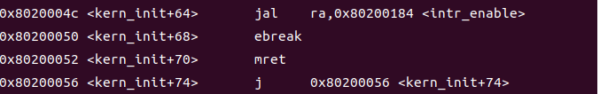

# Lab0.5：比麻雀更小的麻雀

## 问题
>为了熟悉使用qemu和gdb进行调试工作,使用gdb调试QEMU模拟的RISC-V计算机加电开始运行到执行应用程序的第一条指令（即跳转到0x80200000）这个阶段的执行过程，说明RISC-V硬件加电后的几条指令在哪里？完成了哪些功能？要求在报告中简要写出练习过程和回答。

## 解答

### 加电指令

1. 为了探究RISC-V计算机加电开始运行到执行应用程序的第一条指令这一阶段的执行过程，我们首先在lab0文件夹中运行`make debug`和`make gdb`，然后通过指令`x/10i $pc`显示即将执行的10条汇编指令，得到如下结果：

    

2. 通过搜索，在`qemu-4.1.1/hw/riscv/virt.c`的`riscv_virt_board_init`函数中找到了这些指令，指令存放在`reset_vec`数组中，作为复位向量，代码如下所示：

    ```cpp
    /* reset vector */
    uint32_t reset_vec[8] = {
        0x00000297,                  /* 1:  auipc  t0, %pcrel_hi(dtb) */
        0x02028593,                  /*     addi   a1, t0, %pcrel_lo(1b) */
        0xf1402573,                  /*     csrr   a0, mhartid  */
    #if defined(TARGET_RISCV32)
        0x0182a283,                  /*     lw     t0, 24(t0) */
    #elif defined(TARGET_RISCV64)
        0x0182b283,                  /*     ld     t0, 24(t0) */
    #endif
        0x00028067,                  /*     jr     t0 */
        0x00000000,
        memmap[VIRT_DRAM].base,      /* start: .dword memmap[VIRT_DRAM].base */
        0x00000000,
                                     /* dtb: */
    };
    ```
    
    下面对每一条指令进行解析：

    1. **auipc t0, %pcrel_hi(dtb)：**

        `auipc`指令的作用是将一个立即数符号拓展为32位，并将高20位左移12位，然后加上pc寄存器的值，并最后保存到目标寄存器中。具体到本程序，该指令将设备树文件（device tree blob）偏移地址dtb的高20位左移12位并加上pc寄存器的值然后保存到t0寄存器中。而本程序dtb的高20位值为0x0，所以执行后t0的值为0x1000。
    
        
        
    2. **addi a1, t0, %pcrel_lo(1b)：**

        该指令将立即数lb的低12位加上t0并存储到a1中。
        由于lb存储着dtb低12位的数据，所以上述两行汇编代码实现了将pc加上一个32位的偏移量，以此得到dtb的地址并保存到a1寄存器，dtb存储着硬件描述信息。
        通过指令`info r a1`得到a1的值为0x1020：

        

        通过指令`x/10i 0x1020`得到dtb部分的代码：

        

    
    3. **csrr a0, mhartid：**

        `csrr` 是一个特权级指令，用于读取特权级CSR（Control and Status Register，控制和状态寄存器）的值。mhartid（机器硬件线程ID寄存器） 是一个CSR，它存储了当前硬件线程的唯一标识符。该指令的作用是将mhartid寄存器的值加载到寄存器 a0 中。
        运行指令`info r a0`，得到a0的值为0：

        

        经过上面三条汇编代码， 将dtb地址和机器硬件线程ID加载到函数参数寄存器a0和a1中，以传递参数。
    
    4. **ld t0, 24(t0)：**

        预处理器会首先判断当前指令集是RISCV32还是RISCV64，然后决定读取单字还是双字。由于本实验指令集为RISCV64，所以使用`ld`指令读取双字。
        `ld` 指令将寄存器 t0 中存储的基地址加上一个偏移量 24，以计算出要访问的内存地址并读取双字存储在t0中。
        由于t0等于0x1000，所以该指令从`0x1000+0x18=0x1018`处读取双字存储在to中。由于机器内部使用小端字节序存储，从第一步可以看出0x1018处四个字节的值分别为00 00 00 80，所以此时t0存储的值为0x80000000。
        通过运行指令`x/xw 0x1018`证明了这一点。

        
        
    5. **jr t0：**

        `jr`指令跳转到寄存器t0所存储的地址，即0x80000000，以加载OpenSBI.bin 到以物理地址 0x80000000 开头的区域上。

### OpenSBI

1. 通过指令x/10i 0x80000000显示OpenSBI的前10条汇编指令，得到如下结果：


在`qemu-4.1.1/roms/opensbi/firmware/fw_base.S`的`_start`函数找到了源代码，其中与上面前7条汇编代码对应的指令如下：
    ```asm
    csrr	a6, CSR_MHARTID
	blt	zero, a6, _wait_relocate_copy_done
	/* Save load address */
	la	t0, _load_start
	la	t1, _start
	REG_S	t1, 0(t0)
    ```
    
    经分析，OpenSBI执行过程主要可分为三部分：1）、**底层初始化阶段**。2）、**设备初始化阶段**；3）、**二级boot跳转阶段**。下面将分别对其进行介绍：
    
#### 底层初始化阶段

1. 检查mhartid并保存加载地址
    ```asm
    csrr	a6, CSR_MHARTID
	blt	zero, a6, _wait_relocate_copy_done
    la	t0, _load_start
	la	t1, _start
	REG_S	t1, 0(t0)
    ```
    这个部分的目的是检查当前的Hart是否是第一个启动的核心。如果不是，它将跳转到`_wait_relocate_copy_done`。如果是，则保存加载地址。
2. 代码重定位
判断load address 与 link address是否一致，若不一致则需要将代码重定位，该项目不用重定位，所以会跳转到`_relocate_done`。
    ```asm
	/* Relocate if load address != link address */
    _relocate:
	la	t0, _link_start
	REG_L	t0, 0(t0)
	la	t1, _link_end
	REG_L	t1, 0(t1)
	la	t2, _load_start
	REG_L	t2, 0(t2)
	sub	t3, t1, t0
	add	t3, t3, t2
	beq	t0, t2, _relocate_done
    ```
3. 清除寄存器的值
    ```asm
	/* Reset all registers except ra, a0, a1 and a2 */
	li sp, 0
	li gp, 0
	li tp, 0
    ...
    ```

4. 清除bss段
    ```asm
    _bss_zero:
	REG_S	zero, (a4)
	add	a4, a4, __SIZEOF_POINTER__
	blt	a4, a5, _bss_zero
    ```

5. 执行sbi_init，进入设备初始化阶段
再经过设置sp指针（预留栈空间），读取设备树中的设备信息，fdt重定位后，执行`sbi_init`，进入设备初始化阶段
    ```asm
	/* Initialize SBI runtime */
	csrr	a0, CSR_MSCRATCH
	call	sbi_init
    ```

#### 设备初始化阶段
`sbi_init`函数如下所示。在该函数中，首先得到当前的硬件线程id以及sbi平台的指针。然后若`hart id`错误，则调用`sbi_hart_hang`进入wfi状态。最后判断当前是冷启动还是暖启动，并执行相应的函数。
```cpp
void __noreturn sbi_init(struct sbi_scratch *scratch)
{
	bool coldboot			= FALSE;
	u32 hartid			= sbi_current_hartid();
	const struct sbi_platform *plat = sbi_platform_ptr(scratch);

	if (sbi_platform_hart_disabled(plat, hartid))
		sbi_hart_hang();

	if (atomic_add_return(&coldboot_lottery, 1) == 1)
		coldboot = TRUE;

	if (coldboot)
		init_coldboot(scratch, hartid);
	else
		init_warmboot(scratch, hartid);
}
```
本项目属于冷启动。对于冷启动，主要流程如下：1）、调用`sbi_system_early_init`函数，进行早期系统初始化；2）、调用`sbi_console_init`函数，进行控制台初始化，此时可以使用串口输出了。3）、调用`sbi_platform_irqchip_init`，进行irq中断初始化。4）、调用`sbi_ipi_init`，进行核间中断初始化。5）、调用`sbi_timer_init`，进行timer初始化。6）、调用`sbi_system_final_init`，进行系统最后的初始化。

#### 二级boot跳转阶段
上述阶段为二级boot的跳转准备了环境，此时可以跳转到0x80200000执行程序了。

## 知识点分析

### 重要知识点

- RISC-V启动流程
    1. 将作为 bootloader 的 opensbi.bin 加载到以物理地址 0x80000000 开头的区域上；将内核镜像 os.bin 加载到以物理地址 0x80200000 开头的区域上。 
    2. 将必要的文件载入到 Qemu 物理内存之后，将PC初始化为 0x1000 。接下来将获取因此 Qemu 实际执行的第一条指令位于物理地址 0x1000 ，接下来在获取dtb地址和机器硬件线程ID后跳转到0x80000000。
    3. 将负责第二阶段的 bootloader：opensbi.bin 放在以物理地址 0x80000000 开头的物理内存中，并负责对计算机进行一些初始化工作，然后跳转到0x80200000。
    4. 保证内核的第一条指令位于物理地址 0x80200000 处。一旦 CPU 开始执行内核的第一条指令，证明计算机的控制权已经被移交给我们的内核，也就完成了加载操作系统的目标

### 拓展知识点

- X86启动流程
    1. 当计算机开机时， CPU 处于实模式。由硬件负责将 BIOS 64K 的内容加载到 0xF0000 到 0xFFFFF(64K 内存)。并将 CS置为 0xF000，IP置为 0xFFF0。组合起来的内存地址 PC 就是 0xFFFF0。 
    2. 此时 CPU 从 PC = 0xFFFF0 处开始取指，执行指令jmp far f000:e05b, 组合起来就是 0xfe05b，跳转到 BIOS 内部的代码去执行。
    3. 此时 CPU 从 PC = 0xfe05b 开始取指，执行开机自检。检查计算机硬件，同时去找启动扇区并将找到的启动扇区 复制到内存 0x7C00 到 0x7DFF 处。最后会将 CS 置为 0x0000， IP 置为 0x7C00，组合起来就是 0x7C00。
    4. 此时 CPU 从 PC = 0x7C00 开始取值、执行。由开发人员决定加载 OS Kernel 的代码，硬盘分区，boot loader 等。


# Lab1：断,都可以断

## Exercise1：理解内核启动中的程序入口操作
### 问题
>阅读kern/init/entry.S内容代码，结合操作系统内核启动流程，说明指令 la sp, bootstacktop 完成了什么操作，目的是什么？tail kern_init 完成了什么操作，目的是什么？
### 解答
1. 指令 la sp, bootstacktop将栈指针sp的值设置为bootstacktop的地址，初始化内核的栈，以确保后续执行过程中有一个有效的栈。同时可以看到该指令下面定义了一个bootstack，用于为栈分配一定字节的空间，并定义了栈顶。所以该句指令的作用是将栈指针sp置于该栈的栈顶，之后内核栈从高地址向低地址增长。

2. tail是一种函数约定，表明该函数调用是尾递归的，它的特点是将调用函数的返回地址寄存器ra的值设置为目标函数的地址，从而在执行指令tail kern_init时将直接跳转到kern_init，不再返回。所以该条指令的目的便是让程序执行真正的入口点kern_init，从而启动操作系统内核。
## Exercise2：完善中断处理
### 问题
>请编程完善trap.c中的中断处理函数trap，在对时钟中断进行处理的部分填写kern/trap/trap.c函数中处理时钟中断的部分，使操作系统每遇到100次时钟中断后，调用print_ticks子程序，向屏幕上打印一行文字”100 ticks”，在打印完10行后调用sbi.h中的shut_down()函数关机。
### 解答
```cpp
case IRQ_S_TIMER:
    /*(1)设置下次时钟中断- clock_set_next_event()
     *(2)计数器（ticks）加一
     *(3)当计数器加到100的时候，我们会输出一个`100ticks`表示我们触发了100次时钟中断，同时打印次数（num）加一
     *(4)判断打印次数，当打印次数为10时，调用<sbi.h>中的关机函数关机
     */
    clock_set_next_event();
    if(++ticks % TICK_NUM == 0) {
        print_ticks();
        num ++;
        if(num == 10){
            sbi_shutdown();
        }
    }
    break;
```
### 分析
- `kern/init/init.c`调用`kern/driver/clock.c`中的`clock_init()`对计时器进行初始化
```cpp
void clock_init(void) {
    set_csr(sie, MIP_STIP); // enable timer interrupt in sie
    //设置第一个时钟中断事件
    clock_set_next_event();
    // 初始化一个计数器
    ticks = 0;
    cprintf("++ setup timer interrupts\n");
}
//设置时钟中断：timer的数值变为当前时间 + timebase 后，触发一次时钟中断
void clock_set_next_event(void) { sbi_set_timer(get_time() + timebase); }
```
- 在初始化计时器的过程中调用`clock_set_next_event()`，设置下一个定时器中断的时间点
- 当经过`timebase`个时钟周期后，触发`IRQ_S_TIMER`事件，此时`kern/trap/trapentry.S`接收到此事件，调用`__alltraps`，保存上下文，然后调用`kern/trap/trap.c`的`trap()`处理中断
```cpp
static inline void trap_dispatch(struct trapframe *tf) {
    // scause的最高位是1，说明trap是由中断引起的
    if ((intptr_t)tf->cause < 0) {
        // interrupts
        interrupt_handler(tf);
    } else {
        // exceptions
        exception_handler(tf);
    }
}
void trap(struct trapframe *tf) { trap_dispatch(tf); }
```
- 通过`trap()`进入`trap_dispatch()`，然后进入`interrupt_handler()`函数中执行上述代码中补充的内容。

### 验证结果


## Challenge1：描述与理解中断流程
### 问题
>描述ucore中处理中断异常的流程（从异常的产生开始）

### 解答
**1. 异常与中断的产生和检测**
- 异常(Exception)，指在执行一条指令的过程中发生了错误，此时我们通过中断来处理错误。最常见的异常包括：访问无效内存地址、执行非法指令(除零)、发生缺页等。他们有的可以恢复(如缺页)，有的不可恢复(如除零)，只能终止程序执行。
- 陷入(Trap)，指我们主动通过一条指令停下来，并跳转到处理函数。常见的形式有通过ecall进行系统调用(syscall)，或通过ebreak进入断点(breakpoint)。
- 外部中断(Interrupt)，简称中断，指的是 CPU 的执行过程被外设发来的信号打断，此时我们必须先停下来对该外设进行处理。典型的有定时器倒计时结束、串口收到数据等。

由于中断处理需要进行较高权限的操作，中断处理程序一般处于内核态。在RISCV里，中断(interrupt)和异常(exception)统称为"trap"。

以时钟中断为例：时钟中断通过调用 `openSBI` 固件中提供的 `SBI_SET_TIMER` 接口实现。通过使用`sbi_call`方法调用`openSBI`的接口。封装一个`sbi_set_timer()` 函数，通过调用这个函数并传参，即可实现按照指定时间对 `cpu` 发送一个时钟中断。随后，`cpu` 会在硬件层面检测到这个时钟中断信号，触发中断的处理流程。

**2. 异常与中断的跳转**

在中断产生后，应该有个中断处理程序来处理中断。RISCV架构有个CSR叫做stvec，即所谓的”中断向量表基址”。中断向量表的作用就是把不同种类的中断映射到对应的中断处理程序。如果只有一个中断处理程序，那么可以让stvec直接指向那个中断处理程序的地址。
>stvec 寄存器储存了中断向量表的地址。在硬件发现了异常后，会把 pc 跳转到 stvec 所在的地址，然后根据异常处理的模式，跳转到对应的异常处理程序的入口。
>>异常处理向量表有两种模式，分为直接模式和向量模式。直接模式，即 stvec 处只有一个异常处理程序。向量模式则是在 stvec 处存在一个向量表，需要根据异常的类型进行映射到对应的异常处理程序。

```cpp
// kern/trap/trap.c
void idt_init(void) {
    extern void __alltraps(void);
    //我们现在是内核态所以给sscratch置零
    write_csr(sscratch, 0);
    //我们保证__alltraps的地址是四字节对齐的，将__alltraps这个符号的地址直接写到stvec寄存器
    write_csr(stvec, &__alltraps);
}
```
在发现异常后，`pc` 会切换到 `stvec` 的值。本次实验中，我们选取第一种直接模式，即 `direct` 模式，则会直接跳转到中断处理函数的入口点，即 `__alltrap` 处。接下来，我们将对异常与中断进行初步的处理，保存cpu先前的各个寄存器状态，保证cpu在中断处理能够正常恢复。

**3. 异常与中断的保存和恢复**

为了保持 CPU 各寄存器先前的值与状态，我们需要实现上下文切换机制，这包含两步：
- 保存CPU的寄存器（上下文）到内存中（栈上）
- 从内存中（栈上）恢复CPU的寄存器

我们通过 `__alltrap` 中的宏定义 `SAVE_ALL` 实现现场信息的封装，以此来完成上下文切换机制。为了方便我们组织上下文的数据（几十个寄存器），我们定义一个结构体`trapFrame`。一个`trapFrame`结构体占据36个uintptr_t的空间，里面依次排列通用寄存器x0到x31,然后依次排列4个和中断相关的CSR, 我们希望中断处理程序能够利用这几个CSR的数值，利用栈顶指针sp把一个`trapFrame`结构体放到了栈顶。

在中断处理后，需要重新读取这块内存上存储的寄存器值和sstatus、sepc两个和恢复状态相关的寄存器，这里通过进入类似于 `__alltrap` 的 `__trapret` 入口点实现，其中的宏定义 `RESTORE_ALL` 即为读取这段栈空间的值到寄存器上，恢复中断处理前的现场，并调用 `sret` 从内核态返回。
```armasm
    .globl __alltraps

.align(2) #中断入口点 __alltraps必须四字节对齐
__alltraps:
    SAVE_ALL #保存上下文

    move  a0, sp #传递参数。
    #按照RISCV calling convention, a0寄存器传递参数给接下来调用的函数trap。
    #trap是trap.c里面的一个C语言函数，也就是我们的中断处理程序
    jal trap 
    #trap函数指向完之后，会回到这里向下继续执行__trapret里面的内容，RESTORE_ALL,sret

    .globl __trapret
__trapret:
    RESTORE_ALL
    # return from supervisor call
    sret
```
`trapentry.S`这个中断入口点的作用是保存和恢复上下文，并把上下文包装成结构体送到`trap`函数那里去。

**4. 异常与中断在trap函数中的处理**

中断处理函数`trap`, 把中断处理,异常处理的工作分发给了`interrupt_handler()`，`exception_handler()`, 这些函数再根据中断或异常的不同类型来处理。
```cpp
// kern/trap/trap.c
static inline void trap_dispatch(struct trapframe *tf) {
    //scause的最高位是1，说明trap是由中断引起的
    if ((intptr_t)tf->cause < 0) {
        // interrupts
        interrupt_handler(tf);
    } else {
        // exceptions
        exception_handler(tf);
    }
}
void trap(struct trapframe *tf) { trap_dispatch(tf); }
```
通过`trap()`进入`trap_dispatch()`，然后进入`interrupt_handler()`或`exception_handler()`函数中执行对应中断的处理内容。`interrupt_handler()`和`exception_handler()`根据`scause`的数值更仔细地分了下类，做了一些输出就直接返回了。`switch`里的各种`case`, 如`IRQ_U_SOFT`,`CAUSE_USER_ECALL`,是`riscv ISA` 标准里规定的。

### 问题
>mov a0，sp的目的是什么？SAVE_ALL中寄寄存器保存在栈中的位置是什么确定的？对于任何中断，__alltraps 中都需要保存所有寄存器吗？请说明理由。
### 解答
1. `mov a0,sp`把栈顶指针`sp`的值传给参数寄存器`a0`，此时`a0`存放的就是汇编宏`SAVE_ALL`得到的`trapFrame`结构体的首地址，即将此次中断新生成的`trapFrame`结构体作为参数，传递给`trap.c`中的`trap()`函数，从而实现中断。
>**RISCV函数调用约定，寄存器传参**\
在一个函数调用另一个函数时，调用者（caller）和被调用者（callee）必须约定好在哪里放置参数和返回值。在RISC-V程序中，惯例是调用者在进行函数调用前将最多八个参数放在寄存器a0到a7中，而被调用者在完成前将返回值放在寄存器a0中。遵循这个惯例，两个函数都知道在哪里找到参数和返回值，即使调用者和被调用者是由不同的人编写的。
被调用者不能干扰调用者的行为。这意味着被调用者必须知道在完成后返回到哪里，而且不能破坏调用者需要的任何寄存器或内存。调用者在使用跳转并链接（jump and link）指令（jal）跳转到被调用者时，同时将返回地址存储在返回地址寄存器ra中。被调用者不能覆盖任何架构状态或内存，因为这些是调用者依赖的。具体来说，被调用者必须保持保存寄存器（s0−s11）、返回地址（ra）和堆栈（一部分内存用于临时变量）不变。
RISC-V的约定是，函数使用a0到a7这八个寄存器来传递输入参数，其中a0是最左边的参数，a7是最右边的参数。函数使用a0寄存器来返回输出值。如果函数有多于八个的输入参数，那么多余的参数会被放在栈上。

2. C语言里面的结构体，是若干个变量在内存里的直线排列，也就是说，一个 `trapFrame` 结构体占据36个 `uintptr_t` 的空间，里面依次排列通用寄存器 `x0`到 `x31`（`trapFrame` 还有4个和中断相关的控制状态寄存器） 知道这一点后，寄存器保存在栈中的位置就很好确定了：只要知道栈顶指针 sp，通过固定的偏移量，再乘以索引号，就可以找到我们想要的寄存器。<br>
对于特殊寄存器的 CSR，按照 sstatus、sepc、sbadaddr、scause 的顺序存储在通用寄存器的高地址处，同样通过固定的偏移量乘以索引号即可找到。

3. 对于中断，大部分情况下`__alltraps` 中都需要保存所有寄存器。这是因为中断可能会在任何时刻发生，而处理器的状态可能会被修改，因此需要保存所有寄存器以确保中断处理程序能够正确地恢复处理器的状态。由于不同的中断类型可能需要保存的寄存器不同，因此在 `__alltraps` 中保存所有寄存器可以保证处理器状态的完整性。<br>
但是小部分情况下具体的异常或中断处理程序的设计和要求可能会有所不同。可以选择只保存必要的寄存器以减小处理程序的开销。

## Challenge2：理解上下文切换机制
### 问题
>在 trapentry.S 中汇编代码 csrw sscratch, sp；csrrw s0, sscratch, x0 实现了什么操作，目的是什么？save all 里面保存了 stval scause 这些 csr，而在 restore all 里面却不还原它们？那这样 store 的意义何在呢？
### 解答
1. 汇编代码csrw sscratch, sp实现了将栈顶指针sp的值存储在寄存器sscratch中，由于中断前处于S态，该CSR初始值为0，用于保存最初的栈状态；而汇编代码csrrw s0, sscratch, x0是用于保存寄存器sscratch的值到内存，但由于RISCV中不能直接从CSR写到内存，所以用csrrw先将sscratch读取到通用寄存器s0，然后再将s0的值保存到内存，之后再将x0寄存器中的值保存到sscratch中，由于x0是零寄存器，所以将sscratch清零，恢复为原来的值。这两条指令目的在于保存异常或中断时栈顶指针sp的值，用于处理结束后的恢复。

2. save all保存stval scause 这些 csr，是因为在异常或中断处理时会用到这些寄存器的值，其中stval主要用于提供中断或者异常发生时候的一些附加信息（比如异常指令的内容，非法访问的地址）给应用程序，应用程序根据这些信息可以做一些额外的诊断；而scause这个寄存器存储了导致最近一次异常或中断的原因代码。它用于确定异常的类型，例如页故障、非法指令等。但在restore时后续将用不到这些CSR，所以没有恢复。store是为了将这些CSR的值保存到定义的数据结构trapFrame中，作为trap函数的参数调用，因此需要store将这些CSR入栈。

## Challenge3：完善异常中断

### 问题
> 编程完善在触发一条非法指令异常 mret和，在 kern/trap/trap.c的异常处理函数中捕获，并对其进行处理，简单输出异常类型和异常指令触发地址，即“Illegal instruction caught at 0x(地址)”，“ebreak caught at 0x（地址）”与“Exception type:Illegal instruction"，“Exception type: breakpoint”。

### 解答
添加对于非法指令异常以及断点异常的处理函数，首先输出错误类型，然后打印错误地址，之后不对异常进行处理，直接跳到下一条指令。对于ebreak，指令长度为2字节，所以通过epc+=2跳到下一条指令，而mret指令长度为4字节，epc需要+4.

```cpp
case CAUSE_ILLEGAL_INSTRUCTION:
     // 非法指令异常处理
     /* LAB1 CHALLENGE3   YOUR CODE :  */
    /*(1)输出指令异常类型（ Illegal instruction）
     *(2)输出异常指令地址
     *(3)更新 tf->epc寄存器
    */
    cprintf("Exception type:Illegal instruction\n");
    cprintf("Illegal instruction caught at 0x%016llx\n", tf->epc);
    tf->epc += 4;
    break;
case CAUSE_BREAKPOINT:
    //断点异常处理
    /* LAB1 CHALLLENGE3   YOUR CODE :  */
    /*(1)输出指令异常类型（ breakpoint）
     *(2)输出异常指令地址
     *(3)更新 tf->epc寄存器
    */
    cprintf("Exception type: breakpoint\n");
    cprintf("ebreak caught at 0x%016llx\n", tf->epc);
    tf->epc += 2;
    break;
```
将ebreak和mret内联汇编到`kern_init`函数后部，保证之前已经对异常处理进行了初始化：
```cpp
    ...
    intr_enable();  // enable irq interrupt

    asm volatile("ebreak");
    asm volatile("mret");
    
    while (1)
    ...
```
通过gdb查看，发现ebreak和mret都成功添加进程序中：



进一步查看两指令的机器码：


发现与`libs/riscv.h`文件中定义的机器码一致，再次说明了ebreak和mret都成功添加进程序中。
```cpp
#define MATCH_MRET 0x30200073
#define MATCH_C_EBREAK 0x9002
```
最后的输出结果如下，可以看到输出的异常类型和地址均和上述的一致，表明成功完善并添加了中断异常。


## 知识点分析

### 重要知识点
**Exercise1：理解内核启动中的程序入口操作**

这部分知识点主要涉及了程序入口点entry.S文件中的内容，包括初始化内核栈，为栈分配一定的空间，将栈指针的值设置为栈顶，从而便于后续栈的使用，从高地址向低地址增长。另外，还包括tail尾指令的作用，将程序跳转到kern_init而不再返回，去执行程序真正的入口点，从而启动操作系统内核，完成一些初始化工作。

**Exercise2：完善中断处理**

- **中断处理程序**：编写中断处理程序，这些程序在发生中断时执行特定操作。中断处理程序通常需要保存和恢复上下文，并执行特定的中断处理逻辑。
- **时钟中断**：了解时钟中断的概念，通常用于操作系统中的时间管理和调度。时钟中断周期性地触发，可以用于计算时间、调度任务等。
- **保存和恢复上下文**：中断处理程序需要正确保存和恢复寄存器和状态，以确保中断处理完毕后程序的继续执行不受影响。

**Challenge1：描述与理解中断流程**

- **异常与中断的产生和检测**：了解异常（exception）和中断（interrupt）的区别，以及它们是如何产生和检测的。异常通常是由执行指令时的错误或异常条件引发的，而中断是外部设备或定时器等硬件触发的事件。
- **中断处理程序**：中断处理程序是用于响应中断或异常的特殊代码段。它需要保存和恢复寄存器状态，并执行特定的处理逻辑。
- **保存和恢复上下文**：在处理中断或异常时，必须保存当前执行上下文，包括寄存器的状态和程序计数器等。这可以通过将上下文保存在堆栈上来实现。
- **CSR寄存器**：了解Control and Status Register（CSR）寄存器的作用，包括scause（中断原因）、stval（导致异常的值）、sscratch（用于保存栈指针）等。
- **异常处理向量表**：异常处理向量表是将不同的异常映射到对应处理程序的表格。了解如何配置和使用异常处理向量表。

**Challenge2：理解上下文切换机制**

该部分主要涉及了中断处理过程中的上下文切换机制。中断与异常发生时，操作系统需要实现进程的切换，在终止当前进程时，便需要实现上下文的切换。trapentry.S文件首先用于保存上下文，并把上下文包装成一个结构体trapFrame作为参数传递给函数trap去执行中断处理函数，然后再恢复上下文。在trapentry.S文件中，save_all用于保存上下文，用store指令将32个通用寄存器以及4个和中断有关的CSR读取到内存中，其中栈顶指针sp需要特殊处理。而restore_all主要是用load指令恢复上下文，需注意恢复顺序要与保存顺序相反，先恢复两个CSR（sstatus和sepc）的值，再恢复通用寄存器的值，另外有两个CSR不恢复，因为后续执行过程中使用不到。

**Challenge3：完善异常中断**

在 M 模式运行期间可能发生的同步例外有五种：
-  **访问错误异常** 当物理内存的地址不支持访问类型时发生（例如尝试写入 ROM）。
- **断点异常** 在执行 ebreak 指令，或者地址或数据与调试触发器匹配时发生。
- **环境调用异常** 在执行 ecall 指令时发生。
- **非法指令异常** 在译码阶段发现无效操作码时发生。
- **非对齐地址异常** 在有效地址不能被访问大小整除时发生，例如地址为 0x12 的amoadd.w。

### 拓展知识点
**1. RISCV函数调用约定，寄存器传参**

在一个函数调用另一个函数时，调用者（caller）和被调用者（callee）必须约定好在哪里放置参数和返回值。在RISC-V程序中，惯例是调用者在进行函数调用前将最多八个参数放在寄存器a0到a7中，而被调用者在完成前将返回值放在寄存器a0中。遵循这个惯例，两个函数都知道在哪里找到参数和返回值，即使调用者和被调用者是由不同的人编写的。

被调用者不能干扰调用者的行为。这意味着被调用者必须知道在完成后返回到哪里，而且不能破坏调用者需要的任何寄存器或内存。调用者在使用跳转并链接（jump and link）指令（jal）跳转到被调用者时，同时将返回地址存储在返回地址寄存器ra中。被调用者不能覆盖任何架构状态或内存，因为这些是调用者依赖的。具体来说，被调用者必须保持保存寄存器（s0−s11）、返回地址（ra）和堆栈（一部分内存用于临时变量）不变。

RISC-V的约定是，函数使用a0到a7这八个寄存器来传递输入参数，其中a0是最左边的参数，a7是最右边的参数。函数使用a0寄存器来返回输出值。如果函数有多于八个的输入参数，那么多余的参数会被放在栈上。