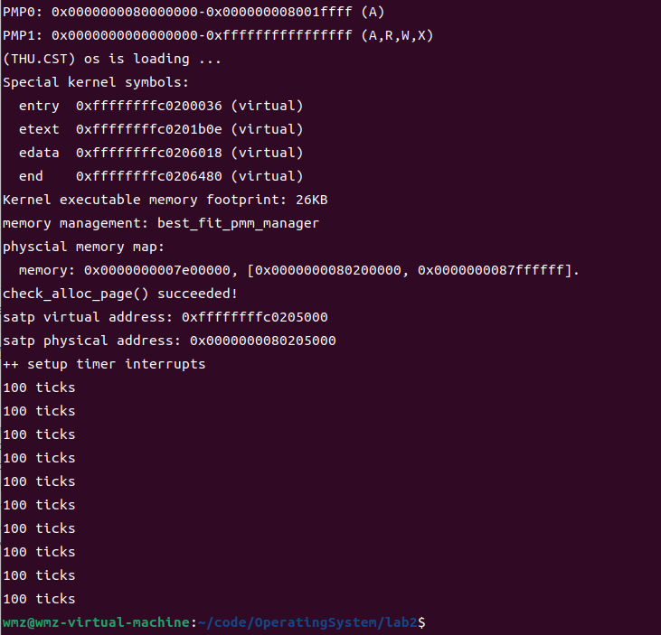
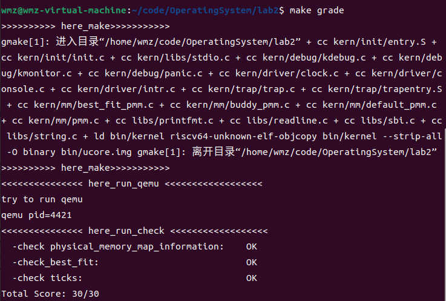
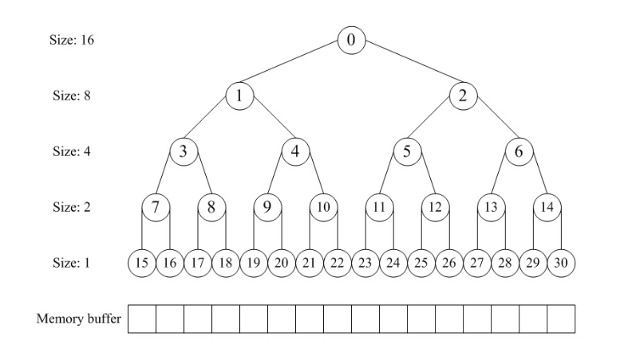
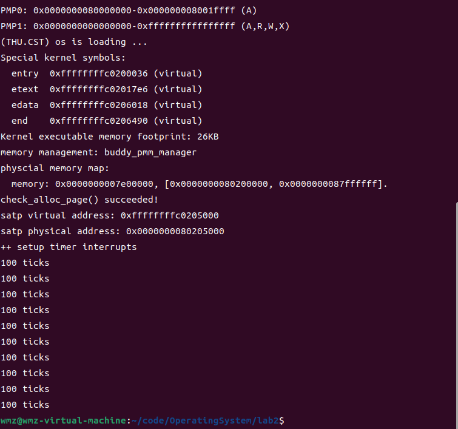
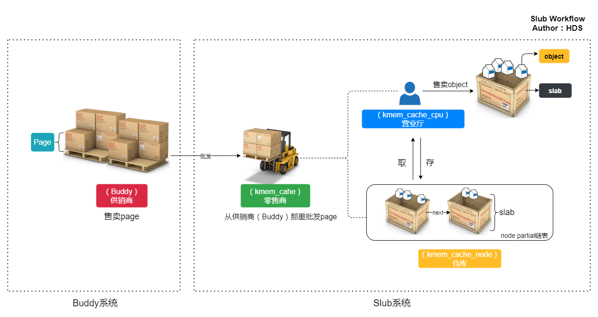
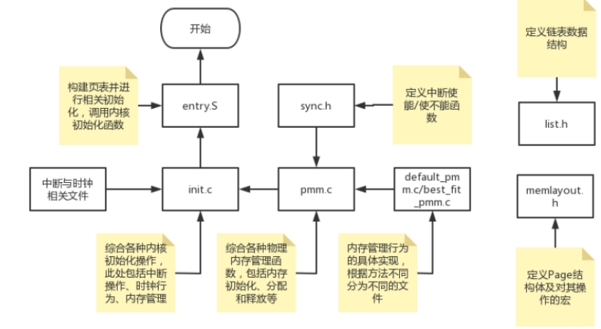

# Lab2：物理内存和页表

## 练习1：理解 first-fit 连续物理内存分配算法（思考题）
>first-fit 连续物理内存分配算法作为物理内存分配一个很基础的方法，需要同学们理解它的实现过程。请大家仔细阅读实验手册的教程并结合kern/mm/default_pmm.c中的相关代码，认真分析default_init，default_init_memmap，default_alloc_pages， default_free_pages等相关函数，并描述程序在进行物理内存分配的过程以及各个函数的作用。 请在实验报告中简要说明你的设计实现过程。

`ucore`中采用面向对象编程的思想，将物理内存管理的内容抽象成若干个特定的函数，并以结构体`pmm_manager`作为物理内存管理器封装各个内存管理函数的指针，这样在管理物理内存时只需调用结构体内封装的函数，从而可将内存管理功能的具体实现与系统中其他部分隔离开。`pmm_manager`中保存的函数及其功能如下所述：

```cpp
// kern/mm/pmm.h
struct pmm_manager {
    const char *name; /*物理内存管理器的名称*/
    void (*init)(void); /*物理内存管理器初始化，包括生成内部描述和数据结构（空闲块链表和空闲页总数）*/ 
    void (*init_memmap)(struct Page *base, size_t n); /*初始化空闲页，根据初始时的空闲物理内存区域将页映射到物理内存上*/
    struct Page *(*alloc_pages)(size_t n); /*申请分配指定数量的物理页*/
    void (*free_pages)(struct Page *base, size_t n); /*申请释放若干指定物理页*/
    size_t (*nr_free_pages)(void); /*查询当前空闲页总数*/
    void (*check)(void); /*检查物理内存管理器的正确性*/
};
```
`pmm_manager`提供了各种接口：分配页面，释放页面，查看当前空闲页面数，这些接口作为函数指针，作为`pmm_manager`的一部分，下一步我们需要把那些函数指针变量赋值为真正的函数名称。

我们在`pmm_init()`里调用了`init_pmm_manager()`, 在这里面我们把`pmm_manager`的指针赋值成`&default_pmm_manager`， 实现了那些接口。
```c
// kern/mm/pmm.c
static void init_pmm_manager(void) {
    pmm_manager = &default_pmm_manager;
    cprintf("memory management: %s\n", pmm_manager->name);
    pmm_manager->init();
}
```

然后我们在`default_pmm_manager`结构体中实现了`First Fit`算法。`First Fit`算法就是当需要分配页面时，它会从空闲页块链表中找到第一个适合大小的空闲页块，然后进行分配。当释放页面时，它会将释放的页面添加回链表，并在必要时合并相邻的空闲页块，以最大限度地减少内存碎片。

`default_pmm.c`通过五个函数实现其功能：
- default_nr_free_pages：返回freelist中的空闲页的数目
- default_init：初始化物理内存管理器；
- default_init_memmap：初始化空闲页；
- default_alloc_pages：申请分配指定数量的物理页；
- default_free_pages: 申请释放若干指定物理页；

`default_init`初始化了内存管理器，`default_init_memmap`将物理内存映射到`struct Page`结构体中并插入`free_list`链表中。当需要分配内存时，`default_alloc_pages`在`free_list`中寻找符合条件的内存块并分割，返回分配的内存块的指针。释放内存时，`default_free_pages`将被释放的内存块标记为空闲，并尝试合并相邻的空闲内存块。最后，`basic_check` 和 `default_check` 函数用于验证内存分配算法的正确性，确保分配和释放的行为符合预期。整个过程中，`free_list`链表记录了空闲内存块的信息，`nr_free`变量记录了剩余的空闲页面数。

### default_nr_free_pages

该函数用于返回freelist中的空闲页的数目。其实现如下：

```cpp
typedef struct {
    list_entry_t free_list;
    unsigned int nr_free;
} free_area_t;

free_area_t free_area;
#define free_list (free_area.free_list)
#define nr_free (free_area.nr_free)

static size_t
default_nr_free_pages(void) {
    return nr_free;
}
```

该函数返回`nr_free`并通过宏定义转为`(free_area.nr_free)`，而`free_area`是`free_area_t`对象，里面有`free_list`和`nr_free`两个属性。在申请及释放页面时，都会对这两个属性进行修改，从而使得`nr_free`一直等于空闲页面的数目。

### default_init

该函数对freelist进行了初始化。

```cpp
static inline void
list_init(list_entry_t *elm) {
    elm->prev = elm->next = elm;
}

static void
default_init(void) {
    list_init(&free_list);
    nr_free = 0;
}
```

首先初始化当前系统的`free_list`指针，将其头尾相连，表示空页为0。然后将`nr_free`即空页数目设为0.


### default_init_memmap
```cpp
static void default_init_memmap(struct Page *base, size_t n) {
    assert(n > 0); // 确保要初始化的物理页数量大于0
    struct Page *p = base;// 创建一个指向物理页的指针 p，初始化为 base
    for (; p != base + n; p ++) {
        assert(PageReserved(p)); // 对每个物理页进行检查，确保每个物理页都是已被内核保留的，不能用于分配或释放操作。
        //PG_reserved：如果该位被设置为1，则表示页面帧已被内核保留，不能用于分配或释放操作；
        //如果该位被设置为0，则表示页面帧未被保留，可以用于分配或释放操作。
        p->flags = p->property = 0; // 清空物理页的标志和属性字段
        set_page_ref(p, 0); // 将物理页的引用计数设置为0
    }
    base->property = n; // 设置地址为 base 物理页的 property 字段为 n，表示连续的空闲页数量
    SetPageProperty(base); // 设置 base 物理页的 "property" 标志位
    //PG_property：如果该位被设置为1，则表示页面帧是空闲内存块的首个页面，可以用于分配操作；
    //如果该位被设置为0，则表示页面帧不是空闲内存块的首个页面，或者该内存块已经被分配。
    nr_free += n; // 增加系统中的可用空闲页数量
    //插入到表头
    if (list_empty(&free_list)) {
        // 如果空闲页列表为空，将 base 物理页添加到空闲页列表中
        list_add(&free_list, &(base->page_link));
    } else {
        list_entry_t* le = &free_list;
        // 遍历空闲页列表，将物理页插入表中
        while ((le = list_next(le)) != &free_list) {
            //计算得到page的地址
            struct Page* page = le2page(le, page_link);
            if (base < page) {
                list_add_before(le, &(base->page_link));
                break;
            } else if (list_next(le) == &free_list) {
                //插入到表尾
                list_add(le, &(base->page_link));
            }
        }
    }
}
```
计算`page`地址的相关函数如下：
```c
// convert list entry to page
#define le2page(le, member)                 \
    to_struct((le), struct Page, member)

#define to_struct(ptr, type, member)                               \
    ((type *)((char *)(ptr) - offsetof(type, member)))

#define offsetof(type, member)                                      \
    ((size_t)(&((type *)0)->member))
```
`default_init_memmap`函数初始化一整个空闲物理内存块，将块内每一页对应的Page结构初始化，并添加到系统的空闲页列表中，以供后续的内存分配操作使用。

**函数实现流程**
- 检查要初始化的物理页数量`n`是否大于0。
- 遍历连续的物理页，对每个物理页执行以下操作：
  - 确保该物理页是被内核保留的。
  - 物理页的`flag`和`property`都设置为0。
  - 将物理页的引用计数设置为0。
- 设置 `base` 物理页的 `property` 字段为 `n`，表示这些物理页构成一个连续的空闲内存块。
- 设置 `base` 物理页的 `property` 标志位，表示这个物理页是一个空闲内存块的首个页面。
- 增加系统中的可用空闲页数量 `nr_free`，增加的数量为 `n`。
- 把这个初始化的内存块加入到空闲列表中，分为三种情况，分别调用双向链表中的不同函数插入到表头，表中和表尾。

### default_alloc_pages
```cpp
static struct Page *
default_alloc_pages(size_t n) {
    assert(n > 0); //确保要使用的物理页数大于0
    if (n > nr_free) {  //需求页大于现有页
        return NULL;
    }
    struct Page *page = NULL;
    list_entry_t *le = &free_list;
    while ((le = list_next(le)) != &free_list) {
        struct Page *p = le2page(le, page_link);
        if (p->property >= n) {  //空闲页多于需求
            page = p;
            break;
        }
    }
    if (page != NULL) { //可以分配到Page
        list_entry_t* prev = list_prev(&(page->page_link)); //获取空闲Page链表中该page的前一个Page的list_entry变量地址
        list_del(&(page->page_link));  //该page从链表删除
        if (page->property > n) { //把剩余的块重新加到页链表里
            struct Page *p = page + n;  //新页
            p->property = page->property - n; //property物理页数量减去需要的n
            SetPageProperty(p);  //设置新Page的PG_Property
            list_add(prev, &(p->page_link)); //将新Page加入到获取的前一个Page指针prev的后面
        }
        nr_free -= n;  //空闲页减去n
        ClearPageProperty(page);
    }
    return page;
}

```
default_alloc_pages函数主要实现了根据所需的物理页n，查找符合要求的第一个Page，返回其指针，然后将该page从链表中删去，将page中剩余的物理页作为一个新的Page重新加入到Page链表中。

**函数具体实现流程**：
*  首先`assert(n > 0)` 判断需要的物理页 `n` 是否大于0，然后判断目前所有的空闲物理内存页 `nr_free` 是否多于需要的内存页数。
* 如果 `n <= nr_free` ，令指针le指向空闲Page的 `list_entry` 成员变量链表 `free_list` 的首地址，`while` 循环从头遍历该链表，调用函数 `le2page` 进行强制类型转化，令指针p指向当前Page的地址，判断其空闲页数量 `p->property` 是否大于等于n。如果大于等于n，则找到了满足令指针page指向p，跳出循环。
* 调用 `list_prev` 函数获得空闲Page链表中page的前一个Page并赋给指针 `prev`，函数 `list_del` 将page从链表中删除。如果分配page的空闲页多于需求，则定义一个新的Page指针p，令其等于 `page+n` ，即从当前Page的首页向后偏移n个页，得到多出的物理页的首地址，设置其Property为 `page->property - n` ，`SetPageProperty(p)` 重新设置  `PG_Property` 标志位，表明其为当前新空闲内存块的首页，之后调用函数 `list_add` 将新块p加在链表。
* 最后更新系统所有的空闲物理页数，即 `nr_free-=n` ，并且 `ClearPageProperty(page)` ，清除查找到的page的 `PG_Property` 标志位，表明其不再是空闲Page。

### default_free_pages

该函数的定义如下：`default_free_pages(struct Page *base, size_t n)`。其作用为从地址`base`指向的页面开始，释放`n`个页面。

#### 总体流程

- 将相应页面设为空页面
- 将相应页面加入空闲列表
- 合并相邻空闲块

下面逐一介绍各个流程：

#### 将相应页面设为空页面

该步骤首先确保n>0，然后确保要释放的每个页面都不为空，最后清空相应页面的flags和ref。

```cpp
assert(n > 0); // 确保n大于0
struct Page *p = base;
for (; p != base + n; p ++) { // 将相应页面设为空页面
    assert(!PageReserved(p) && !PageProperty(p));//保证当前页面已经使用
    p->flags = 0;//清空flags
    set_page_ref(p, 0);//清空ref
}
```

#### 加入空闲列表

该步骤首先将该块的空闲列表数设为n，并将base指定为空闲列表块的开头，然后增加总的空闲列表数。然后判断空闲列表是否为空，如果空闲列表为空，则直接插入；否则遍历空闲列表项，根据list_entry_t得到对应的page，按照base的地址大小插入，使空闲列表保持地址的**有序性**。

```cpp
base->property = n;//将该块的空闲列表数设为n
SetPageProperty(base);//将base指定为空闲列表块的开头
nr_free += n;//增加总的空闲列表数
if (list_empty(&free_list)) {//如果空闲列表为空，则直接插入
    list_add(&free_list, &(base->page_link));
} else {
    list_entry_t* le = &free_list;
    while ((le = list_next(le)) != &free_list) {
        struct Page* page = le2page(le, page_link);//根据list_entry_t得到对应的page
        if (base < page) {//找到第一个地址更大的块，插入在之前
            list_add_before(le, &(base->page_link));
            break;
        } else if (list_next(le) == &free_list) {//遍历到末尾，直接插入
            list_add(le, &(base->page_link));
        }
    }
}
```

#### 合并相邻空闲块

首先向前合并，得到前一个空闲块的`list_entry_t`指针并在其不等于`free_list`的情况下进一步得到对应空闲块开头的`page`。如果两个空闲块相邻，则将本块合并到前一个块中，然后将本块的`PG_property`属性设为0，并删除本块的空闲列表项，然后将`base`改为前一块的指针。

然后向后合并，得到后一个空闲块的`list_entry_t`指针并在其不等于`free_list`的情况下进一步得到对应空闲块开头的`page`。如果两个空闲块相邻，则将后一个块合并到本块中，然后将后一个块的`PG_property`属性设为0，并删除后一个块的空闲列表项。

```cpp
list_entry_t* le = list_prev(&(base->page_link));
if (le != &free_list) {
    p = le2page(le, page_link);//得到空闲列表项对应的page
    if (p + p->property == base) {//如果与前一个空闲块相邻
        p->property += base->property;//合并到前一个块中
        ClearPageProperty(base);//将本块的`PG_property`属性设为0
        list_del(&(base->page_link));.//删除本块的空闲列表项
        base = p;
    }
}

le = list_next(&(base->page_link));
if (le != &free_list) {
    p = le2page(le, page_link);//得到空闲列表项对应的page
    if (base + base->property == p) {//如果与后一个空闲块相邻
        base->property += p->property;//后一个块合并到本块中
        ClearPageProperty(p);//将后一个块的`PG_property`属性设为0
        list_del(&(p->page_link));//删除后一个块的空闲列表项
    }
}
```

>请回答如下问题：你的first fit算法是否有进一步的改进空间？
first fit存在的问题以及可以改进的地方如下：
* **碎片问题**：First Fit算法可能会导致内存碎片，特别是外部碎片。外部碎片是指内存中有很多小的未分配的块，但它们无法用于满足大块内存请求。这种情况可能导致内存利用率低下。
* **优化内存利用**：First Fit不一定是最有效的内存分配算法，它可能导致内存浪费。进一步的改进可能包括使用更复杂的算法，如最佳适应（Best Fit）或下次适应（Next Fit），以更好地利用可用内存。
* **性能问题**：First Fit可能需要遍历整个空闲内存块列表以找到第一个适合的块，这可能在内存管理系统中引入性能问题，特别是在有大量内存块时。
* **处理外部碎片**：First Fit不处理外部碎片，这可能需要额外的步骤来合并或重组内存块以最大程度地减少碎片问题。
* **多任务环境**：在多任务操作系统中，First Fit可能需要考虑更多的因素，如内存分区、进程切换和动态内存需求。这可能需要更复杂的算法和数据结构来管理内存。

总之，虽然First Fit算法是一个简单而容易实现的内存分配算法，但在一些情况下，它可能需要改进以更好地应对内存碎片和提高性能。改进可以包括使用更复杂的分配策略，实现内存合并、分区和动态内存分配等技术，以便更好地管理系统的内存。
## 练习2：实现 Best-Fit 连续物理内存分配算法（需要编程）
>在完成练习一后，参考kern/mm/default_pmm.c对First Fit算法的实现，编程实现Best Fit页面分配算法，算法的时空复杂度不做要求，能通过测试即可。 请在实验报告中简要说明你的设计实现过程，阐述代码是如何对物理内存进行分配和释放.

`Best-fit` 算法选择最能满足进程需求的空闲块分配给进程。它会遍历所有的空闲块，找到一个最接近所需大小的块，这样可以最大程度地减少内存碎片。然而，这个算法需要更多的计算开销，因为它必须查找整个内存块列表以找到最佳匹配。

### best_fit_init_memmap
```cpp
static void
best_fit_init_memmap(struct Page *base, size_t n) {
    assert(n > 0);
    struct Page *p = base;
    for (; p != base + n; p ++) {
        assert(PageReserved(p));
        /*LAB2 EXERCISE 2: 2111460*/ 
        // 清空当前页框的标志和属性信息，并将页框的引用计数设置为0
        p->flags = p->property = 0;
        set_page_ref(p, 0);
    }
    base->property = n;
    SetPageProperty(base);
    nr_free += n;
    if (list_empty(&free_list)) {
        list_add(&free_list, &(base->page_link));
    } else {
        list_entry_t* le = &free_list;
        while ((le = list_next(le)) != &free_list) {
            struct Page* page = le2page(le, page_link);
             /*LAB2 EXERCISE 2: 2111460*/ 
            // 编写代码
            // 1、当base < page时，找到第一个大于base的页，将base插入到它前面，并退出循环
            // 2、当list_next(le) == &free_list时，若已经到达链表结尾，将base插入到链表尾部
            if (base < page) {
                list_add_before(le, &(base->page_link));
                break;
            } else if (list_next(le) == &free_list) {
                list_add(le, &(p->page_link));
            }
        }
    }
}
```
`best_fit_init_memmap`函数是为了将一块内存区域分割成页框（Page）并将它们加入到空闲内存块链表中，这个过程对于两种内存分配算法都是必要且一致的，故在填充时只需将 `first-fit` 中的代码在理解的基础上照搬即可。对当前页框的标志和属性信息以及引用计数的清零很容易实现；将当前内存块按地址升序排列插入到`free_list`中时，使用了双向链表值的判断与插入，注意实现时需要用对给定的函数接口。
### best_fit_alloc_pages
该函数是实现 `best_fit` 算法的具体分配函数，总体思想是从空闲Page链表中找到满足最接近物理页面需求n的Page，同时将此Page中的剩余物理页面作为一个新Page加入到链表中。
```cpp
static struct Page *
best_fit_alloc_pages(size_t n) {
    assert(n > 0);  //确保n>0
    if (n > nr_free) {   //需求页数大于现有页数
        return NULL;
    }
    struct Page *page = NULL;
    list_entry_t *le = &free_list;
    size_t min_size = nr_free + 1; //表示满足需求的Page的最小页数
     /*LAB2 EXERCISE 2: 2112558*/ 
    // 下面的代码是first-fit的部分代码，请修改下面的代码改为best-fit
    // 遍历空闲链表，查找满足需求的空闲页框
    // 如果找到满足需求的页面，记录该页面以及当前找到的最小连续空闲页框数量

    while((le=list_next(le))!=&free_list){
        struct Page *p=le2page(le,page_link);
        if((p->property>=n)&&(p->property<min_size)){ //当前page的页数大于等于n，并且小于目前满足需求的最小的页数，更新Page
            page=p;
            min_size=p->property; //更新min_size
        }
    }

    if (page != NULL) {  //成功分配Page
        list_entry_t* prev = list_prev(&(page->page_link));
        list_del(&(page->page_link));
        if (page->property > n) {  //该页面空闲页数大于n，将剩余的物理页作为一个新Page加入到Page链表中
            struct Page *p = page + n;
            p->property = page->property - n;  //属性值为剩余的物理页数
            SetPageProperty(p);  //设置p的属性标记为空闲Page
            list_add(prev, &(p->page_link));   //加入到Page链表中
        }
        nr_free -= n;
        ClearPageProperty(page);  //清除属性标志，page不再是空闲Page
    }
    return page;
}

```
`best_fit_alloc_pages` 分配函数的具体实现大部分与 `default_fit_alloc_pages` 类似，均是先判断n是否大于0，现有的物理页面nr_free是否大于n，然后 `while` 循环遍历Page链表 `free_lits`，查找满足需求的Page，然后将该Page从链表中删除，剩余物理页面作为一个新Page加入到Page链表中，不同点主要在于：
* `size_t min_size = nr_free + 1` 定义了一个变量min_size，用来表示满足需求的Page的最小物理页面
* `if((p->property>=n)&&(p->property<min_size))` 查找Page时，判断其物理页面是否大于n，并且是否小于min_size，如果满足，则执行 `page=p` ，当前内存块p作为分配的Page，并且`min_size=p->property` 更新min_size为当前Page的property值。


### best_fit_free_pages

该函数用于释放从给定地址`base`开始的`n`个页面，其实现与first-fit中的没有区别，下面主要介绍空缺部分代码的编写：

#### 任务1

> 设置当前页块的属性为释放的页块数、并将当前页块标记为已分配状态、最后增加nr_free的值

```cpp
/*LAB2 EXERCISE 2: 2113972*/
base->property = n;//设置当前页块的属性为释放的页块数
SetPageProperty(base);//将当前页块标记为已分配状态
nr_free += n;//增加nr_free的值
```

#### 任务2
>1、判断前面的空闲页块是否与当前页块是连续的，如果是连续的，则将当前页块合并到前面的空闲页块中\
2、首先更新前一个空闲页块的大小，加上当前页块的大小\
3、清除当前页块的属性标记，表示不再是空闲页块\
4、从链表中删除当前页块\
5、将指针指向前一个空闲页块，以便继续检查合并后的连续空闲页块

```cpp
/*LAB2 EXERCISE 2: 2113972*/
if (p + p->property == base) {//如果前面的空闲页块与当前页块连续
    p->property += base->property;//将前一个页块加上当前页块大小
    ClearPageProperty(base);//清除当前页块的属性标记，表示不再是空闲页块
    list_del(&(base->page_link));//从链表中删除当前页块
    base = p;//将base指针指向前一个空闲页块
}
```

### 结果展示
#### make qemu

通过`make qemu`检测`best_fit`的正确性，结果如上图所示，entry、etext、edata、end、physcial memory map 等信息也与设想中的一致，证明了算法实现的正确性。

#### meke grade

通过`make grade`再次检测`best_fit`的正确性，得到了满分，进一步证明了算法实现的正确性。

>请回答如下问题：你的 Best-Fit 算法是否有进一步的改进空间？
Best_fit算法存在的局限性如下：
* **外部碎片问题**：使用Best-Fit算法可能会导致外部碎片问题，因为它会留下许多小的未使用空间，这些空间太小而无法满足较大的内存请求。这可能导致内存利用率降低。
* **分配时间复杂度**：Best-Fit算法需要在整个空闲内存块列表中搜索最佳适应的块。这可能会导致较高的时间复杂度，尤其是在大型内存管理系统中。
* **内存碎片整理**：Best-Fit算法可能需要采取额外的步骤来合并碎片化的内存块，以最大程度地减少外部碎片。这些合并操作可能会增加额外的开销。
* **性能问题**：类似于First-Fit算法，Best-Fit算法在某些情况下可能会引入性能问题，特别是在有大量内存块时。

针对上述问题，可以考虑以下措施进行优化：

* **综合分配策略**：将Best-Fit算法与其他适当的分配策略结合使用，以便更好地处理不同大小的内存请求。
* **内存碎片整理**：实现内存碎片整理算法，以便在必要时合并和重新组织内存块，从而最大限度地减少外部碎片。
* **高效的数据结构**：设计高效的数据结构和搜索算法来管理可用的内存块，比如二分查找等，以减少搜索和分配时间。
* **动态内存分配管理**：引入动态内存分配管理技术，可以根据内存需求的动态变化来调整内存分配策略。
##  扩展练习 Challenge1：buddy system（伙伴系统）分配算法（需要编程）
> Buddy System 算法把系统中的可用存储空间划分为存储块 (Block) 来进行管理, 每个存储块的大小必须是 2 的n 次幂 (Pow(2, n)), 即 1, 2, 4, 8, 16, 32, 64, 128…
> • 参考伙伴分配器的一个极简实现，在 ucore 中实现 buddy system 分配算法，要求有比较充分的测试用例说明实现的正确性，需要有设计文档。

### 算法介绍


Buddy系统是一种内存分配算法，用于管理计算机系统中的物理内存。它的主要目标是解决内存碎片问题，以便更有效地分配和回收内存。Buddy系统将物理内存划分为一组连续的块，这些块的大小是2的幂次方。以下是Buddy系统的工作原理：

- 内存分割：Buddy系统将物理内存划分为一组大小相等的块，每个块包含2的幂次方个页，例如，1页、2页、4页等。

- 内存分配：当需要分配内存时，Buddy系统会查找一个与请求的内存大小最接近的、尚未分配的块。如果该块的大小正好等于所需内存大小，它会被分配。如果块的大小大于所需内存，它将被拆分成两个较小的块，其中一个块会被分配，而另一个块将被保留以备将来使用。这个拆分过程将一直进行，直到找到一个大小合适的块或达到最小的块。

- 内存释放：当释放内存时，Buddy系统将释放的内存块与相邻的空闲块合并，以形成更大的块。这个合并过程会一直进行，直到无法再合并为止。

- 内存管理策略：Buddy系统通常使用二叉树结构来管理这些块，其中每个节点代表一个块。树的根节点表示整个可用内存，每个子节点表示一个较小的块。内存分配和释放的过程涉及遍历这个树，查找合适的块以供分配或合并。



Buddy系统的优点包括内存分配效率高，容易管理，且能够避免外部碎片的问题。然而，它也存在一些缺点，如内部碎片（由于块大小必须是2的幂次方而产生）和对树结构的维护可能会引入一定的开销。它通常用于嵌入式系统和实时系统等特定环境中，对内存效率要求较高的情况下。

### 算法设计

#### 全局变量

- unsigned *root：堆的根节点
- unsigned root_size：根节点能保存的最大页数
- struct Page *base_page：可分配页面实际开始地址（前面是堆）
- int free_page_num：空闲页数
- int node_num：堆的节点数
- int buddy_page_num：存放堆消耗的页数

#### 函数接口

- unsigned fix_up(unsigned num)：向上舍入到最近的2的整数次幂的幂
- unsigned fix_down(unsigned num)：向下舍入到最近的2的整数次幂的幂
- void update(int index)：更新某个index对应的longest
- size_t buddy_nr_free_pages(void)：返回freelist中的空闲页的数目
- void buddy_init(void)：初始化物理内存管理器；
- void buddy_init_memmap(struct Page *base, size_t n)：初始化内存；
- struct Page *buddy_alloc_pages(size_t n)：申请分配指定数量的物理页；
- void buddy_free_pages(struct Page *base, size_t n): 申请释放若干指定物理页；
- static void buddy_check(void)：对buddy算法进行测试

### 宏定义

代码首先宏定义了一些函数，以简化代码编写，编写的函数如下：

- LEFT_LEAF(index)：返回当前节点的左孩子节点在数组中的下标
- RIGHT_LEAF(index)：返回当前节点的右孩子节点在数组中的下标
- PARENT(index)：返回当前节点的父节点在数组中的下标
- MAX(a, b)：计算 a 和 b 中的较大值
- MAX_LONGEST(index)：计算某个index对应的最大longest（longest即该节点最大还能分配多长的页面）

```cpp
// 计算当前节点的左孩子节点在数组中的下标；
#define LEFT_LEAF(index) ((index) << 1)
// 计算当前节点的右孩子节点在数组中的下标；
#define RIGHT_LEAF(index) (((index) << 1) + 1)
// 计算当前节点的父节点在数组中的下标；
#define PARENT(index) ((index) >> 1)
// 计算 a 和 b 中的较大值。
#define MAX(a, b) ((a) > (b) ? (a) : (b))
// 计算某个index对应的最大longest
#define MAX_LONGEST(index) (root_size >> fix_down(index))
```

### 舍入函数

本实验实现了两个舍入函数，分别是：

- fix_up(unsigned num)：向上舍入到最近的2的整数次幂的幂
- fix_down(unsigned num)：向下舍入到最近的2的整数次幂的幂

对于`fix_up`函数，首先初始化幂`power`为0，然后不断递增`power`，直到`2^power`大于等于当前值，返回此时的`power`。

对于`fix_down`函数，首先初始化幂`power`为0，然后不断递增`power`，直到`2^(power+1)`大于当前值，返回此时的`power`。

```cpp
// 向上舍入到最近的2的整数次幂的幂
unsigned fix_up(unsigned num){
    int power = 0;
    while ((1 << power) < num) {
        power++;
    }
    return power;
}

// 向下舍入到最近的2的整数次幂的幂
unsigned fix_down(unsigned num){
    int power = 0;
    while ((1 << (power + 1)) <= num) {
        power++;
    }
    return power;
}
```

### 更新函数

该函数用于更新某个index对应的longest，其实现流程如下：

- 如果有左子树
    - 如果有右子树
        -  如果左子树与右子树的longest相等且等于该位置最大的longest
            - 将该节点的longest设为两者的和
        - 否则
            - 将该节点的longest设为两者的较大值
    - 否则
        - 等于左子树的longest

```cpp
// 更新某个index对应的longest
static void update(int index){
    int l_index = LEFT_LEAF(index);
    int r_index = RIGHT_LEAF(index);
    if (l_index < node_num) {//存在左子树
        if (r_index < node_num) {//存在右子树
            // 如果左子树与右子树的longest相等且等于该位置最大的longest
            if (root[l_index] == root[r_index] && root[r_index] == MAX_LONGEST(r_index)) {
                root[index] = 2 * root[r_index];// 将该节点的longest设为两者的和
            } else {//不存在右子树
                root[index] = MAX(root[l_index], root[r_index]); // 将该节点的longest设为两者的较大值
            }
        } else {// 存在左子树不存在右子树
            root[index] = root[LEFT_LEAF(index)]; // 等于左子树的longest
        }
    }
}
```

### buddy_init_memmap

该函数用于从base页面开始初始化n个页面，其实现如下：

函数首先确保n大于零，然后遍历这n个页面，确保当前页面是保留的，并清空当前页框的标志信息，将页框的引用计数设置为0，将页面设为空闲态。

然后，函数开始在页面的开头建立堆，以管理每个页面。首先将实际分配的大小向上变为最近的2的整数次幂，并计算堆的大小，由于是从1开始编码，所以需要2倍的空间。然后，将base通过page2pa转化为起始页面的物理地址并进一步通过KADDR转为虚拟地址，以作为堆的开头。之后根据堆的大小计算需要的页数，将堆之后的第一页设为base_page，并计算空闲页的数量。

由于申请的页数向上变为最近的2的整数次幂，而系统输入的n为物理内存能容纳的最大页数，所以多申请的页数是非法的，需要先将多申请的部分的longest设为0，以保证不会使用这些页，然后将剩下的叶子节点设为1。而对于树的内部节点，则通过update计算longest。

```cpp
static void buddy_init_memmap(struct Page *base, size_t n){
    assert(n > 0); // 确保n大于零
    for (struct Page *p = base; p != base + n; p++) {
        assert(PageReserved(p)); // 判断当前页面是否是保留的
        // 清空当前页框的标志信息，并将页框的引用计数设置为0，将页面设为空闲态
        p->flags = 0;
        set_page_ref(p, 0);
        SetPageProperty(p);
    }

    // 构建二叉树存储不同节点的使用情况
    // 实际分配的大小，向上变为最近的2的整数次幂
    root_size = 1 << fix_up(n);
    // 二叉树数组的大小，从1开始编码，所以需要2倍的空间
    node_num = 2 * root_size;
    // 利用最开始的若干页建立二叉树组
    root = (unsigned *)KADDR(page2pa(base));
    // 得到二叉树组需要的页数
    int buddy_page_size = node_num * sizeof(unsigned *);
    buddy_page_num = buddy_page_size / 4096 + (int)(buddy_page_size % 4096 != 0);
    // 得到能分配的页的首地址
    base_page = base + buddy_page_num;
    // 更新空闲页
    free_page_num += n - buddy_page_num;

    // 由于申请的页数向上变为最近的2的整数次幂，而系统输入的n为物理内存能容纳的最大页数，所以多申请的页数是非法的
    // 将多申请的部分的longest设为0
    for (int i = root_size + free_page_num; i <= node_num; i++) {
        root[i] = 0;
    }
    // 将叶子节点的longest设置为1
    for (int i = root_size + free_page_num - 1; i >= root_size; i--) {
        root[i] = 1;
    }
    // 更新每个块的longest
    for (int i = root_size - 1; i > 0; i--) {
        update(i);
    }
}
```

#### 要点

1. 由于在所申请的base位置放置了堆，所以可分配内存的实际起始页是base_page。

2. 由于算法最开始通过fix_up将申请的页数向上变为了距离最近的2的整数次幂数，而系统输入的n为物理内存能容纳的最大页数，所以多申请的页数是非法的，需要将多申请的部分的longest设为0，以防止访问错误的地址。

3. page2pa得到的是页面的物理地址，需要通过KADDR转为虚拟地址才能使用。

### buddy_alloc_pages

该函数的作用是申请n个页供其他函数使用，其实现如下：

该函数首先保证n大于零，然后将n向上变为最近的2的整数次幂，当没有足够空间时返回NULL。

之后从根节点往下深度遍历，先判断左子树的longest是否大于申请页数，如果大于则先向左子树申请，否则则向右子树申请，直到找到恰好等于size的块，得到index。

然后通过上述步骤得到的index计算对应的起始页面。首先计算左兄弟节点数目，然后计算划分出去的块的首页，之后循环将这些page的状态设为已分配。

最后，我们向上回溯至根节点，修改沿途节点的longest，不需要向下修改，因为分配内存是从上往下申请的，当找到一个0时就不会再向下。

```cpp
static struct Page *buddy_alloc_pages(size_t n){
    assert(n > 0);       // 保证n大于零
    unsigned index = 1;  // 根节点开始遍历
    n = 1 << fix_up(n);  // 将n向上变为最近的2的整数次幂
    if (n > root[index]) // 当没有足够空间时返回NULL
        return NULL;

    // 从根节点往下深度遍历，找到恰好等于size的块
    for (size_t node_size = root_size; node_size != n; node_size /= 2) {
        if (root[LEFT_LEAF(index)] >= n) { // 先向左子树申请
            index = LEFT_LEAF(index);
        } else { // 左子树没有时再向右子树申请
            index = RIGHT_LEAF(index);
        }
    }

    // 计算对应的起始页面
    int left_brother_num = index - (1 << fix_down(index));     // 计算左兄弟节点数目
    struct Page *base = base_page + (left_brother_num * n);    // 计算开始的page
    for (struct Page *page = base; page != base + n; page++) { // 更新属性
        ClearPageProperty(page);
    }

    // 更新堆中对应节点的longest
    root[index] = 0;    // 将找到的块取出分配
    free_page_num -= n; // 更新空闲页数
    // 向上回溯至根节点，修改沿途节点的大小
    // 不需要向下修改，因为分配内存是从上往下申请的，当找到一个0时就不会再向下
    while (PARENT(index)) {
        index = PARENT(index);
        update(index);
    }

    return base;
}
```

### buddy_free_pages

该函数首先保证n大于零，并将n向上变为最近的2的整数次幂，然后检查对应page是否是保留态且已分配，将ref设为0。

然后计算对应叶节点索引，并不断转向父节点直到找到对应节点。之后将对应节点的longest设置为n并更新空闲页数目。最后再回溯直到根节点，更改沿途的longest。

```cpp
static void buddy_free_pages(struct Page *base, size_t n)
{
    assert(n > 0);      // 保证n大于零
    n = 1 << fix_up(n); // 将n向上变为最近的2的整数次幂

    // 检查对应page是否是保留态且已分配，将ref设为0
    for (struct Page *p = base; p < base + n; p++) {
        assert(!PageReserved(p) && !PageProperty(p));
        set_page_ref(p, 0);
    }

    // 对应叶节点索引
    unsigned index = root_size + (base - base_page);

    // 找到对应节点
    for (unsigned node_size = 1; node_size != n; node_size <<= 1) {
        index = PARENT(index);
        assert(index); // 防止index为0
    }

    root[index] = n;    // 将对应节点的longest设置为n
    free_page_num += n; // 更新空闲页数目

    // 回溯直到根节点，更改沿途的longest
    while (PARENT(index)) {
        index = PARENT(index);
        update(index);
    }
}
```

### buddy_check

该测试函数的流程如下：

1. 申请并多个单页面
2. 判断申请页面的地址是否相邻
3. 判断申请的页面的ref是否为0
4. 判断申请页面的地址是否合法
5. 释放页面
6. 申请并释放多个页面，且将一个块拆开释放
7. 在最前面申请若干页面，以测试块不再最前方时的正确性
8. 申请两块页面，释放前一块页面，再申请两个小的页面，判断两个小页面是否在刚释放的位置生成
9. 全部释放

```cpp
static void
buddy_check(void)
{
    // 申请并多个单页面
    struct Page *p0, *p1, *p2, *p3, *p4;
    p0 = p1 = p2 = NULL;
    assert((p0 = alloc_page()) != NULL);
    assert((p1 = alloc_page()) != NULL);
    assert((p2 = alloc_page()) != NULL);

    // 判断申请页面的地址是否相邻
    assert(p0 + 1 == p1 && p1 + 1 == p2);

    // 判断申请的页面的ref是否为0
    assert(page_ref(p0) == 0 && page_ref(p1) == 0 && page_ref(p2) == 0);

    // 判断申请页面的地址是否合法
    assert(page2pa(p0) < npage * PGSIZE);
    assert(page2pa(p1) < npage * PGSIZE);
    assert(page2pa(p2) < npage * PGSIZE);

    // 释放页面
    free_page(p0);
    free_page(p1);
    free_page(p2);

    // 申请并释放多个页面，且将一个块拆开释放
    p1 = alloc_pages(512);
    p2 = alloc_pages(512);
    free_pages(p1, 256);
    free_pages(p2, 512);
    free_pages(p1 + 256, 256);

    // 在最前面申请若干页面，以测试块不再最前方时的正确性
    p0 = alloc_pages(1024);
    assert(p0 == p1);

    // 申请两块页面，释放前一块页面，再申请两个小的页面
    // 判断两个小页面是否在刚释放的位置生成
    p1 = alloc_pages(128);
    p2 = alloc_pages(64);
    assert(p1 + 128 == p2);
    free_pages(p1, 128);
    p3 = alloc_pages(64);
    assert(p1 + 128 == p2);
    p4 = alloc_pages(64);
    assert(p4 == p3 + 64 && p4 == p2 - 64);

    // 全部释放
    free_pages(p2, 64);
    free_pages(p4, 64);
    free_pages(p3, 64);
    free_pages(p0, 1024);
}
```

### 结果展示

可以看到使用buddy_pmm_manager也能成功运行，并且通过了check_alloc_page()的检测，表明了实现的正确性。


##  扩展练习 Challenge2：任意大小的内存单元 slub 分配算法（需要编程）
> slub算法，实现两层架构的高效内存单元分配，第一层是基于页大小的内存分配，第二层是在第一层基础上实现基于任意大小的内存分配。可简化实现，能够体现其主体思想即可。

### 算法介绍
challenge2中的buddy system像是一个批发商，按页批发大量的内存。但是很多时候买东西并不需要去批发，而是去零售。零售商就是我们的slub分配算法。slub运行在buddy system之上，为内核（客户）提供小内存的管理功能。
>每个数组元素对应一种大小的内存，可以把一个kmem_cache结构体看做是一个特定大小内存的零售商，整个Slub系统中有很多个这样的零售商，每个“零售商”只“零售”特定大小的内存，例如：有的“零售商”只"零售"8Byte大小的内存，有的只”零售“16Byte大小的内存。
——luken.《linux内核内存管理slub算法(一)原理》


>每个零售商(kmem_cache)有两个“部门”，一个是“仓库”：kmem_cache_node，一个“营业厅”：kmem_cache_cpu。“营业厅”里只保留一个slab，只有在营业厅(kmem_cache_cpu)中没有空闲内存的情况下才会从仓库中换出其他的slab。
所谓slab就是零售商(kmem_cache)批发的连续的整页内存，零售商把这些整页的内存分成许多小内存，然后分别“零售”出去，一个slab可能包含多个连续的内存页。slab的大小和零售商有关。
——luken.《linux内核内存管理slub算法(一)原理》

slub算法将内存分组管理，每个组分别为2^3^,2^4^,2^5^,...,2^11^B和两个特殊组96B和192B。为什么这么分，因为我们的页大小默认为4KB=2^12^B，也就是说如果我们需要大于等于4KB的内存，就用buddy system批发，而需要小内存的时候就用slub来分配就行。

我们可以用一个kmem_cache数组 kmalloc_caches[12]来存放上面的12个组，可以把kmem_cache想象为12个零售商，每个零售商只卖一种东西。零售商有自己的仓库和自己的店面，店面里只有一个slab，如果slab卖完了再从仓库中换出其他的slab。

### 算法设计
在slub的使用过程中有如下几种情况。
1. 刚刚创建SLUB系统，第一次申请空间：

   在SLUB系统刚刚启动时，它没有可用的内存块。此时需要从buddy system中分配一些空闲的内存页。SLUB系统首先向buddy system请求一个或多个空闲的内存页，通常以页面大小（例如4KB）的倍数为单位分配。这些分配的页面将被划分为多个相同大小的SLUB对象，其中一部分会被放在"商店"，也就是SLUB管理器中。剩余的SLUB对象将被放在"仓库"中，等待后续使用。然后，SLUB系统可以分配其中一个对象并将其分配给应用程序（"顾客"），这是第一次分配。

2. 商店里有可用的对象：

   如果商店中有可用的SLUB对象，SLUB系统可以直接将一个对象分配给新的请求，无需从仓库中获取。

3. 商店没有对象，但仓库有：

   如果商店中没有可用的对象，但仓库中还有一些空闲的SLUB对象，SLUB系统将执行以下操作：
   - 从仓库中获取一个新的空的SLUB对象。
   - 将这个新的对象中的一个空闲块分配给应用程序（"顾客"）。
   - 仓库中的剩余SLUB对象继续等待以备后续使用。
4. 商店和仓库都没有对象：
   - 从buddy system请求更多的内存页，通常以页面大小的倍数。
   - 这些新的页面将被划分为多个SLUB对象，并一部分放在商店中。
   - 重复步骤2或步骤3，以满足应用程序的内存需求。

##  扩展练习 Challenge3：硬件的可用物理内存范围的获取方法（思考题）
> 如果 OS 无法提前知道当前硬件的可用物理内存范围，请问你有何办法让 OS 获取可用物理内存范围？

如果操作系统无法提前知道硬件的可用物理内存范围，通常可以通过以下方法来获取可用物理内存范围：

* **BIOS/UEFI信息**： 许多计算机系统在启动时会执行基本输入/输出系统（BIOS）或统一扩展固件接口（UEFI）代码，这些固件通常会提供有关系统硬件的信息，包括可用的物理内存范围。操作系统可以通过与这些固件接口进行通信来获取内存信息。这通常包括内存地址范围和大小。
* **ACPI表**： 高级配置与电源接口（ACPI）是一种标准，用于管理计算机硬件资源和电源管理。操作系统可以通过解析计算机的ACPI表格来获取内存信息，包括可用的物理内存地址范围和其属性。
* **物理内存扫描**： 如果其他方法无法获得内存信息，操作系统可以尝试进行物理内存扫描。这意味着操作系统会尝试访问整个物理内存地址范围，以查找可用内存块。这是一种相对低级的方法，可能需要直接访问硬件，因此在不同硬件平台上可能需要不同的实现。
* **引导参数传递**： 操作系统可以在引导过程中从引导加载程序（Bootloader）或引导引导加载器（如GRUB）接收可用内存信息作为引导参数。这些信息通常由引导加载程序从BIOS或其他源中获取，然后传递给操作系统内核。
* **使用设备树（Device Tree**）： 如果RISC-V系统使用设备树描述硬件配置，设备树可能包含有关内存的信息。操作系统内核可以解析设备树以获取内存范围和其他硬件信息。

**设备树**是一种描述硬件配置的数据结构，它包含了有关处理器、内存、外设以及其他硬件组件的信息，以下是在RISC-V操作系统中使用设备树获取可用物理内存范围的一般流程：
* **创建或编辑设备树**： 首先，需要创建或编辑设备树以包含有关可用物理内存的信息。这通常需要在引导加载程序（如Bootloader）的环境中完成。设备树通常是一个以.dts（Device Tree Source）为扩展名的文本文件。
* **定义内存节点**： 在设备树中，您需要定义一个内存节点来描述物理内存范围。这通常是在根级别的节点下进行定义。比如:
 ```
memory {
     device_type = "memory";
     reg = <0x80000000 0x40000000>; // 内存范围的起始地址和大小，以十六进制表示
 };
 ```
* **编译设备树**： 将设备树源文件编译为二进制设备树文件（.dtb），可以使用设备树编译器（dtc）来执行此操作。
* **在内核中解析设备树**： 操作系统内核（例如Linux）在启动时通常会加载设备树文件。内核将解析设备树文件，并可以访问其中定义的硬件信息，包括内存范围。
* **获取内存范围信息**： 在内核中，可以使用适当的API或方法来访问设备树中的内存节点，并提取内存范围的信息。具体的方法可能因操作系统版本和内核配置而异，但通常涉及使用设备树API来查找内存节点并读取 `reg` 属性的值

这个流程允许操作系统在不预先了解硬件配置的情况下，通过设备树获取可用物理内存范围。设备树的灵活性和通用性使其成为在多种不同硬件平台上运行RISC-V操作系统的强大工具。
# 知识点分析
## 重要知识点
### first fit算法
`first fit` （首次适应）算法是一种内存分配算法，用于将可用内存块分配给进程或程序。该算法的核心思想是将请求的内存块分配给第一个足够大的空闲内存块。其具体实现流程如下：
* **初始化**：首先，操作系统将物理内存划分成不同的分区或块。这些分区包括已分配给进程的内存块和未分配的空闲内存块。
* **请求内存**：当一个进程请求一定大小的内存块时，操作系统会搜索可用内存块列表（通常是一个链表或其他数据结构）以查找第一个足够大的空闲内存块。
* **分配内存**：一旦找到合适的内存块，操作系统将该内存块分配给请求的进程，并更新可用内存块列表以反映分配的变化。
* **内存碎片**：对于分配的内存块，如果该内存块的物理页数多于需求页，则需要把该内存块中剩余的物理页作为一个新的内存块加入到内存块列表中，更新内存块列表。如果该内存块过小，这些内存碎片便可能不能满足大内存请求。
### Best_fit算法
`Best Fit`（最佳适应）是一种内存分配算法，用于将可用内存块分配给进程或程序。它的核心思想是选择最小的合适的空闲内存块来满足进程的内存需求。`Best Fit` 算法的基本工作流程与`first fit` 算法类似，主要区别在于：
* **请求内存**：当一个进程请求一定大小的内存块时，操作系统会搜索可用内存块列表（通常是一个链表或其他数据结构）以查找最小的足够大的空闲内存块。
* **内存碎片**：与 `first fit` 分配算法不同，`Best Fit` 算法通常会产生较少的外部碎片，因为它选择最小的合适内存块。这有助于提高内存利用率。

虽然`Best_fit` 算法可以减少碎片的产生，提高内存利用率，但是它需要在可用内存块列表中进行线性搜索，因此可能会引入较高的时间复杂度。
### buddy system(伙伴系统)
伙伴系统（`Buddy System` ）是一种用于内存管理的动态分区分配算法，通常用于操作系统中。它的主要目标是减少内存碎片并提高内存分配的效率。下面是有关伙伴系统的重要知识点：
* **内存分割**： 在伙伴系统中，物理内存被分割成等大小的块，通常是2的幂次方大小。这些块是分割成一对，每对块大小相同，被称为"伙伴"。
* **分割过程**： 当进程请求一定大小的内存块时，伙伴系统会查找最小且大于或等于所需大小的伙伴块。如果找到一个伙伴块，它会被分割成两个块，其中一个分配给进程，而另一个成为新的伙伴块。
* **合并过程**： 当进程释放内存时，伙伴系统会检查它的内存块与相邻的内存块是否是伙伴。如果是伙伴，它们会合并成一个较大的内存块，并继续检查是否可以与更大的伙伴块合并。
* **内存块大小的限制**： 伙伴系统中内存块的大小通常是2的幂次方，这简化了合并和分割的过程。这也意味着伙伴系统不太适合处理非2的幂次方大小的内存分配请求，因为这可能会导致内存浪费。
* **内存碎片**： 伙伴系统有效地减少了外部碎片，因为所有的内存块都是2的幂次方大小，且可以方便地合并。然而，它可能会导致内部碎片，因为分配的内存块大小通常会略微大于进程请求的大小。
* **数据结构**： 伙伴系统需要维护一种数据结构，通常是二叉树，来跟踪可用内存块和它们的大小。这个数据结构用于快速查找可用的伙伴块以及进行合并操作。
* **性能和开销**： 伙伴系统的性能通常很好，因为它可以快速分配和合并内存块。然而，在处理大量不同大小的内存块请求时，可能会导致内存碎片增加以及数据结构的复杂性。
## 拓展知识点
### 项目主要文件结构及执行流
本次实验主要关注操作系统的物理内存管理，涉及的主要文件包括总体性文件（entry.S, init.c）和内存管理相关文件（pmm.c, default_pmm.c, memlayout.h, sync.h, list.h等），这些文件间的关系及执行流如下图所示：

### 分段和分页内存管理方式的对比
分段和分页是计算机系统中常用的两种内存管理方式，以下是对这两种内存管理方式的对比。
**分段内存管理方式：**
1. **基本原理：** 分段内存管理将内存划分为若干不同的段，每个段具有不同的用途和大小。例如，可以有一个代码段、数据段、堆段和栈段等。每个段都可以包含不同数量的内存页。

3. **地址生成：** 程序中的指针通常由两个部分组成：段标识符和段内偏移。这两部分一起形成一个地址，用于访问内存。这意味着不同段可以有不同的地址空间大小。

3. **优点：**
   - 灵活性：分段内存管理方式支持更多的灵活性，因为不同段可以有不同的大小，并且更容易适应不同的内存需求。
   - 适用于多道程序设计：可以更容易地将多个程序加载到内存中，因为每个程序的不同段可以单独加载。

4. **缺点：**
   - 内部碎片：每个段的大小可以不是2的幂，这可能导致内部碎片问题。
   - 地址空间管理复杂：需要更多的硬件和软件支持来管理不同段之间的地址空间。

**分页内存管理方式：**
1. **基本原理：** 分页内存管理将内存划分为固定大小的页面（通常为4KB或其他固定大小）。物理内存和虚拟内存都被分成相同大小的页面。

2. **地址生成：** 在分页内存管理中，虚拟地址和物理地址都由页号和页内偏移组成。地址翻译单元（MMU）将虚拟地址映射到物理地址。

3. **优点：**
   - 内存利用率高：分页方式减少了内部碎片，因为页面大小是固定的，不会浪费空间。
   - 地址映射简单：由于固定大小的页面，地址映射更容易实现。

4. **缺点：**
   - 不如分段灵活：分页方式不如分段方式灵活，因为每个页面的大小都是相同的，不容易适应不同的内存需求。
   - 可能会浪费外部碎片：分页方式可能会浪费外部碎片，因为一个页面的最后部分可能无法用于存储数据。

在实际操作系统中，通常会将两种方式结合使用，即采用分页方式的基本框架，然后在每个页面中使用分段方式来管理不同的内存区域，以充分发挥它们各自的优势。