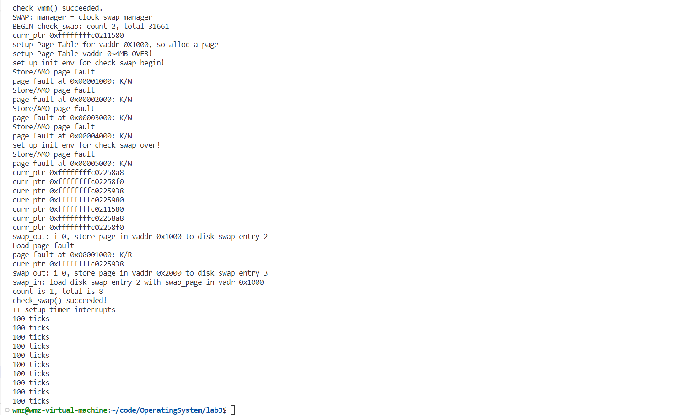

# lab3:缺页异常和页面置换

## 练习1：理解基于FIFO的页面替换算法（思考题）
>描述FIFO页面置换算法下，一个页面从被换入到被换出的过程中，会经过代码里哪些函数/宏的处理（或者说，需要调用哪些函数/宏），并用简单的一两句话描述每个函数在过程中做了什么？（为了方便同学们完成练习，所以实际上我们的项目代码和实验指导的还是略有不同，例如我们将FIFO页面置换算法头文件的大部分代码放在了`kern/mm/swap_fifo.c`文件中，这点请同学们注意）
> - 至少正确指出10个不同的函数分别做了什么？如果少于10个将酌情给分。我们认为只要函数原型不同，就算两个不同的函数。要求指出对执行过程有实际影响,删去后会导致输出结果不同的函数（例如assert）而不是cprintf这样的函数。如果你选择的函数不能完整地体现”从换入到换出“的过程，比如10个函数都是页面换入的时候调用的，或者解释功能的时候只解释了这10个函数在页面换入时的功能，那么也会扣除一定的分数

**FIFO(First in, First out)页面置换算法**，就是把所有页面排在一个队列里，每次换入页面的时候，把队列里最靠前（最早被换入）的页面置换出去。换出页面的时机相对复杂一些，针对不同的策略有不同的时机。目前的框架支持消极换出策略，在alloc_pages()里面，如果此时试图得到空闲页且没有空闲的物理页时，我们才尝试换出页面到硬盘上。

一个页面从被换入到被换出的过程中，以下是一些调用的函数和宏：

1. `int pgfault_handler(struct trapframe *tf)`:
   - 当程序触发页异常的时候，会进入此处理程序，在此函数中会调用 `print_pgfault` 打印一些错误信息，以及将这些错误信息交给 `do_pgfault` 函数处理。
2. `int do_pgfault(struct mm_struct *mm, uint_t error_code, uintptr_t addr)` :
   - 调用`find_vma`函数尝试查找包含`addr`的`vma`。
   - 调用`get_pte`函数，函数会根据得到的虚拟地址，在三级页表中进行查找。在查找页表项的时候，如果页表项无效的话会给页表项分配一个全是0的页并建立映射。最后返回虚拟地址对应的一级页表的页表项。
   - 获取了 `pte` 以后，会检测此页表项是否有对应的页面。如果页表项为0，这个时候就会调用 `pgdir_alloc_page` 。
   - 获取 `addr` 函数对应的 `pte` 不为空的话，则首先会调用 `swap_in` 函数。然后会调用 `page_insert` 函数进行页面的映射以及调用 `swap_map_swappable` 则是将页面加入相应的链表，设置页面可交换。
3. `vma_struct *find_vma(struct mm_struct *mm, uintptr_t addr)`:
   - 寻找`vma->vm_start <= addr <= vma_vm_end`的结构体
   - 如果返回NULL，说明查询的虚拟地址不存在/不合法，既不对应内存里的某个页，也不对应硬盘里某个可以换进来的页。
4. `pte_t *get_pte(pde_t *pgdir, uintptr_t la, bool create)`:
    - 通过 `PDX1(la)` 获取虚拟地址 `la` 对应的二级页表的目录，然后获取该入口的地址。检查是否存在（`PTE_V`标志位）。如果不存在，需要创建一个新的页表。
    - 通过 `PDX0(la)` 获取虚拟地址 `la` 对应的一级页表的目录，然后获取该入口的地址。检查是否存在（`PTE_V`标志位）。如果不存在，需要创建一个新的页表。
    - 最后返回虚拟地址对应的一级页表的页表项。
5. `struct Page *pgdir_alloc_page(pde_t *pgdir, uintptr_t la, uint32_t perm)`:
    - 调用 `alloc_page` 函数，在`alloc_page` 函数中调用了 `alloc_pages(1)`。
    - 调用 `page_insert` 函数将虚拟地址和页面之间建立映射关系。
    - 调用 `swap_map_swappable` 函数将页面加入相应的链表，设置页面可交换。

6. `struct Page *alloc_pages(size_t n)`:

    - 根据物理页面分配算法给自身分配一个物理页面，然后会调用 `swap_out` 函数
7. `int swap_out(struct mm_struct *mm, int n, int in_tick)`:

    - 根据页面置换算法选择出一个应该换出的页面并写入到磁盘中，并将此页面释放。
    - 找到应该换出的页面则是通过 `swap_out_victim` 实现的。
8. `int _fifo_swap_out_victim(struct mm_struct *mm, struct Page ** ptr_page, int in_tick)`:

    - 根据此算法的思想，在页面置换中，我们需要换出的是最先使用的页面，也就是最先加入到链表的节点对应的页面。在链表中，最先加入页面对应的节点就是头节点 `head` 的上一个，调用 `list_prev` 即可。

9. `int swapfs_write(swap_entry_t entry, struct Page *page)`:
    - 将页面内容写入磁盘是通过磁盘的写函数实现的，此函数封装了磁盘的写操作。

10. `int page_insert(pde_t *pgdir, struct Page *page, uintptr_t la, uint32_t perm)`:

    - 用 `get_pte` 获取页表项。然后会判断页表项对应的页面和要建立映射的页面是否相同。不同的话会调用 `page_remove_pte` 函数将此页表项失效。接着会调用 `pte_create` 函数建立新的页表项并将其赋值给 `get_pte` 找到的页表项的地址。

11. `void page_remove_pte(pde_t *pgdir, uintptr_t la, pte_t *ptep)`:

    - 找到 `pte` 对应的页面，减少其引用，并将页面释放。

12. `pte_t pte_create(uintptr_t ppn, int type)`:

    - 根据物理页号进行偏移并对标志位进行设置完成。

13. `int _fifo_map_swappable(struct mm_struct *mm, uintptr_t addr, struct Page *page, int swap_in)`:

    - 根据FIFO页面置换算法，将页面插入到队列末尾。

14. `int swap_in(struct mm_struct *mm, uintptr_t addr, struct Page **ptr_result)`:

    - 分配一个页面并从磁盘中将相应的值写入到此页面上。

15. `int swapfs_read(swap_entry_t entry, struct Page *page)`:

    - 从磁盘读取数据到页面是通过磁盘的读函数实现的，此函数封装了磁盘的读操作。

15. `void swap_init(void)`:
    - 调用`swapfs_init`函数。
    - 检查`max_swap_offset`的取值是否在合理范围内，确保IDE虚拟设备能够存储的页面数不超过上限。
    - 选择并初始化使用`FIFO`页面置换算法的交换管理器`swap_manager_fifo`。
    - 如果初始化成功，将`swap_init_ok`标志设置为1，表示交换机制初始化完成，并打印当前使用的页面置换算法名称。
    - 调用`check_swap`函数进行交换机制的测试。

16. `void swapfs_init(void)`：
    - 初始化交换文件系统。

16. `int _fifo_init_mm(struct mm_struct *mm)`:

    - 初始化mm结构体中的FIFO页面置换算法所需`pra_list_head`，将mm结构体的`sm_priv`字段指向`pra_list_head`，以便在mm结构体中访问FIFO页面置换算法。

18. `void check_swap(void)`:
    - 备份内存环境
    - 设置物理页面环境，调用`mm_create`函数，`vma_create`函数，`insert_vma_struct`函数。
    - 设置临时页表的虚拟地址 0~4MB，调用`get_pte`函数
    - 设置用于测试页面替换算法的初始虚拟页<->物理页环境
    - 访问虚拟页以测试页面替换算法，调用`check_content_access`函数
    - 回复内核内存环境。
19. `struct mm_struct *mm_create(void)`:
    - 存储 `mm_struct` 结构并初始化。

19. `struct vma_struct *vma_create(uintptr_t vm_start, uintptr_t vm_end, uint_t vm_flags)`:
    - 存储`vma_struct`结构体并初始化。
20. `void insert_vma_struct(struct mm_struct *mm, struct vma_struct *vma)`:
    - 将`vma`插入到`mm`的链表中
    - 使用`check_vma_overlap`函数检查新插入的`vma`是否与相邻的`vma`有重叠。
21. `void check_vma_overlap(struct vma_struct *prev, struct vma_struct *next)`:
    - 在插入一个新的`vma_struct`之前，我们要保证它和原有的区间都不重合。

22. `assert()`:

    - 在代码中进行断言检查，如果条件不成立则会触发`panic`，终止程序执行。在这里用于检查条件是否符合预期，如果不符合，则会触发`panic`，表示算法实现错误。

23. `le2page(le, member)`：

    - 将`list_entry`转换为`Page`结构体，用于获取页面信息。

24. `pte2page(*check_ptep[i])`:

    - 将页表项转换为页面结构体，用于获取页面信息。

25. `int _fifo_check_swap(void)`:

    - 用于检查FIFO页面置换算法的测试,这里对页面的读写操作模拟了页面置换的情况。


## 练习2：深入理解不同分页模式的工作原理（思考题）
>get_pte()函数（位于`kern/mm/pmm.c`）用于在页表中查找或创建页表项，从而实现对指定线性地址对应的物理页的访问和映射操作。这在操作系统中的分页机制下，是实现虚拟内存与物理内存之间映射关系非常重要的内容。
> - get_pte()函数中有两段形式类似的代码， 结合sv32，sv39，sv48的异同，解释这两段代码为什么如此相像。
> - 目前get_pte()函数将页表项的查找和页表项的分配合并在一个函数里，你认为这种写法好吗？有没有必要把两个功能拆开？

`get_pte()`函数原型如下，其功能主要是根据提供的虚拟地址，找到对应的页表项，如果没有则创建一个页表项与之对应。其中参数 `pgdir` 表示页表基址（stap），`la` 表示要查找的虚拟地址，bool型变量 `create` 用来判断在未找到对应页表项的情况下，是否创建一个新的页表项，1表示创建，0表示不创建。
```
pte_t *get_pte(pde_t *pgdir, uintptr_t la, bool create)
```
get_pte()函数中两段类似的代码分别如下：
```
 pde_t *pdep1 = &pgdir[PDX1(la)];
    if (!(*pdep1 & PTE_V)) {
        struct Page *page;
        if (!create || (page = alloc_page()) == NULL) {
            return NULL;
        }
        set_page_ref(page, 1);
        uintptr_t pa = page2pa(page);
        memset(KADDR(pa), 0, PGSIZE);
        *pdep1 = pte_create(page2ppn(page), PTE_U | PTE_V);
    }
```
第一段代码具体实现分析如下：
*    `pde_t *pdep1` 通过PDX1函数获得该虚拟地址对应的Giga Page地址，即第三级页表。
*    `if (!(*pdep1 & PTE_V))` 判断pdep1是否存在，PTE_V是否为1，也就是判断Giga Page是否存在。
*    如果不存在， `if (!create || (page = alloc_page()) == NULL)` 判断是否需要分配新页，需要的话判断调用 `alloc_page()` 是否成功创建一个Giga Page，并将其地址赋值给变量page。
*    ` set_page_ref(page, 1)` 将创建的页表page引用次数设为1，然后 `memset(KADDR(pa), 0, PGSIZE)` 将该页表初始化。
*    `pte_create()`  函数创建一个页表项并返回给 `pdep1` ，将其标记为用户可访问（ `PTE_U` ）和有效（ `PTE_V` ）。
   
 第二段代码如下：
```
pde_t *pdep0 = &((pde_t *)KADDR(PDE_ADDR(*pdep1)))[PDX0(la)];
//    pde_t *pdep0 = &((pde_t *)(PDE_ADDR(*pdep1)))[PDX0(la)];
    if (!(*pdep0 & PTE_V)) {
    	struct Page *page;
    	if (!create || (page = alloc_page()) == NULL) {
    		return NULL;
    	}
    	set_page_ref(page, 1);
    	uintptr_t pa = page2pa(page);
    	memset(KADDR(pa), 0, PGSIZE);
 //   	memset(pa, 0, PGSIZE);
    	*pdep0 = pte_create(page2ppn(page), PTE_U | PTE_V);
    }
```
该段代码实现过程与第一段类似，
*    `pde_t *pdep0` 通过PDX0函数获得该虚拟地址对应的次级页表。
*    `if (!(*pdep0 & PTE_V))` 判断pdep0是否存在，PTE_V是否为1，也就是判断次级页表是否存在。
*    如果不存在， `if (!create || (page = alloc_page()) == NULL)` 判断是否需要分配新页，需要的话判断调用 `alloc_page()` 是否成功创建一个次级页表，并将其地址赋值给变量page。
*    ` set_page_ref(page, 1)` 将创建的页表page引用次数设为1，然后 `memset(KADDR(pa), 0, PGSIZE)` 将该页表初始化。
*    `pte_create()`  函数创建一个页表项，并返回给 `pdep0` ，将其标记为用户可访问（ `PTE_U` ）和有效（ `PTE_V` ）。
*    获得次级页表的地址` pdep0` 后，最后便可以通过 `&((pte_t *)KADDR(PDE_ADDR(*pdep0)))[PTX(la)]` 获得虚拟地址la对应的页表项。

**问题一**：
>get_pte()函数中有两段形式类似的代码， 结合sv32，sv39，sv48的异同，解释这两段代码为什么如此相像。

以上两段代码相似的结构保证了在sv39的三级页表中，通过类似的结构，将一个虚拟地址，按照上述顺序自顶向下逐步获得三级页表 `Giga Page` 和二极页表 `Mega Page` ，如果不存在则创建一个新的页表，并创建相应的标志位，最终获得对应的页表项。

对于 `sv32` 、`sv39` 、`sv48` 来说，它们分别利用二级页表、三级页表、四级页表，但是通过多级页表获取页表项的方式是相同的，都是从顶级页表不断向下寻址，并且每一级页表在虚拟地址中均占据9位，所以上述代码分别适用于这三种情况。

**问题二**：
>目前get_pte()函数将页表项的查找和页表项的分配合并在一个函数里，你认为这种写法好吗？有没有必要把两个功能拆开？

get_pte()函数将页表项的查找和页表项的分配是否合并在一个函数里设计和性能的权衡以及操作系统的具体需求
本次实验中合并在一个函数的优点在于：
* **简化代码**：合并功能可以减少函数数量，使代码更易于维护和理解。减少函数数量还可以减小内核的大小，这在某些情况下是有益的。
* **性能优化**：在某些情况下，将查找和分配合并到一个函数中可以更好地优化性能。例如，可以在查找页表项时检查是否需要分配新的页表来处理缺页中断。

而在实际的操作系统内核中，可能需要更加复杂的页表管理功能，比如添加页表项的缓存等，操作系统需要更多的灵活性和可拓展性，这种情况下需要把这两部分拆开，优点在于：
* **模块化**：将查找和分配分开可以更好地模块化代码，使其更容易理解和维护。这有助于减小单个函数的复杂性。
* **可扩展性**：分开功能使得更容易添加新的功能，例如不同的页表项分配策略或页表项的缓存。
* **代码可读性**：明确分开查找和分配的功能可以使代码更易于阅读和理解。

总之，页表项的查找和分配是否分开取决于操作系统的具体需求，在简单的场景下，合并具有更优的性能，而在复杂的场景下，将其拆开使代码更具灵活性和可拓展性。
## 练习3：给未被映射的地址映射上物理页（需要编程）
>补充完成do_pgfault（mm/vmm.c）函数，给未被映射的地址映射上物理页。设置访问权限的时候需要参考页面所在 VMA 的权限，同时需要注意映射物理页时需要操作内存控制结构所指定的页表，而不是内核的页表。
请在实验报告中简要说明你的设计实现过程。请回答如下问题：
> - 请描述页目录项（Page Directory Entry）和页表项（Page Table Entry）中组成部分对ucore实现页替换算法的潜在用处。
> - 如果ucore的缺页服务例程在执行过程中访问内存，出现了页访问异常，请问硬件要做哪些事情？
> - 数据结构Page的全局变量（其实是一个数组）的每一项与页表中的页目录项和页表项有无对应关系？如果有，其对应关系是啥？
>
`do_pgfault（mm/vmm.c）` 函数补充代码如下：
```
if (*ptep == 0) {
        if (pgdir_alloc_page(mm->pgdir, addr, perm) == NULL) {
            cprintf("pgdir_alloc_page in do_pgfault failed\n");
            goto failed;
        }
    } else {
        /*LAB3 EXERCISE 3: 2112558
        * 请你根据以下信息提示，补充函数
        * 现在我们认为pte是一个交换条目，那我们应该从磁盘加载数据并放到带有phy addr的页面，
        * 并将phy addr与逻辑addr映射，触发交换管理器记录该页面的访问情况
        *
        *  一些有用的宏和定义，可能会对你接下来代码的编写产生帮助(显然是有帮助的)
        *  宏或函数:
        *    swap_in(mm, addr, &page) : 分配一个内存页，然后根据
        *    PTE中的swap条目的addr，找到磁盘页的地址，将磁盘页的内容读入这个内存页
        *    page_insert ： 建立一个Page的phy addr与线性addr la的映射
        *    swap_map_swappable ： 设置页面可交换
        */
        if (swap_init_ok) {
            struct Page *page = NULL;
             // 你要编写的内容在这里，请基于上文说明以及下文的英文注释完成代码编写
            //(1）According to the mm AND addr, try
            //to load the content of right disk page
            //into the memory which page managed.
            //(2) According to the mm,
            //addr AND page, setup the
            //map of phy addr <--->
            //logical addr
            //(3) make the page swappable.
            
            swap_in(mm, addr, &page);
            page_insert(mm->pgdir, page, addr, perm);
            swap_map_swappable(mm, addr, page, 1);

            page->pra_vaddr = addr;
        } else {
            cprintf("no swap_init_ok but ptep is %x, failed\n", *ptep);
            goto failed;
        }
```
该函数的补充部分具体设计思路如下：

* 首先 `do_pgfault` 函数调用 `find_vma(mm, addr)` 已经找到了出现页面错误的虚拟地址addr对应的vma，并通过 `ptep = get_pte(mm->pgdir, addr, 1)`找到了对应的页表项并返回给 `ptep` ，参数1表示如果未找到则为其创建一个页表项。
* if语句判断是否成功找到页表项，成功的话首先调用 `swap_init_ok` 函数检查页面置换机制是否初始化成功。
* 接着调用 `swap_in(mm, addr, &page)` 函数，分配一个内存页，然后根据PTE中swap条目的addr，找到对应磁盘页的地址，将磁盘页的内容写入分配的内存页中，page保存分配的内存页的地址。
* `page_insert(mm->pgdir, page, addr, perm)` 建立分配的内存页page物理地址和虚拟地址addr的映射关系，其中 `mm->pgdir` 表示二级页表，perm为该二极页表的权限位。
* `swap_map_swappable(mm, addr, page, 1)` 最后将该页表设置为可交换的。

**问题一**：
>请回答如下问题：请描述页目录项（Page Directory Entry）和页表项（Page Table Entry）中组成部分对ucore实现页替换算法的潜在用处。

页目录项（PDE）和页表项（PTE）适用于管理虚拟内存的重要数据结构，它们通常用于创建页表，存储了虚拟地址到物理地址的映射关系。
页目录项的组成部分主要包括：
* **有效/无效位**（Present bit）：指示该目录项是否有效，如果无效，则对应的页表不可访问。在页替换算法中，可以使用有效/无效位来标记页面的状态，以确定哪些页面可以被替换出去。
* **物理页表基址**（Page Table Base Address）：用于指向关联的页表的物理地址。在页替换算法中，这个地址可以用于查找特定虚拟地址的页表。
* **读/写权限位**（Read/Write permissions）：用于指定对于页表的读写权限。在页替换算法中，这些权限位可以用于限制或允许页面的写入，从而在页面替换时起到控制作用。

页表项的组成部分主要包括：
* **有效/无效位**（Present bit）：与页目录项类似，指示该页表项是否有效。在页替换算法中，可以用于标记页面的状态。
* 物理页面基址（Page Base Address）：指向物理内存中页面的地址。在页替换算法中，这个字段用于确定页面在物理内存中的位置。
* **读/写权限位**（Read/Write permissions）：用于指定对于页面的读写权限，以控制页面的修改。
* **访问位**（Accessed bit）：用于标记页面是否被访问。在页替换算法中，可以使用访问位来确定哪些页面经常被访问，以支持基于页面访问频率的替换策略，如LRU（最近最少使用）。
* **修改位**（Dirty bit）：用于标记页面是否被修改。在页替换算法中，可以使用修改位来确定哪些页面已被修改，以支持页面置换策略，如写时复制（Copy-on-Write）。

由上可知，页目录项和页表项在ucore实现页替换算法的潜在用处主要包括以下几方面：
* **页面替换策略**：通过有效/无效位、访问位、修改位等字段，可以实现各种页替换算法，如LRU、FIFO、CLOCK等，以决定哪些页面应该被替换出去，从而优化内存使用。
* **内存保护**：读/写权限位可以用于实现内存保护，确保不被未经授权的访问修改。
* **页面分配和回收**：页目录项和页表项的有效/无效位可用于分配和回收物理页面，确保页面管理的有效性。
* **页面访问统计**：访问位和修改位可以用于统计页面的访问情况，帮助性能分析和优化。
* **虚拟内存管理**：这些数据结构是虚拟内存管理的关键组成部分，支持了虚拟地址空间和物理内存之间的映射。
问题二：
>如果ucore的缺页服务例程在执行过程中访问内存，出现了页访问异常，请问硬件要做哪些事情？
当出现页访问异常时，硬件通常做以下事情：
* **保存上下文**：硬件会自动保存当前进程的上下文，包括程序计数器（PC）和其他相关寄存器状态等，将这些信息保存在内核栈中或者特定的异常堆栈中。
* **触发异常处理**：当处理器检测到对一个没有合法物理页面映射的虚拟地址的访问时，会触发页访问异常，将控制权转移到操作系统内核的页访问异常处理例程。
* **切换特权级别**：硬件会将处理器的特权级别从用户模式切换到内核模式，以便访问操作系统的数据结构和指令。
* **提供异常信息**：硬件会将引发异常的原因和相关信息（如错误码）传递给操作系统，帮助操作系统确定异常的具体类型和原因。
* **查找缺页的物理内存**：调用相关的缺页处理函数，操作系统会尝试为缺页找到一个合法的物理页面，找到后将物理页面加载到内存中，并更新页表等数据结构。
* **恢复上下文**：异常处理结束后，操作系统会恢复之前保存的上下文，以确保程序可以继续执行。
* **重新执行指令**：一旦缺页处理例程完成，处理器会尝试重新执行引发缺页异常的指令，整个缺页服务例程结束。

**问题三**：
>数据结构Page的全局变量（其实是一个数组）的每一项与页表中的页目录项和页表项有无对应关系？如果有，其对应关系是啥？

`struct Page *pages` 这个全局变量表示了系统中所有可用的的物理内存页，它是一个指向 `Page` 结构体数组的指针。这个数组的每一项代表一个物理页，包含了物理页的相关信息，比如引用计数、状态标志、属性等。而页目录项PDE和页表项PTE是用来创建虚拟地址和物理地址的映射关系，用于虚拟内存的管理。二者关系如下：
页目录项和页表项用于页表的虚拟内存管理，页目录项建立了虚拟地址和页表项的映射关系，页表项建立了虚拟地址到物理地址的映射关系，页表项中的每一项分别存储了虚拟地址对应的物理页地址。通过逐步访问页目录项和页表项，我们可以获得虚拟地址对应的物理页的地址，也就是存储在全局变量 `pages` 中的某一项，进而可以访问该物理页面的具体信息。

## 练习4：补充完成Clock页替换算法（需要编程）
>通过之前的练习，相信大家对FIFO的页面替换算法有了更深入的了解，现在请在我们给出的框架上，填写代码，实现 Clock页替换算法（mm/swap_clock.c）。
请在实验报告中简要说明你的设计实现过程。请回答如下问题：
> - 比较Clock页替换算法和FIFO算法的不同。

Clock算法是一种页面置换算法，通常用于操作系统的内存管理。它的主要目标是在有限的物理内存中维护活跃页面，以最大程度地减少页面错误（Page Faults）的发生。

Clock算法的实现通常需要以下数据结构和步骤：

1. **环形链表**: 使用环形链表（循环队列）来表示物理内存中的页面帧。

2. **访问位**: 为每个页面帧维护一个附加的访问位（通常是一个位标志），并初始化为0。

3. **CLOCK指针**: 使用一个指针来指示当前扫描位置，开始时通常指向链表的头部。

4. **替换策略**: 当需要进行页面置换时，从当前指针位置开始扫描链表，检查访问位。如果访问位为0，替换该页面，将指针向前移动，完成置换。如果访问位为1，将访问位重置为0，并将指针向前移动，继续扫描。如果整个链表都被扫描并且没有找到访问位为0的页面，则可能需要多次扫描。

### swap_init

修改`swap.c`文件，将使用的`swap manager`变为`swap_manager_clock`，以使用CLOCK算法进行内存管理。

  ```c++
  int swap_init(void){
       ...
       //sm = &swap_manager_fifo;
       sm = &swap_manager_clock;
       ...
  }
  ```

### _clock_init_mm

**作用**: 该函数是用于初始化算法所需的数据结构，包括一个链表头 `pra_list_head` 和两个指针 `curr_ptr` 和 `mm->sm_priv` 。

**实现**: 首先初始化`pra_list_head`为空链表，然后初始化当前指针`curr_ptr`指向`pra_list_head`，表示当前页面替换位置为链表头，并将mm的私有成员指针指向`pra_list_head`，最后打印`curr_ptr`的值。

```c
//初始化pra_list_head为空链表
list_init(&pra_list_head);
//初始化当前指针curr_ptr指向pra_list_head，表示当前页面替换位置为链表头
curr_ptr = &pra_list_head;
// 将mm的私有成员指针指向pra_list_head，用于后续的页面替换算法操作
mm->sm_priv = &pra_list_head;
//打印curr_ptr
cprintf("curr_ptr 0xffffffff%x\n", curr_ptr);
return 0;
```
### _clock_map_swappable

**作用**: 将新访问的页面加入到替换队列中，以未来将该页面换出。

**实现**: 首先得到`page`的`pra_page_link`并命名为`entry`，以便之后插入链表中并确保`entry`和`cur_ptr`不为NULL。然后将页面插入到页面链表`pra_list_head`的末尾，并将页面的`visited`标志置为1，表示该页面已被访问。

```cpp
// 得到&(page->pra_page_link)并确保不为空
list_entry_t *entry=&(page->pra_page_link);
assert(entry != NULL && curr_ptr != NULL);

// 将页面插入到页面链表pra_list_head的末尾
list_add_before(&(pra_list_head), entry);
// 将页面的visited标志置为1，表示该页面已被访问
page->visited = 1;

return 0;
```
  
### _clock_swap_out_victim

**作用**: 根据CLOCK算法的替换策略选择要换出的页面。

**实现**: 首先得到链表的起始节点`head`，然后通过循环找到需要换出的页面。在循环中，首先判断是否到达链表头，是则跳到下一个列表项并打印`curr_ptr`。然后获取当前页面对应的`Page`结构指针，跳到下一个列表项并打印`curr_ptr`。如果当前页面未被访问，则该页面从页面链表中删除并将该页面指针赋值给`ptr_page`作为换出页面；如果页面已被访问，将`visited`标志置为0，表示该页面已被重新访问。

```cpp
list_entry_t *head=(list_entry_t*) mm->sm_priv;
assert(head != NULL);
assert(in_tick==0);
while (1) {
    // 如果到达链表头，则跳到下一个并打印curr_ptr
    if (curr_ptr == head) {
        curr_ptr = list_next(curr_ptr);
        cprintf("curr_ptr %p\n", (void*)curr_ptr);
    }
    // 获取当前页面对应的Page结构指针
    struct Page *page = le2page(curr_ptr, pra_page_link);
    // 将curr_ptr指向下一个
    curr_ptr = list_next(curr_ptr);
    // 输出当前的curr_ptr
    cprintf("curr_ptr %p\n", (void*)curr_ptr);

    // 如果当前页面未被访问
    if (page->visited == 0) {
        //将该页面从页面链表中删除，
        list_del(&(page->pra_page_link));
        // 将该页面指针赋值给ptr_page作为换出页面
        *ptr_page = page;
        return 0;
    } else {
        // 如果页面已被访问，将visited标志置为0，表示该页面已被重新访问
        page->visited = 0;
    }
}
return 0;
```

### 算法验证

运行 `make qemu`，截图如下：



由图可知，代码中的各个check均成功，并且换入换出的页面也与预期的相符合。

运行 `make grade`，截图如下：


由图可知，得分为45/45，表明算法实现正确。

### Clock算法和FIFO算法比较

#### Clock算法：

- **工作原理**：Clock算法使用一个类似于时钟的指针，维护一个循环缓冲区（循环队列），其中包含了当前内存中的页。当需要进行页面替换时，该指针按顺时针方向移动，查找第一个未被访问的页。如果找到未被访问的页，它将被替换，否则，指针继续移动，直到找到未被访问的页。

- **性能特点**：Clock算法通常比FIFO算法性能更好，因为它考虑了页的访问频率。它更倾向于保留经常使用的页，从而减少了缺页率。然而，它仍然可能会产生不必要的页面抖动，特别是对于内存密集型应用程序以及负载的快速增加与减少。

- **实现复杂性**：Clock算法的实现相对较复杂，因为它需要维护一个环形数据结构和跟踪每个页的访问状态。但这种复杂性可以提高性能。

#### FIFO算法：

- **工作原理**：FIFO算法按照最早进入内存的顺序（先进先出）替换页面。当需要进行页面替换时，最先进入内存的页将被替换。

- **性能特点**：FIFO算法非常简单，但它可能表现得不太好，因为它忽略了页的访问模式。即使一个页面被频繁访问，如果它最早进入内存，也会被替换掉，这可能导致较高的缺页率，尤其是在存在局部性的情况下。

- **实现复杂性**：FIFO算法实现相对容易。它通常使用一个队列数据结构来管理内存中的页。

#### 比较总结：

Clock算法相对于FIFO算法来说，更关注页的访问频率，因此通常表现更好，尤其是在存在局部性的情况下。FIFO算法非常简单，但它可能导致较高的缺页率，因为它不考虑页面的使用频率。选择哪种算法取决于具体的使用场景和性能需求。在一些情况下，FIFO算法可能足够简单并且性能足够好，但在对缺页率有更高要求的情况下，Clock算法等更复杂的算法可能更适合。此外，还有其他高级的页面替换算法，如LRU（Least Recently Used）和LRU的变种，它们在更精细的页面替换策略方面提供了更好的性能。

## 练习5：阅读代码和实现手册，理解页表映射方式相关知识（思考题）
>如果我们采用”一个大页“ 的页表映射方式，相比分级页表，有什么好处、优势，有什么坏处、风险？

**优势和好处：**

1. **性能提升：** 使用大页可以减少页表的大小，因为一个大页覆盖的内存范围更广。这意味着更少的页表项需要被管理，减少了页表查找和维护的开销。这可以提高内存管理的性能，特别是在处理大型内存区域时。

2. **减少TLB缺失：** 大页表映射可以降低翻译后备缓冲（TLB）缺失的频率。TLB是一个硬件缓存，用于存储最近使用的虚拟地址到物理地址的映射。大页表允许更多的内存被映射到一个TLB条目中，因此更多的访问可以命中TLB，从而提高内存访问速度。

3. **减少内存开销：** 大页表减少了页表项的数量，因此减小了页表的内存开销。这对于具有有限内存资源的嵌入式系统或虚拟机管理来说尤其重要。

**劣势和风险：**

1. **内部碎片：** 大页可能会导致内部碎片问题。如果应用程序未使用分配给大页的全部内存，那么内存中可能会出现未使用的部分，这被称为内部碎片。这会导致浪费内存资源。

2. **不适用于小内存：** 大页通常适用于较大的内存区域，而不适用于小内存。在小内存环境中，使用大页可能浪费内存。

3. **不适用于不连续的内存需求：** 如果应用程序需要分散在内存中的小块数据，大页可能不是最佳选择，因为它们可能会导致浪费或不必要的页面调度。

4. **难以管理：** 大页的管理可能较复杂，特别是在多任务或虚拟化环境中，需要动态分配和回收大页。这可能需要更多的操作系统支持和复杂性。

使用"一个大页"的页表映射方式可能具有性能提升的优势，但也需要考虑内存开销和碎片问题。适用性取决于特定的应用场景和内存需求。大页通常在需要大量连续内存的应用中表现良好，如数据库管理系统或科学计算应用。在其他情况下，分级页表可能更灵活，更适合管理内存。

## 扩展练习 Challenge：实现不考虑实现开销和效率的LRU页替换算法（需要编程）

LRU（Least Recently Used）页面替换算法是一种常用的页面置换算法，用于操作系统中的内存管理。其基本思想是，当需要替换页面时，选择最近最少使用的页面进行替换，以最大程度地减少页面错误率。

LRU算法的实现通常需要以下数据结构和步骤：

1. 维护一个链表或栈，用于记录页面访问历史。

2. 每当页面被访问，将该页面移动到链表的开头。

3. 当需要替换页面时，选择链表末尾的页面。

4. 用新页面替换所选择的页面。

### swap_lru.h

该文件首先通过宏定义防止头文件重复包含，然后它声明了一个名为 swap_manager_lru 的外部变量，其类型为 struct swap_manager，该变量是在其他源文件中定义的，而当前源文件仅仅是引用了它。

```cpp
#ifndef __KERN_MM_SWAP_LRU_H__
#define __KERN_MM_SWAP_LRU_H__

#include <swap.h>
extern struct swap_manager swap_manager_lru;

#endif
```

### swap_init

修改`swap.c`文件，将使用的`swap manager`变为`swap_manager_lru`，以使用LRU算法进行内存管理。

  ```c++
  int swap_init(void){
       ...
     // sm = &swap_manager_fifo;
     // sm = &swap_manager_clock;
     sm = &swap_manager_lru;
       ...
  }
  ```

### 内存访问

LRU算法会在每次访问内存时将对应页面移到链表最前面，但是在ucore中的内存访问在内部进行，我们不能在每次访问内存时获取消息将对应页面移到链表头。所以我编写了`read`和`write`函数来模拟内存访问，以验证LRU算法实现的正确性。

```cpp
static void
read(uintptr_t addr, unsigned char* value){
    *value = *(unsigned char *)addr;//读取内存
    move2begin(addr);//更新链表
}

static void
write(uintptr_t addr, unsigned char value){
    *(unsigned char *)addr = value;//写入内存
    move2begin(addr);//更新链表
}
```

### move2begin

**作用**: 该函数用于将`addr`对应的页面移动到链表头部。

**实现**: 首先遍历链表找到对应`addr`的页面，找到之后先将`&(page->pra_page_link)`从链表中删除，然后将其添加到链表头部。

```cpp
static void
move2begin(uintptr_t addr) 
{
    // 遍历链表找到对应addr的页面
    for (list_entry_t * pos = list_next(&pra_list_head); pos != (&pra_list_head); pos = list_next(pos))
    {
        struct Page *page = le2page(pos, pra_page_link); 
        if (page->pra_vaddr == addr) {
            // 从链表中找到 addr 对应的 page ，将其放到链表末尾
            list_del(&(page->pra_page_link));
            list_add(&pra_list_head, &(page->pra_page_link));
            break; 
        }
    }
}
```

### _lru_init_mm

**作用**: 该函数是用于初始化算法所需的数据结构，包括一个链表头 `pra_list_head` 和一个指针`mm->sm_priv` 。

**实现**: 首先初始化`pra_list_head`为空链表，然后将mm的私有成员指针指向`pra_list_head`。

```cpp
//初始化pra_list_head为空链表
list_init(&pra_list_head);
// 将mm的私有成员指针指向pra_list_head，用于后续的页面替换算法操作
mm->sm_priv = &pra_list_head;
return 0;
```

### _lru_map_swappable

**作用**: 将新访问的页面加入到替换队列中，以未来将该页面换出。

**实现**: 首先将`(list_entry_t*)mm->sm_priv`赋值给`head`，将`&(page->pra_page_link)`赋值给`entry`，并确保`entry`和`head`不为`NULL`。然后将`entry`加到首位并返回。

```cpp
// 得到head和entry，并确保entry和head不为空
list_entry_t *head=(list_entry_t*)mm->sm_priv;
list_entry_t *entry=&(page->pra_page_link);
assert(entry != NULL && head != NULL);
//将entry加到首位
list_add(head, entry);
return 0;
```
  
### _lru_swap_out_victim

**作用**: 根据LRU算法的替换策略选择要换出的页面。

**实现**: 首先将`(list_entry_t*) mm->sm_priv`赋值给`head`并确保`head`不为`NULL`、`in_tick`等于0。然后得到最后一个链表项，如果不等于首项（即链表不为空），则将该链表项删去，然后得到对应的`page`并赋值给`*ptr_page`；链表为空时返回的页面为`NULL`。

```cpp
// 得到head并确保head不为NULL、in_tick等于0
list_entry_t *head=(list_entry_t*) mm->sm_priv;
assert(head != NULL);
assert(in_tick==0);
//换出最后一个页面
list_entry_t* entry = list_prev(head);
if (entry != head) {// 如果链表不为空
    list_del(entry);//将最后一个页面从链表中删除
    *ptr_page = le2page(entry, pra_page_link);//得到对应的page
} else {//为空时返回的页面为NULL
    *ptr_page = NULL;
}
return 0;
```

### is_swap

**作用**: 判断`addr`对应的页面是否换出

**实现**: 遍历链表，并得到链表项对应的`page`，如果`page`的`pra_vaddr`等于`addr`，则说明没被换出，返回`false`，否则返回`true`。

```cpp
// 通过判断链表中page的pra_vaddr是否与addr相等来判断该页面是否换出
static bool
is_swap(uintptr_t addr){
    for (list_entry_t * pos = list_next(&pra_list_head); pos != (&pra_list_head); pos = list_next(pos))
    {
        struct Page *page = le2page(pos, pra_page_link); 
        if (page->pra_vaddr == addr) {
            return false;
        }
    }

    return true;
}
```

### _lru_check_swap

**作用**: 判断LRU算法实现的正确性

#### 1. 写普通页面

此时队列为4, 3, 2, 1，写入之后判断是否没有换出页面、是否成功在`0x1000`写入、`pgfault_num`是否等于4。

```cpp
write(0x1000, 0x1a);
assert(is_swap(0x5000));
read(0x1000, &value);
assert(value==0x1a);
assert(pgfault_num == 4);
```

#### 2. 写换出页面

此时队列为1, 4, 3, 2，所以会先交换`0x2000`，写入之后判断是否换出`0x2000`、是否成功在`0x5000`写入`0x2a`、`pgfault_num`是否等于5。

```cpp
write(0x5000, 0x2a);
assert(is_swap(0x2000));
read(0x5000, &value);
assert(value==0x2a);
assert(pgfault_num == 5);
```

#### 3. 读普通页面

此时队列为5, 1, 4, 3，读入之后判断是否没有换出页面、判断值是否正确、`pgfault_num`是否等于5。

```cpp
read(0x1000, &value);
assert(is_swap(0x2000));
assert(value==0x1a);
assert(pgfault_num == 5);
```

#### 4. 读换出页面

此时队列为1, 5, 4, 3，所以会先交换`0x3000`，读入之后判断是否换出`0x3000`、`pgfault_num`是否等于6。

```cpp
read(0x2000, &value);
assert(is_swap(0x3000));
assert(pgfault_num == 6);
```

#### 5. 多次写

此时队列为2, 1, 5, 4，在换出位置判断是否换出，在最后判断`pgfault_num`是否等于9.

```cpp
write(0x1000, 0x3a);
write(0x3000, 0x3a);
assert(is_swap(0x4000));
write(0x5000, 0x3a);
write(0x4000, 0x3a);
assert(is_swap(0x2000));
write(0x2000, 0x3a);
assert(is_swap(0x1000));
assert(pgfault_num == 9);
```

#### 6. 多次读

此时队列为2, 4, 5, 3，在换出位置判断是否换出，在最后判断`pgfault_num`是否等于10.

```cpp
read(0x2000, &value);
read(0x1000, &value);
assert(is_swap(0x3000));
read(0x4000, &value);
read(0x5000, &value);
read(0x5000, &value);
assert(pgfault_num == 10);
```

#### 7. 读写混合

此时队列为5, 4, 1, 2，在换出位置判断是否换出，在最后判断`pgfault_num`是否等于11.

```cpp
write(0x4000, 0x3a);
read(0x2000, &value);
read(0x1000, &value);
read(0x5000, &value);
write(0x2000, 0x3a);
write(0x1000, 0x3a);
read(0x3000, &value);
assert(is_swap(0x4000));
read(0x2000, &value);
write(0x3000, 0x3a);
assert(pgfault_num == 11);
```

### 算法验证

运行 `make qemu`，截图如下：


由图可知，代码中的各个check均成功，并且换入换出的页面也与预期的相符合。

## 知识点分析

### 重要知识点

#### 页替换算法

页替换算法是操作系统中用于管理虚拟内存的关键部分，它确定了哪些页面将被交换到磁盘上以腾出物理内存空间。不同的页替换算法有不同的原理、实现方式、优点和缺点。以下是一些常见的页替换算法：

##### 1.FIFO（First-In-First-Out）算法：

**原理**： FIFO算法是最简单的算法，它基于一个队列，将最早进入内存的页面最早替换出去。
**实现**： 使用一个队列来维护内存中页面的顺序。当需要替换页面时，选择队列中的第一个页面。
**优点**： 实现简单。
**缺点**： 可能受"Belady's Anomaly"影响，不考虑页面的访问频率。

##### 2.LRU（Least Recently Used）算法：

**原理**： LRU算法根据页面的最近访问历史来选择最长时间未被访问的页面进行替换。
**实现**： 使用一个数据结构（通常是双向链表）来维护页面的访问历史。每次页面被访问，将其移到列表的末尾。
**优点**： 能更好地反映页面的访问模式。
**缺点**： 实现较复杂，可能需要更多计算资源来维护访问历史。

##### 3.CLOCK算法：

**原理**： CLOCK算法是基于FIFO算法的改进，它使用一个环形缓冲区（类似时钟的指针）来维护页面的状态。当需要替换页面时，算法查看指针指向的页面，如果未被访问，则替换之；如果已被访问，则清除访问标记并移动指针。
**实现**： 使用一个环形缓冲区来存储页面，一个指针指向当前页面。每次替换页面时，考虑指针指向的页面。
**优点**： 相对简单，能够一定程度上考虑页面的访问频率。
**缺点**： 无法处理高访问频率的页面，可能需要多次扫描。

##### 4.LFU（Least Frequently Used）算法：

**原理**： LFU算法根据页面被访问的频率来选择最少被访问的页面进行替换。
**实现**： 维护一个计数器来跟踪每个页面的访问次数。当需要替换页面时，选择访问次数最少的页面。
**优点**： 能有效处理高访问频率的页面。
**缺点**： 需要额外的计数器，实现相对复杂。

##### 5.NRU（Not Recently Used）算法：

**原理**： NRU算法根据页面的访问历史以及修改历史来选择替换页面，分为四个类别。
**实现**： 维护一个类别列表，根据页面的访问和修改历史将页面分类。当需要替换页面时，选择类别列表中的页面。
**优点**： 考虑了页面的多个属性。
**缺点**： 实现较复杂，可能需要多次扫描。

不同的页替换算法适用于不同的应用场景。选择合适的算法通常取决于内存大小、页面访问模式以及可用的硬件资源。操作系统开发人员需要仔细考虑这些因素以提供最佳性能。

### 拓展知识点
#### RISC-V 和 x86 架构在页面置换操作的机制和策略

**1. 页面表机制：**

- **x86** 使用两级或多级页面表来管理虚拟内存，其中每个页面表项通常包括脏位（Dirty Bit）和访问位（Accessed Bit），这些位用于页面置换策略的支持。x86 还支持页面大小多样性，包括4KB、2MB和1GB等。
- **RISC-V** 通常使用单级的页表结构（Sv39、Sv48 等），与 x86 不同，RISC-V 的标准页表项没有明确的脏位和访问位。这意味着在 RISC-V 上，操作系统可能需要在页表项中添加自定义位来支持脏页检测。

**2. 置换算法：**

- **x86** 操作系统通常使用常见的页面置换算法，如LRU（Least Recently Used）、FIFO（First-In, First-Out）或CLOCK算法。这些算法可以利用硬件支持的脏位和访问位来帮助选择要置换的页面。
- **RISC-V** 中，由于硬件架构和页表项的差异，操作系统在页面置换方面更加自由。通常，RISC-V 操作系统可以实现自定义的页面置换策略，根据需要添加脏位并根据应用程序的需求选择合适的算法。

**3. 系统调用和指令：**

- **x86** 体系结构通常具有一组专门的系统调用（如`mmap`和`munmap`）和特殊的汇编指令（如`invlpg`），用于管理虚拟内存和页表。这些指令和系统调用在页表维护和内存管理中起着关键作用。
- **RISC-V** 架构的系统调用和指令集可能因操作系统的不同而有所变化。操作系统需要实现适用于虚拟内存管理的系统调用和指令。

