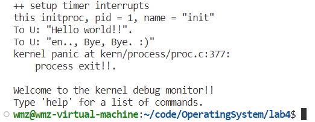
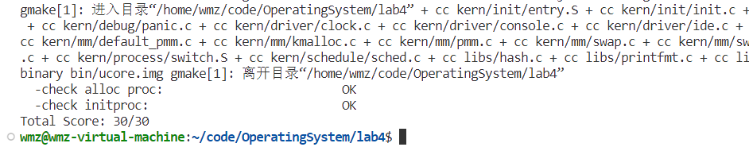

# Lab4: 进程管理

> 2113972 王茂增
> 2111460 张洋
> 2112558 刘蓓

## 练习 1：分配并初始化一个进程控制块（需要编码）

> alloc_proc 函数（位于 kern/process/proc.c 中）负责分配并返回一个新的 struct proc_struct 结构，用于存储新建立的内核线程的管理信息。ucore 需要对这个结构进行最基本的初始化，你需要完成这个初始化过程。
> 【提示】在 alloc_proc 函数的实现中，需要初始化的 proc_struct 结构中的成员变量至少包括：state/pid/runs/kstack/need_resched/parent/mm/context/tf/cr3/flags/name
> 请在实验报告中简要说明你的设计实现过程。

实现内核线程的第一步是给线程创建进程（ucore 中的线程相当于一个不拥有资源的轻量级进程）控制块。

在`kern/process/proc.c`的`alloc_proc`函数中，给要创建的进程控制块指针（`struct proc_struct *proc`）分配了内存空间，并在分配的内存块上对该结构体中的如下字段作了初始化：

```cpp
enum proc_state state;                      // Process state
int pid;                                    // Process ID
int runs;                                   // the running times of Proces
uintptr_t kstack;                           // Process kernel stack
volatile bool need_resched;                 // bool value: need to be rescheduled to release CPU?
struct proc_struct *parent;                 // the parent process
struct mm_struct *mm;                       // Process's memory management field
struct context context;                     // Switch here to run process
struct trapframe *tf;                       // Trap frame for current interrupt
uintptr_t cr3;                              // CR3 register: the base addr of Page Directroy Table(PDT)
uint32_t flags;                             // Process flag
char name[PROC_NAME_LEN + 1];               // Process name
```

各个变量的详细解释如下：

- `state`：进程状态，`proc.h`中定义了四种状态：创建（`UNINIT`）、睡眠（`SLEEPING`）、就绪（`RUNNABLE`）、退出（`ZOMBIE`，等待父进程回收其资源）
- `pid`：进程 ID，调用本函数时尚未指定，默认值设为-1
- `runs`：线程运行总数，默认值 0
- `kstack`: 进程的内核栈地址，初始化为 0。
- `need_resched`：标志位，表示该进程是否需要重新参与调度以释放 CPU，初值 0（false，表示不需要）
- `parent`：父进程控制块指针，初值 NULL
- `mm`：用户进程虚拟内存管理单元指针，由于系统进程没有虚拟内存，其值为 NULL
- `context`：进程上下文，默认值全零
- `tf`：中断帧指针，默认值 NULL
- `cr3`：该进程页目录表的基址寄存器，初值为`ucore`启动时建立好的内核虚拟空间的页目录表首地址`boot_cr3`（在`kern/mm/pmm.c`的`pmm_init`函数中初始化）
- `flags`：进程标志位，默认值 0
- `name`：进程名数组

初始化代码：

```cpp
static struct proc_struct *alloc_proc(void) {
    //通过kmalloc函数获得proc_struct结构的一块内存块，作为第0个进程控制块。
    struct proc_struct *proc = kmalloc(sizeof(struct proc_struct));
    if (proc != NULL) {
        proc->state = PROC_UNINIT;
        proc->pid = -1;
        proc->runs = 0;
        proc->kstack = 0;
        proc->need_resched = 0;
        proc->parent = NULL;
        proc->mm = NULL;
        memset(&(proc->context), 0, sizeof(struct context));
        proc->tf = NULL;
        proc->cr3 = boot_cr3;
        proc->flags = 0;
        memset(proc->name, 0, PROC_NAME_LEN);
    }
    return proc;
}
```

> 请说明 proc_struct 中 struct context context 和 struct trapframe \*tf 成员变量含义和在本实验中的作用是啥？（提示通过看代码和编程调试可以判断出来）

**struct context context:** 用于在进程切换的过程中保存这一进程的上下文，具体而言就是保存创建进程时父进程的部分寄存器值：eip, esp, ebx, ecx, edx, esi, edi, ebp，由于其他寄存器在切换进程时值不变，故无需保存。切换过程的实现在`kern/process/switch.S`。

**struct trapframe \*tf:** 中断帧的指针，总是指向内核栈的某个位置：当进程从用户空间跳到内核空间时，中断帧记录了进程在被中断前的状态。当内核需要跳回用户空间时，需要调整中断帧以恢复让进程继续执行的各寄存器值。

可以从整个进程创建、启动的过程进行观察。首先，在 `proc_init` 中先手动初始化了 `idle` 这一内核线程，之后再通过 `kernel_thread` 创建了 `init` 这一内核线程并且输出 `Hello world!!`。

```cpp
int kernel_thread(int (*fn)(void *), void *arg, uint32_t clone_flags) {
    struct trapframe tf;
    memset(&tf, 0, sizeof(struct trapframe));
    tf.gpr.s0 = (uintptr_t)fn;
    tf.gpr.s1 = (uintptr_t)arg;
    tf.status = (read_csr(sstatus) | SSTATUS_SPP | SSTATUS_SPIE) & ~SSTATUS_SIE;
    tf.epc = (uintptr_t)kernel_thread_entry;
    return do_fork(clone_flags | CLONE_VM, 0, &tf);
}
```

在 `kernel_thread` 中，首先设置了一个 `trapframe`。其中 `s0` 寄存器的位置存入函数地址，`s1` 的地址存入函数参数的地址，并且设置 `sstatus`。其中 `SPP` 位为 1 表示陷入这个 `trap` 前并非处于用户态。`SPIE` 表示陷入前开启了中断，`~SSTATUS_SIE` 表示关闭当前中断。之后 `epc` 被设置为了 `kernel_thread_entry` 地址。最后调用 `do_fork`，并且指定拷贝内存，将 `tf` 的地址传入。

`do_fork` 会先使用 `alloc_proc` 分配一个进程管理块。由于 `fork` 产生的进程一定是由父进程产生的，所以再将 `parent` 设置为 `current`，并且设置进程对应的内核栈空间（分配连续两个页的空间），然后调用 `copy_thread` 函数。

```cpp
static void copy_thread(struct proc_struct *proc, uintptr_t esp, struct trapframe *tf) {
    // 将 trapframe 放置在进程的内核栈顶
    proc->tf = (struct trapframe *)(proc->kstack + KSTACKSIZE - sizeof(struct trapframe));
    *(proc->tf) = *tf;// 复制传入的 trapframe 到新的进程的 trapframe
    // 将 a0 设置为 0，以便子进程知道它只是被 fork 出来的
    proc->tf->gpr.a0 = 0;
    // 如果 esp 为 0，则将子进程的栈指针设置为新的 trapframe 的地址，否则设置为传入的 esp
    proc->tf->gpr.sp = (esp == 0) ? (uintptr_t)proc->tf : esp;
    proc->context.ra = (uintptr_t)forkret;// 设置返回地址为 forkret
    proc->context.sp = (uintptr_t)(proc->tf);// 把trapframe放在上下文的栈顶
}
```

在 `copy_thread` 中会首先在新创建的进程对应的内核栈的顶部为 `trapframe` 设置空间，将传入的 `tf` 位置对应的内容拷贝到对应的位置；并且将返回值（`a0`）设置为 0 表示这是一个 `fork` 得到的子进程，并且由于传入的栈顶地址为 0，所以 `sp` 会指向 `proc->tf` 对应 `trapframe` 的底部。之后 `copy_thread` 还设置了进程对应的 `context` 的内容，将 `ra` 返回地址设置为了 `forkret`。

```cpp
    .globl forkrets
forkrets:
    # set stack to this new process's trapframe
    move sp, a0
    j __trapret

    .globl __trapret
__trapret:
    RESTORE_ALL
    # go back from supervisor call
    sret
```

`forkret` 会调用 `forkrets` 这个汇编过程。`forkrets` 把传进来的参数，也就是进程的中断帧放在了 `sp`，这样在`__trapret`中就可以直接从中断帧里面恢复所有的寄存器，之后使用 `sret` 指令返回 `sepc` 对应的地址。所以在 `forkret` 中将参数设置为当前进程 `current` 的 `tf`。

回到 `do_fork` 中，`ucore` 初始化了 `pid` 并且维护了进程块在哈希表和链表中的位置，再调用 `wakeup_proc`，将进程状态设置为 `PROC_RUNNABLE`，至此完成了初始化工作。之后会在 `cpu_idle` 中进行调度。

```cpp
void cpu_idle(void) {
    while (1) {
        if (current->need_resched) {
            schedule();
        }
    }
}
```

`schedule` 会寻找 `PROC_RUNNABLE` 的进程，并且使用 `proc_run` 执行这一进程。`proc_run` 在设置页表之后会进行 `context` 的切换，并且最后返回到先前设置的 `ra` 的地址处继续执行。而由于设置内核线程时，`epc` 成员设置为了 `kernel_thread_entry` 所以此时 `__trapret` 会将跳转到 `kernel_thread_entry`，

```cpp
.globl kernel_thread_entry
kernel_thread_entry:        # void kernel_thread(void)
	move a0, s1
	jalr s0

	jal do_exit
```

将此前设置在 `tf` 中的参数位置 `s1` 转移到 `a0` 作为实际的参数，并且跳转到 `s0` 对应的地址处，即 `kernel_thread` 调用时传入的 `fn`，此处即为 `init_main` 函数的地址。

至此，一个内核线程就成功被创建并且启动了。

在上述进程创建、调度的过程中，`ucore` 会首先让 `CPU` 执行 `context` 中设置的 `ra` 地址，但是此处仍然是处于 `Supervisor Mode`，此时就需要借助一个“伪造”的 `trapframe` 进行特权级的切换。对于内核线程来说，由于 `sstatus` 中的 `SPP` 位被设置，所以切换之后仍然为 `S` 态。

## 练习 2：为新创建的内核线程分配资源（需要编码）

> 创建一个内核线程需要分配和设置好很多资源。kernel_thread 函数通过调用 do_fork 函数完成具体内核线程
> 的创建工作。do_kernel 函数会调用 alloc_proc 函数来分配并初始化一个进程控制块，但 alloc_proc 只是找到
> 了一小块内存用以记录进程的必要信息，并没有实际分配这些资源。ucore 一般通过 do_fork 实际创建新的内
> 核线程。do_fork 的作用是，创建当前内核线程的一个副本，它们的执行上下文、代码、数据都一样，但是存
> 储位置不同。因此，我们实际需要”fork”的东西就是 stack 和 trapframe。在这个过程中，需要给新内核线
> 程分配资源，并且复制原进程的状态。你需要完成在 kern/process/proc.c 中的 do_fork 函数中的处理过程。它
> 的大致执行步骤包括：
>
> - 调用 alloc_proc，首先获得一块用户信息块。
> - 为进程分配一个内核栈。
> - 复制原进程的内存管理信息到新进程（但内核线程不必做此事）
> - 复制原进程上下文到新进程
> - 将新进程添加到进程列表
> - 唤醒新进程
> - 返回新进程号
>
> 请在实验报告中简要说明你的设计实现过程。请回答如下问题：
>
> - 请说明 ucore 是否做到给每个新 fork 的线程一个唯一的 id？请说明你的分析和理由。

`do_fork` 函数实现代码如下：

```cpp
int
do_fork(uint32_t clone_flags, uintptr_t stack, struct trapframe *tf) { //完成具体内核的创建工作
    int ret = -E_NO_FREE_PROC;
    struct proc_struct *proc;
    if (nr_process >= MAX_PROCESS) {
        goto fork_out;
    }
    ret = -E_NO_MEM;
    //LAB4:EXERCISE2

    if((proc=alloc_proc())==NULL){  //分配proc_struct结构体并初始化
        goto fork_out;
    }
    proc->parent=current; //更新创建proc的parent父线程变量为当前线程

    if(setup_kstack(proc)!=0){  //调用setup_kstack分配并初始化内核栈
        goto bad_fork_cleanup_proc;
    }

    if (copy_mm(clone_flags, proc) != 0) { //调用copy_mm根据 clone_flags 决定是复制还是共享内存管理系统
        goto bad_fork_cleanup_kstack;
    }
    copy_thread(proc, stack, tf); //设置进程的中断帧和上下文

    bool intr_flag;
    local_intr_save(intr_flag);  //禁用中断
    {    //将设置好的proc_struct结构体proc加入hash_list哈希链表和proc_list链表
        proc->pid = get_pid(); //为创建的进程proc分配一个pid号
        hash_proc(proc);
        list_add(&proc_list, &(proc->list_link));
        nr_process ++;  //进程块数+1
    }
    local_intr_restore(intr_flag);  //使能中断

    wakeup_proc(proc);  //将创建线程设置为就绪状态：PROC_RUNNABLE

    ret = proc->pid; //返回值设置为线程id

fork_out:   //调用alloc_proc出错的处理
    return ret;

bad_fork_cleanup_kstack: //调用copy_mm出错时的处理
    put_kstack(proc);  //释放分配的内核栈空间

bad_fork_cleanup_proc: //调用setup_kstack出错时的处理
    kfree(proc);
    goto fork_out;
}
```

整个实现过程包括：

- 调用 `alloc_proc` 函数为即将要创建的进程 proc 分配一个 `proc_struct` 结构体并进行初始化，如果分配失败则跳转至 `fork_out` 返回 ret；
- `proc->parent=current` 将当前进程设为创建进程 proc 的父进程；
- 调用 `setup_kstack()` 函数分配一个 `KSTACKPAGE = 8KB` 大小的内核栈并初始化，失败则跳转至 `bad_fork_cleanup_proc` ， `kfree` 释放进程 proc 进程空间，并跳转至 `fork_out` 返回 ret；
- 调用 `copy_mm` 根据 `clone_flags` 决定是复制还是共享内存管理系统，失败则跳转至 `bad_fork_cleanup_kstack` ，执行 `put_kstack(proc)`释放分配的内核栈空间；
- `copy_thread()` 函数设置进程的中断帧和上下文；
- `local_intr_save(intr_flag)` 设置为禁用中断，保证在修改全局数据结构时不会被打断，然后调用 `get_pid()` 函数为创建的进程 proc 分配一个 pid 号，接着调用 `hash_proc()` 函数以及 `list_add()` 函数分别将设置好的 proc_struct 结构体 proc 加入 `hash_list` 哈希链表和 `proc_list` 双向链表中，同时将进程块数量 `nr_process `加 1, `local_intr_restore(intr_flag)` 恢复为使能中断状态；
- `wakeup_proc(proc)` 函数设置 `proc->state` 的值为 `PROC_RUNNABLE` ，将创建线程设置为就绪状态；
- `ret = proc->pid` 将返回值设置为线程 id，整个过程结束。

**问题**

> 请说明 ucore 是否做到给每个新 fork 的线程一个唯一的 id？请说明你的分析和理由。

在前面 do_fork 函数的分析中，我们通过 get_pid()函数为创建的新进程 proc 分配一个 pid，get_pid()函数的具体实现代码如下：

```cpp
// get_pid - alloc a unique pid for process
static int
get_pid(void) {
    static_assert(MAX_PID > MAX_PROCESS);
    struct proc_struct *proc;
    list_entry_t *list = &proc_list, *le;
    static int next_safe = MAX_PID, last_pid = MAX_PID;
    if (++ last_pid >= MAX_PID) {
        last_pid = 1;
        goto inside;
    }
    if (last_pid >= next_safe) {
    inside:
        next_safe = MAX_PID;
    repeat:
        le = list;
        while ((le = list_next(le)) != list) {
            proc = le2proc(le, list_link);
            if (proc->pid == last_pid) {
                if (++ last_pid >= next_safe) {
                    if (last_pid >= MAX_PID) {
                        last_pid = 1;
                    }
                    next_safe = MAX_PID;
                    goto repeat;
                }
            }
            else if (proc->pid > last_pid && next_safe > proc->pid) {
                next_safe = proc->pid;
            }
        }
    }
    return last_pid;
}
```

分析上述代码可知，ucore 做到了给每个新 fork 的线程分配一个唯一的 id，原因如下：

- 在 `get_pid()` 函数中， `last_pid` 表示上一次为新 fork 的线程分配的 id，首先它会加 1，当其大于等于 `MAX_PID` 时，会重新从 1 开始分配。接着 `while` 循环中 `repeat` 实现进程列表的遍历，分配新 id。
- 遍历进程列表时， `if (proc->pid == last_pid)` 判断当前遍历进程的 id 是否和 `last_pid` 相等，如果相等， `if (++ last_pid >= next_safe)` last_pid 递增加 1，并且判断是否大于 `next_safe` 以及 `MAX_PID` ，`last_pid` 从 1 重新开始。
- 当`if (proc->pid == last_pid)` 不符合时，即当前遍历进程的 id 和 `last_pid` 不相等时，`next_safe = proc->pid` ，然后继续遍历进程列表，直至遍历结束找到未分配的唯一的 pid 值
- 遍历结束后的 `last_pid` 便是为新 fork 的线程分配的 id，进程列表中没有进程的 id 值与之相等。
- `next_safe`储存则当前这一轮遍历中，大于`last_pid`的最小 id，由于`last_pid`会在找到相同 id 时加 1，如果一直没有超过`next_safe`，则可以在当前位置继续遍历，而不用每增加一次 id 就重新遍历一遍，提高了程序的效率。

因此，get_pid 函数保证了遍历进程列表，每次 last_pid 递增加 1，最后遍历列表结束，找到唯一的 pid。

## 练习 3：编写 proc_run 函数（需要编码）

> **问题一**：proc_run 用于将指定的进程切换到 CPU 上运行，请实现该函数：

该函数的代码如下：

```cpp
void proc_run(struct proc_struct *proc)
{
    // 检查要切换的进程是否与当前正在运行的进程相同，如果相同则不需要切换
    if (proc != current) {
        bool intr_flag;
        struct proc_struct *prev = current, *next = proc;
        // 禁用中断
        local_intr_save(intr_flag);
        {
            // 切换当前进程为要运行的进程
            current = proc;
            // 将CR3寄存器设置为目标进程的页目录表基址，以确保虚拟地址空间正确映射。
            lcr3(next->cr3);
            // 使用switch_to保存当前线程的上下文到prev->context，
            // 并将next->context加载到对应的寄存器中，实现上下文切换
            switch_to(&(prev->context), &(next->context));
        }
        // 允许中断
        local_intr_restore(intr_flag);
    }
}
```

代码流程：

- 检查要切换的进程是否与当前正在运行的进程相同，如果相同则不需要切换

- 使用`local_intr_save(x)`禁用中断。

- 切换当前进程为要运行的进程。

- 将 CR3 寄存器设置为目标进程的页目录表基址，以确保虚拟地址空间正确映射。

- 使用`switch_to`保存当前线程的上下文到`prev->context`，并将`next->context`加载到对应的寄存器中，实现上下文切换

- 使用`ocal_intr_restore(x)`允许中断。

> **问题二**：在本实验的执行过程中，创建且运行了几个内核线程？

在本实验中，一共创建了两个内核线程：

- **线程 0：idleproc**：

  ucore 在`kern_init`中调用了`proc_init`，对 idleproc 进行了初始化，下面对初始化过程进行分析：

  - **内存分配**：调用`alloc_proc`函数，首先通过`kmalloc`函数分配了一个进程控制块的内存空间，然后对进程控制块进行了一些初始化，如[练习一](#练习1：分配并初始化一个进程控制块（需要编码）)所示。

  - **检测进程控制块**：通过一系列条件判断语句检测进程控制块是否如我们预想地那样被分配和初始化了。

  - **初始化 idleproc**：将线程 id 设为 0，将状态设为`PROC_RUNNABLE`，将内核栈设为 ucore 启动时设置的内核栈，设置为需要调度，将名称设置为`idle`，增加线程数`nr_process`。

  - **设置当前线程**：将当前线程指针`current`指向`idleproc`。

  idleproc 与其他线程不同，仅仅算是“继承了”ucore 的运行，因为当前的执行上下文就可以看成是 uCore 内核中的一个内核线程的上下文。ucore 通过给当前执行的上下文分配一个进程控制块以及对它进行相应初始化，以便对其进行管理。

- **线程 1：initproc**：

  ucore 在`proc_init`中初始化`proc_init`之后，又在其中完成了`initproc`的创建和初始化。

  - **线程初始化**：`ucore`通过调用`kernel_thread`创建`proc_init`线程。在函数内部，会首先初始化一个该函数的`trapframe`，然后进一步调用`do_fork`完成线程地创建，并返回线程具体分析见[练习二](#练习2：为新创建的内核线程分配资源（需要编码）)。

  - **查找线程**：初始化之后，会调用`find_proc`通过返回的 pid 查找该线程。`find_proc`首先通过`pid`的哈希值找到`hash_list`对应的位置，并在其中遍历根据`pid`相等找到该线程。使用`hash_list`主要是为了加快查找速度，基本可以实现 O(1)的查找。

  - **设置线程名称**：设置线程的`name`属性为`init`。

  - **线程调度**：最后在`cpu_idle`函数中，`idle`线程会通过`schedule`函数进行调用，找到第一个`PROC_RUNNABLE`的线程，即`init`线程，并通过上述的`proc_run`函数运行，具体见前面对`proc_run`函数的实现。

## 实验验证

### make qemu

填写完上述代码后，运行指令`make qemu`，得到如下结果：



可以看到，init 线程成功打印出来"Hello world!"，实验成功。值得注意的是，在执行完`init_proc`之后，会调用`do_exit`，退出程序，所以并没有等到 10 次时钟中断之后再退出。

### make grade

运行指令`make grade`，得到如下结果：



可以看到，Total Score 为 30/30，进一步证明了程序实现的正确性，完成了实验验证。

## 扩展练习 Challenge：

> 说明语句 local_intr_save(intr_flag);....local_intr_restore(intr_flag);是如何实现开关中断的？

### 关闭中断

```c++
#define local_intr_save(x) \
    do {                   \
        x = __intr_save(); \
    } while (0)

static inline bool __intr_save(void) {
    if (read_csr(sstatus) & SSTATUS_SIE) {
        intr_disable();
        return 1;
    }
    return 0;
}

void intr_disable(void) { clear_csr(sstatus, SSTATUS_SIE); }

```

1. **#define local_intr_save(x)**

这部分是一个 C 语言的宏定义。它的目的是创建一个局部的临界区，将中断状态保存到一个变量 `x` 中，并在作用域结束时恢复中断状态。具体来说：

- `local_intr_save(x)` 是一个宏，其中 `x` 是用户传入的变量，用于保存中断状态。

- `__intr_save()` 是一个内联函数，用于实际保存中断状态的逻辑。

- `do { ... } while (0)` 是一个常见的技巧，目的是将多条语句封装在一个块内，以避免在宏展开时可能引发的问题。在这里，它用于创建一个单独的作用域。

2. **static inline bool \_\_intr_save(void) { ... }**

这是一个静态内联函数，用于保存中断状态。具体逻辑如下：

- 使用 RISC-V 汇编指令 `read_csr(sstatus)` 读取 S 状态寄存器的值。

- 通过位运算检查 SIE（Supervisor Interrupt Enable）位是否被设置，即检查中断使能是否打开。

- 如果 SIE 位被设置，表明中断使能已经打开，则调用 `intr_disable()` 关闭中断，并返回 `1` 表示之前的 SIE 位为 1。

- 如果 SIE 位未被设置，表明中断使能已经关闭，直接返回 `0` 表示之前的 SIE 位为 0。

### 3. `void intr_disable(void) { ... }`

这是一个函数，用于禁用中断。具体逻辑如下：

- 使用 RISC-V 汇编指令 `clear_csr(sstatus, SSTATUS_SIE)` 清除 S 状态寄存器中的 SIE 位，即关闭中断使能。这会阻止 CPU 响应中断。

这三部分的组合完成了在多任务环境中创建局部临界区的目标。当用户调用 `local_intr_save(x)` 时，会在局部创建一个临界区，该区域内的中断状态被保存在 `x` 变量中。在退出临界区时，中断状态会被恢复。这是一种常见的中断保护机制，用于确保某段代码执行时不会被中断中断。

上述宏通过读取和修改 CSR 中的 SIE（Supervisor Interrupt Enable）位来实现开关中断的操作。下面是对这些宏定义的详细解释：

### 恢复中断

```cpp
#define local_intr_restore(x) __intr_restore(x);

static inline void __intr_restore(bool flag) {
    if (flag) {
        intr_enable();
    }
}

/* intr_enable - enable irq interrupt */
void intr_enable(void) { set_csr(sstatus, SSTATUS_SIE); }
```

1. **#define local_intr_restore(x) \_\_intr_restore(x);**

这是一个宏定义，用于恢复中断状态。具体来说：

- `local_intr_restore(x)` 是一个宏，它会调用内联函数 `__intr_restore(x)`，其中 `x` 是之前保存的中断状态。

2. **static inline void \_\_intr_restore(bool flag) { ... }**

这是一个静态内联函数，用于根据之前保存的中断状态 `flag` 来恢复中断。具体逻辑如下：

- 如果 `flag` 为 `true`，表明之前能中断，则调用 `intr_enable()`，使能中断。

- 如果 `flag` 为 `false`，则说明之前中断是禁用的，无需进行额外操作。

### 3. `void intr_enable(void) { set_csr(sstatus, SSTATUS_SIE); }`

这是一个函数，用于启用中断。具体逻辑如下：

- 使用 RISC-V 汇编指令 `set_csr(sstatus, SSTATUS_SIE)` 设置 S 状态寄存器中的 SIE 位，即打开中断使能。这会允许 CPU 响应中断。

这三部分的组合完成了在多任务环境中恢复中断的目标。当用户调用 `local_intr_restore(x)` 时，会根据之前保存的中断状态 `x` 来决定是否启用中断。这是在执行可能被中断打断的代码后，恢复中断状态，以允许中断再次发生的一种常见机制。

## 知识点分析

**进程控制块（Process Control Block，PCB）** 是操作系统中用于管理和维护进程信息的关键数据结构。PCB 包含了一个进程在执行过程中的所有重要信息，以便操作系统能够有效地进行进程调度、切换和管理。下面详细介绍 PCB 的相关知识：

### 1. **PCB 的内容：**

- **进程标识符（Process ID）：** 唯一标识一个进程的数字或字符。
- **程序计数器（Program Counter）：** 存储下一条将要执行的指令的地址。
- **寄存器集合：** 包含了通用寄存器、堆栈指针、程序状态字等寄存器的内容。
- **进程状态：** 进程可能处于就绪、运行、阻塞等状态。
- **调度信息：** 包括进程的优先级、调度队列指针等。
- **进程计时器：** 记录进程已执行的时间。
- **进程优先级：** 决定进程被调度的优先级。
- **内存管理信息：** 包括基址、界限寄存器等，用于地址转换。
- **文件描述符表：** 包含指向进程打开文件的指针。
- **指向父进程 PCB 的指针：** 记录父进程的信息。
- **指向子进程 PCB 的指针：** 记录子进程的信息。
- **进程控制信息：** 包括信号、进程组、会话等信息。
- **根目录和当前工作目录：** 记录进程的文件系统信息。
- **信号处理机制：** 包括信号位图、信号处理函数等。

### 2. **PCB 的创建：**

- PCB 在进程创建时被创建和初始化。
- 操作系统为新进程分配一个唯一的进程标识符（PID）。
- PCB 中的各个字段根据新进程的需求进行初始化。

### 3. **PCB 的切换：**

- 进程切换时，当前执行进程的 PCB 被保存，即将 CPU 寄存器中的内容保存到 PCB 中。
- 下一个将要执行的进程的 PCB 被加载，即将 PCB 中的内容加载到 CPU 寄存器中。
- 这个过程被称为上下文切换。

### 4. **PCB 的销毁：**

- 进程终止时，其 PCB 中的信息被清理和释放。
- 操作系统回收进程占用的系统资源，包括内存、文件描述符等。
- 进程的退出代码和其他终止信息可能会被保存在 PCB 中。

### 5. **PCB 的管理：**

- 操作系统维护一个 PCB 队列，根据进程状态将 PCB 分类存放。
- 操作系统通过 PCB 管理进程的调度、等待、唤醒等操作。
- PCB 的数据结构和字段可能因不同操作系统而异，但通常包含上述基本信息。

PCB 是实现多任务处理和进程调度的关键机制，它使得操作系统能够有效地管理和控制各个运行中的进程。不同的操作系统可能有不同的 PCB 实现，但基本概念和原理是相通的。
