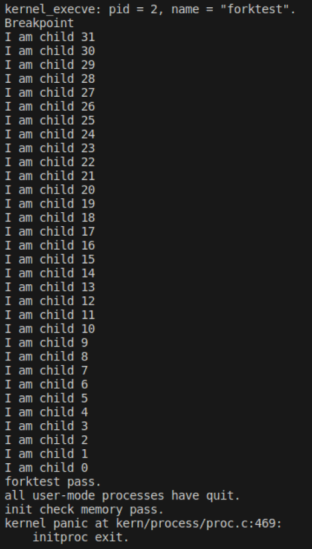
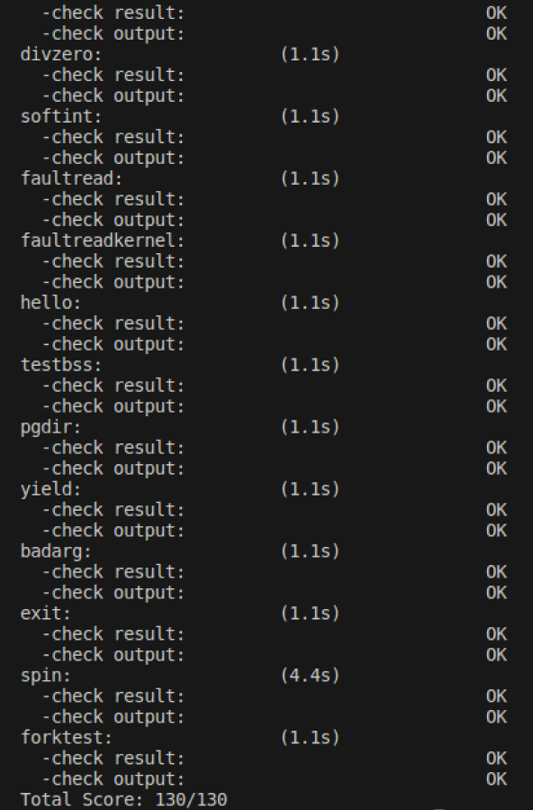
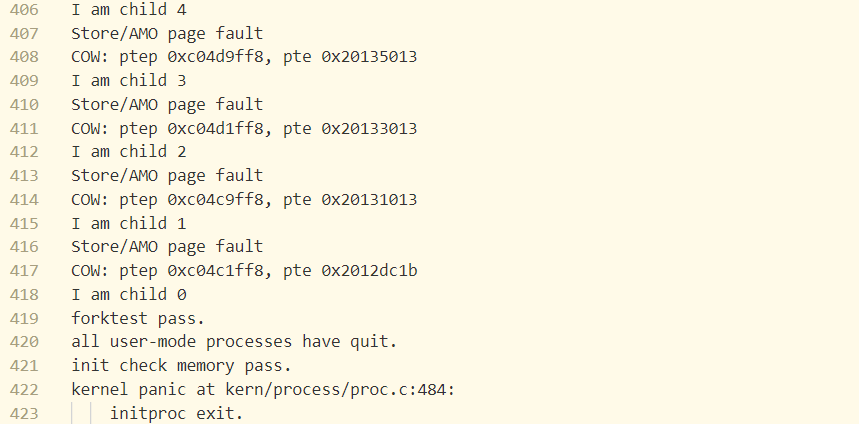
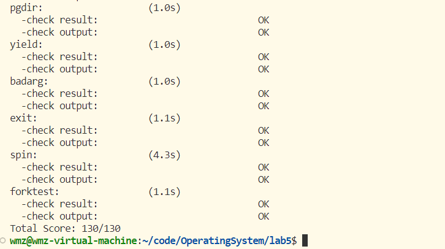
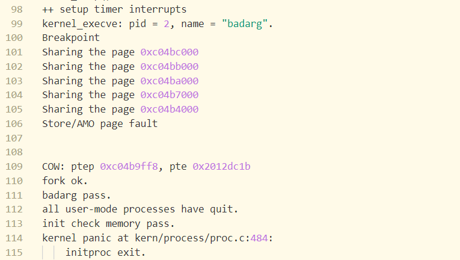

# lab5:用户程序

## 练习0：填写已有实验

>本实验依赖实验2/3/4。请把你做的实验2/3/4的代码填入本实验中代码中有“LAB2”/“LAB3”/“LAB4”的注释相应部分。注意：为了能够正确执行lab5的测试应用程序，可能需对已完成的实验2/3/4的代码进行进一步改进。

需要填入的部分如下：
```
    proc.c/alloc_proc;
    proc.c/proc_run;
    proc.c/do_fork;
    vmm.c/do_pgfault;
```
其中需要进一步改进的部分包括 `alloc_proc` 和 `do_fork` 函数，alloc_proc函数具体如下：
```
static struct proc_struct *
alloc_proc(void) {
    struct proc_struct *proc = kmalloc(sizeof(struct proc_struct));
    if (proc != NULL) {
        proc->state = PROC_UNINIT;
        proc->pid = -1;
        proc->runs = 0;
        proc->kstack = 0;
        proc->need_resched = 0;
        proc->parent = NULL;
        proc->mm = NULL;
        memset(&(proc->context), 0, sizeof(struct context));
        proc->tf = NULL;
        proc->cr3 = boot_cr3;
        proc->flags = 0;
        memset(proc->name, 0, PROC_NAME_LEN);
     //LAB5 YOUR CODE : (update LAB4 steps)
      //LAB5改进的部分
        proc->wait_state = 0; //初始化进程等待状态
        proc->cptr = proc->optr = proc->yptr = NULL; //指针用于设置进程之间的关系
    }
    return proc;
}
```
* `proc->wait_state = 0;` 表示进程的等待状态，初始化为0表示该进程处于没有等待的状态。
* `proc->cptr = proc->optr = proc->yptr = NULL;` 用于初始化进程指针*cptr, *yptr, *optr，用于建立与其他进程之间的关系，比如父子关系和兄弟关系。其中cptr表示当前进程的子进程（它应该指向最新创建的子进程），yptr表示当前进程的下一个兄弟进程，optr表示当前进程的前一个兄弟进程。初始化为NULL表示新创建的进程还没有和其他进程建立关系。

`do_fork` 函数如下：
```
int
do_fork(uint32_t clone_flags, uintptr_t stack, struct trapframe *tf) {
    int ret = -E_NO_FREE_PROC;
    struct proc_struct *proc;
    if (nr_process >= MAX_PROCESS) {
        goto fork_out;
    }
    ret = -E_NO_MEM;
    //LAB4:EXERCISE2 YOUR CODE
   
    //LAB5 YOUR CODE : (update LAB4 steps)
    
    if((proc=alloc_proc())==NULL){  //分配proc_struct结构体并初始化
        goto fork_out;
    }
    proc->parent=current; //更新创建proc的parent父线程变量为当前线程
    assert(current->wait_state == 0); //改进部分，确保当前进程的wait_state为0

    if(setup_kstack(proc)!=0){  //调用setup_kstack分配并初始化内核栈
        goto bad_fork_cleanup_proc;
    }

    if (copy_mm(clone_flags, proc) != 0) { //调用copy_mm根据 clone_flags 决定是复制还是共享内存管理系统
        goto bad_fork_cleanup_kstack;
    }
    copy_thread(proc, stack, tf); //设置进程的中断帧和上下文

    bool intr_flag;
    local_intr_save(intr_flag); //禁用中断，防止结构体加入链表时发生中断
    {    //将设置好的proc_struct结构体proc加入hash_list哈希链表和proc_list链表
        proc->pid = get_pid(); //为创建的进程proc分配一个pid号
        hash_proc(proc);
        set_links(proc); //改进部分，将进程插入proc_list设置进程之间的连接关系
    }
    local_intr_restore(intr_flag);  //恢复中断

    wakeup_proc(proc);  //将创建线程设置为就绪状态：PROC_RUNNABLE

    ret = proc->pid; //返回值设置为线程id

fork_out:
    return ret;

bad_fork_cleanup_kstack:
    put_kstack(proc);
bad_fork_cleanup_proc:
    kfree(proc);
    goto fork_out;
}
```
改进部分包括：
* `assert(current->wait_state == 0);` 用于确保当前进程处于不等待的状态，即需要确保用于创建新进程的父进程不能处于等待状态。
* `set_links(proc);` 为LAB5新增加的函数，用于将创建的进程加入proc_list链表，同时设置进程之间的关系，该函数具体如下：
    ```
    static void
    set_links(struct proc_struct *proc) {
        list_add(&proc_list, &(proc->list_link));
        proc->yptr = NULL;
        if ((proc->optr = proc->parent->cptr) != NULL) {
            proc->optr->yptr = proc;
        }
        proc->parent->cptr = proc;
        nr_process ++;
    }
    ```
    *  `list_add(&proc_list, &(proc->list_link));` 用于将创建的进程加入proc_list进程链表；
    *   `proc->yptr = NULL;` 新进程的下一个兄弟进程设置为NULL，表示它目前没有下一个兄弟进程；
    *  `proc->optr = proc->parent->cptr` 将新创建进程的上一个兄弟进程`proc->optr` 设置为它的父进程的孩子进程（此处父进程的孩子进程应该是除去当前新进程的最近创建的进程）；
    *  `proc->optr->yptr = proc;` 判断如果前面父进程的孩子进程存在的话，将新进程的上一个兄弟进程的下一个兄弟进程设置为新进程；以上三句主要用于设置进程之间的兄弟关系。
    * `proc->parent->cptr = proc;` 更新新进程的父进程的孩子进程指向新进程；
    *  `nr_process ++;` 进程数量加一。
    
## 练习1: 加载应用程序并执行
> do_execv函数调用load_icode（位于kern/process/proc.c中）来加载并解析一个处于内存中的ELF执行文件格式的应用程序。你需要补充load_icode的第6步，建立相应的用户内存空间来放置应用程序的代码段、数据段等，且要设置好proc_struct结构中的成员变量trapframe中的内容，确保在执行此进程后，能够从应用程序设定的起始执行地址开始执行。需设置正确的trapframe内容。
> 
> 请在实验报告中简要说明你的设计实现过程。
> 
> 请简要描述这个用户态进程被ucore选择占用CPU执行（RUNNING态）到具体执行应用程序第一条指令的整个经过。

`load_icode` 修改代码如下：
```
static int
load_icode(unsigned char *binary, size_t size) {
    ...
    //(6) setup trapframe for user environment
    struct trapframe *tf = current->tf;
    uintptr_t sstatus = tf->status;
    memset(tf, 0, sizeof(struct trapframe));
    /* LAB5:EXERCISE1 YOUR CODE*/
    
    tf->gpr.sp = USTACKTOP;  //用户态栈顶
    tf->epc = elf->e_entry;  //用户程序的入口
    tf->status = (read_csr(sstatus) | SSTATUS_SPIE ) & ~SSTATUS_SPP;  //设置状态寄存器
    ret = 0;
    ...
}
```
`load_icode` 函数的主要工作就是给用户进程建立一个能够让用户进程正常运行的用户环境，实现了加载应用程序执行码到当前进程新创建的用户虚拟内存空间中，包括读ELF格式的文件、申请内存空间、建立用户态虚拟内存空间、加载应用程序执行码等。具体的执行过程如下：
* 判断当前进程的内存管理结构数据mm是否为空，如果不为空，说明该进程的内存空间已经分配，可能出现了某些错误，触发内核panic。
    ```
     if (current->mm != NULL) {
        panic("load_icode: current->mm must be empty.\n");
    }
    ```
* 调用 `mm_create` 函数来申请进程的内存管理数据结构 `mm` 所需内存空间，并对 `mm` 进行初始化；申请失败则退出函数。
    ```
    if ((mm = mm_create()) == NULL) {
        goto bad_mm;
    }
    out:
        return ret;
    bad_mm:
        goto out;
    ```
* 调用 `setup_pgdir` 函数来申请一个页目录表所需的一个页大小的内存空间，并把描述 `ucore` 内核虚拟空间映射的内核页表（`boot_pgdir`）所指的内容拷贝到此新目录表中，最后让 `mm->pgdir` 指向此页目录表，作为当前进程新的页目录表，且能够正确映射内核虚空间；申请失败的话则调用mm_destroy函数释放分配的内存空间mm。
    ```
    if (setup_pgdir(mm) != 0) {
        goto bad_pgdir_cleanup_mm;
    }
    bad_pgdir_cleanup_mm:
        mm_destroy(mm);
    ```
* 复制执行程序的代码段、数据段、BSS段等到进程的内存空间mm中。具体来说，就是根据应用程序执行码的起始位置来解析此 `ELF` 格式的执行程序，并调用 `mm_map` 函数根据 `ELF` 格式的执行程序说明的各个段（代码段、数据段、BSS 段等）的起始位置和大小建立对应的 `vma` 结构，并把 `vma` 插入到 `mm` 结构中，从而表明了用户进程的合法用户态虚拟地址空间；
    ```
    struct Page *page;
    //(3.1)获得ELF格式的二进制文件的文件头
    struct elfhdr *elf = (struct elfhdr *)binary;
    //(3.2)获得程序头的入口点
    struct proghdr *ph = (struct proghdr *)(binary + elf->e_phoff);
    //(3.3) 该执行程序是否有效
    if (elf->e_magic != ELF_MAGIC) {
        ret = -E_INVAL_ELF;
        goto bad_elf_cleanup_pgdir;
    }
    
    uint32_t vm_flags, perm;
    struct proghdr *ph_end = ph + elf->e_phnum;
    for (; ph < ph_end; ph ++) {
        //(3.4)获得每个程序头
        if (ph->p_type != ELF_PT_LOAD) {
            continue ;
        }
        if (ph->p_filesz > ph->p_memsz) {
            ret = -E_INVAL_ELF;
            goto bad_cleanup_mmap;
        }
        if (ph->p_filesz == 0) {
            // continue ;
        }
    //(3.5) 调用mm_map函数创建新的vma( ph->p_va, ph->p_memsz)，将vma插入到进程空间中，
        ...
        if ((ret = mm_map(mm, ph->p_va, ph->p_memsz, vm_flags, NULL)) != 0) {
            goto bad_cleanup_mmap;
        }
        ...

     //(3.6) 分配内存，将程序每个段的内容(from, from+end)复制到进程相应的内核虚拟地址空间中(la, la+end)，建立映射关系
        end = ph->p_va + ph->p_filesz;
     //(3.6.1)复制TEXT/DATA的内容
        ...
      //(3.6.2) 处理BSS段
        ...
    }
    ```
* 为用户程序分配用户栈，调用 `mm_mmap` 函数建立用户栈的 `vma` 结构，明确用户栈的位置在用户虚空间的顶端，并调用pgdir_alloc_page分配一定数量的物理内存，并且建立栈的虚拟地址和物理地址的映射关系。
    ```
    if ((ret = mm_map(mm, USTACKTOP - USTACKSIZE, USTACKSIZE, vm_flags, NULL)) != 0) { //建立vma结构
        goto bad_cleanup_mmap;
    }
    //分配内存空间，建立映射关系
    assert(pgdir_alloc_page(mm->pgdir, USTACKTOP-PGSIZE , PTE_USER) != NULL);
    assert(pgdir_alloc_page(mm->pgdir, USTACKTOP-2*PGSIZE , PTE_USER) != NULL);
    assert(pgdir_alloc_page(mm->pgdir, USTACKTOP-3*PGSIZE , PTE_USER) != NULL);
    assert(pgdir_alloc_page(mm->pgdir, USTACKTOP-4*PGSIZE , PTE_USER) != NULL);
    ```
* 设置当前进程的mm，把 `mm->pgdir` 赋值到 `cr3` 寄存器中，更新用户进程的虚拟内存空间。此时用户进程的vma和mm结构已经建立完成。
    ```
    mm_count_inc(mm);
    current->mm = mm;
    current->cr3 = PADDR(mm->pgdir);
    lcr3(PADDR(mm->pgdir));
    ```
* 清空进程的中断帧，再重新设置进程的中断帧，设置用户程序的用户栈指针、入口地址和状态寄存器，使得在执行中断返回指令“sret”后，能够让 CPU 转到用户态，并回到用户态内存空间，使用用户态的代码段、数据段和堆栈，且能够跳转到用户进程的第一条指令执行，并确保在用户态能够响应中断；
    ```
    struct trapframe *tf = current->tf;
    uintptr_t sstatus = tf->status;
    memset(tf, 0, sizeof(struct trapframe)); //清空
    // LAB5:EXERCISE1 YOUR CODE
    tf->gpr.sp = USTACKTOP;  //设置用户栈指针为用户态栈顶
    tf->epc = elf->e_entry;  //用户程序的入口
    tf->status = (read_csr(sstatus) | SSTATUS_SPIE ) & ~SSTATUS_SPP; //设置状态寄存器确保在用户态执行，并开启中断
    ret = 0;
    ```
### 问题
> 请简要描述这个用户态进程被ucore选择占用CPU执行（RUNNING态）到具体执行应用程序第一条指令的整个经过。
具体经过包括：
* 首先经过分析，user_main()函数实现了用户程序的具体执行，它通过调用`kernel_execve()`实现。
    ```
    // user_main - kernel thread used to exec a user program
    static int
    user_main(void *arg) {
    #ifdef TEST
        KERNEL_EXECVE2(TEST, TESTSTART, TESTSIZE);
    #else
        KERNEL_EXECVE(exit);
    #endif
        panic("user_main execve failed.\n");
    }
    ```
* 通过在 `kernel_execve()` 函数中用 `ebreak` 产生断点中断进行处理，设置a7寄存器的值为10说明这不是一个普通的断点中断，实现在内核态的系统调用。在 `trap` 中根据 `scause` 寄存器的值判断为 `CAUSE_BREAKPOINT` ，调用 `syscall()` 。`syscall()` 函数会根据 `a0` 寄存器中的值获得对应的 `num` 进行系统调用的转发，此处可以看到它的值被设置为 `SYS_exec` ，此处会进一步转发给 `do_execve()` 函数，在 `do_execve()` 函数中进行具体处理。
    ```
     // kern/process/proc.c
    // kernel_execve - do SYS_exec syscall to exec a user program called by user_main kernel_thread
    static int kernel_execve(const char *name, unsigned char *binary, size_t size) {
        int64_t ret=0, len = strlen(name);
        asm volatile(
            "li a0, %1\n"
            "lw a1, %2\n"
            "lw a2, %3\n"
            "lw a3, %4\n"
            "lw a4, %5\n"
            "li a7, 10\n"  //设置a7寄存器的值为10
            "ebreak\n"  //产生断点中断
            "sw a0, %0\n"
            : "=m"(ret)
            : "i"(SYS_exec), "m"(name), "m"(len), "m"(binary), "m"(size) //设置为SYS_exec，进而调用do_exec函数
            : "memory"); //这里内联汇编的格式，和用户态调用ecall的格式类似，只是ecall换成了ebreak
        cprintf("ret = %d\n", ret);
        return ret;
    }
    // kern/trap/trap.c
    void exception_handler(struct trapframe *tf) {
        int ret;
        switch (tf->cause) {
            case CAUSE_BREAKPOINT:
            cprintf("Breakpoint\n");
            if(tf->gpr.a7 == 10){  //a7的值为10
                tf->epc += 4;//返回时要执行ebreak的下一条指令
                syscall();
                kernel_execve_ret(tf,current->kstack+KSTACKSIZE);  //返回
            }
            break;
              /* other cases ... */
        }
    }
    void syscall(void) { 
        struct trapframe *tf = current->tf;
        uint64_t arg[5];
        int num = tf->gpr.a0;//a0寄存器保存了系统调用编号
        if (num >= 0 && num < NUM_SYSCALLS) {//防止syscalls[num]下标越界
            if (syscalls[num] != NULL) {
                arg[0] = tf->gpr.a1;
                arg[1] = tf->gpr.a2;
                arg[2] = tf->gpr.a3;
                arg[3] = tf->gpr.a4;
                arg[4] = tf->gpr.a5;
                tf->gpr.a0 = syscalls[num](arg); 
                //把寄存器里的参数取出来，转发给系统调用编号对应的函数进行处理
                return ;
            }
        }
        ...
    }
    ```
* `do_execve()函数` 为加载新的执行码做好用户态内存空间清空准备，调用load_icode函数创建该用户态进程后，并设置进程中断帧，用户态进程的环境搭建完成；
    ```
    int do_execve(const char *name, size_t len, unsigned char *binary, size_t size) {
    struct mm_struct *mm = current->mm;
    if (!user_mem_check(mm, (uintptr_t)name, len, 0)) { //检查name的内存空间能否被访问
        return -E_INVAL;
    }
    if (len > PROC_NAME_LEN) { //进程名字的长度有上限 PROC_NAME_LEN，在proc.h定义
        len = PROC_NAME_LEN;
    }
    ...
    if (mm != NULL) {
        cputs("mm != NULL");
        lcr3(boot_cr3);
        if (mm_count_dec(mm) == 0) { //mm的引用计数为0
            exit_mmap(mm);
            put_pgdir(mm);
            mm_destroy(mm);//把进程当前占用的内存释放，之后重新分配内存
        }
        current->mm = NULL;
    }
    //把新的程序加载到当前进程里的工作都在load_icode()函数里完成
    int ret;
    if ((ret = load_icode(binary, size)) != 0) {
        goto execve_exit;//返回不为0，则加载失败
    }
    ...
    ```
* 系统调用结束后，上下文切换借助中断返回指令 `"sret"` 来完成，`trap` 返回的时候调用了 `sret` 指令，由于在 `load_icode` 函数中将 `sstatus` 寄存器的SPP二进制位设为0，所以sret指令返回的时候会从内核态切换到用户态，从而执行用户程序的第一条指令。

## 练习2: 父进程复制自己的内存空间给子进程

### 问题一

> 创建子进程的函数do_fork在执行中将拷贝当前进程（即父进程）的用户内存地址空间中的合法内容到新进程中（子进程），完成内存资源的复制。具体是通过copy_range函数（位于kern/mm/pmm.c中）实现的，请补充copy_range的实现，确保能够正确执行。

```cpp
int copy_range(pde_t *to, pde_t *from, uintptr_t start, uintptr_t end,
               bool share) {
    ...
    /* LAB5:EXERCISE2 YOUR CODE
     * replicate content of page to npage, 
     * build the map of phy addr of npage with the linear addr start
     * 
     * (1) find src_kvaddr: the kernel virtual address of page
     * (2) find dst_kvaddr: the kernel virtual address of npage
     * (3) memory copy from src_kvaddr to dst_kvaddr, size is PGSIZE
     * (4) build the map of phy addr of  nage with the linear addr start
     */
    void * kva_src = page2kva(page);
    void * kva_dst = page2kva(npage);
    memcpy(kva_dst, kva_src, PGSIZE);
    ret = page_insert(to, npage, start, perm);
    ...
}
```

这段代码的目标是复制一个页的内容到另一个页，同时在页表中建立新页的物理地址到线性地址的映射。下面是对每一步的逐条解释：

1. **`void * kva_src = page2kva(page);`**
   - 通过宏 `page2kva` 将给定的物理页 `page` 转换为内核虚拟地址 `kva_src`。这个内核虚拟地址是用于访问该物理页的地址。

2. **`void * kva_dst = page2kva(npage);`**
   - 通过宏 `page2kva` 将给定的新物理页 `npage` 转换为内核虚拟地址 `kva_dst`。这个内核虚拟地址将用于存储复制源页的内容。

3. **`memcpy(kva_dst, kva_src, PGSIZE);`**
   - 使用标准库函数 `memcpy`，将源地址 `kva_src` 处的物理页内容复制到目标地址 `kva_dst` 处，复制的大小为 `PGSIZE` 字节。这样实现了从一个页到另一个页的内容复制。

4. **`ret = page_insert(to, npage, start, perm);`**
   - 调用函数 `page_insert`，将新的物理页 `npage` 插入到以 `to` 为三级页表的页表中，映射到线性地址 `start` 处，权限为 `perm`。这个步骤确保了在物理内存中的页复制到新的线性地址上，并且在页表中建立了正确的映射关系。

总体而言，这段代码用于在页表中建立映射，将一个物理页的内容复制到另一个物理页，并确保在页表中有正确的映射关系。

### 问题二：

> 如何设计实现 *Copy on Write* 机制？给出概要设计，鼓励给出详细设计。

Copy on Write（写时复制）是一种内存管理技术：在多个进程之间共享同一份内存空间的拷贝，直到某个进程试图修改其拷贝时，才会为该进程创建一个新的私有拷贝。这种机制在多进程环境中减少了内存的冗余拷贝，提高了效率。下面给出一个以页为单位的写时复制设计：
 
#### 实现方法

为了实现写时复制，需要页表、内存管理、每个页的引用计数等功能的支持，这些功能在前面的实验中均已实现。

1. **进程创建和内存映射：**

    - 当一个进程通过`fork()`系统调用创建子进程时，子进程的页表将指向父进程的相应物理页，这些物理页的引用计数将会加一，子进程并不新申请物理页。并将两个进程对应页表项设为**只读**。即在`copy_range()`函数中执行`page_insert(from, page, start, perm & ~PTE_W)`和`page_insert(to, page, start, perm & ~PTE_W)`，通过`~PTE_W`将页表项标记为只读。

2. **写时复制：**

    - **触发异常**: 进程写入某个页时，如果该页为只读，则会触发`CAUSE_STORE_PAGE_FAULT`异常，并最终交给`do_pgfault`处理异常。

    - **判断异常**: 在`do_pgfault`中如果检测到`*ptep & PTE_V`为真，则说明这个错误是由于写时复制机制造成的，则继续进行下列处理。

    - **申请页面**: 根据触发错误的地址找到对应的页面，使用`pgdir_alloc_page(mm->pgdir, addr, perm)`申请一个新页面并建立其虚拟地址到这一新页面的映射，并将对应页表项的权限改为**可写**。之后使用`memcpy()`复制原始页面到新页面中，新页面引用计数设为1。

    - **原始页面处理**：使用`pgdir_alloc_page（）`会将原始页面的引用计数减一，如果引用计数为1，且触发了`CAUSE_STORE_PAGE_FAULT`异常，则说明该页面是COW后剩余的页面，则将原始页面对应页表项的权限也改为**可写**，此时已完成写时复制的全部处理，使用该物理页面的所有进程均已有自己的私有副本。

3. **内存释放：**

    - 当进程退出或不再需要某个页面时，只将对应页表项清空，并减少该物理页面的引用计数，而不是直接释放共享的原始内存页。当引用计数变为0时，才释放该物理页。

#### 总结：

Copy-on-Write 机制通过延迟实际的内存复制，提高了进程之间的内存共享效率。这样可以在多个进程之间共享相同的物理内存页，直到有进程尝试修改其中一个页面时才进行实际的复制。这种机制在虚拟内存管理中被广泛使用，以提高系统的性能和资源利用率。

## 练习3: 阅读分析源代码，理解进程执行 fork/exec/wait/exit 的实现，以及系统调用的实现
>简要说明对 fork/exec/wait/exit函数的分析。

ucore 中涉及的系统调用及其大致函数调用展示如下：
```cpp
SYS_exit        : process exit,                           -->do_exit
SYS_fork        : create child process, dup mm            -->do_fork-->wakeup_proc
SYS_wait        : wait process                            -->do_wait
SYS_exec        : after fork, process execute a program   -->load a program and refresh the mm
SYS_clone       : create child thread                     -->do_fork-->wakeup_proc
SYS_yield       : process flag itself need resecheduling, -->proc->need_sched=1, then scheduler will rescheule this process
SYS_sleep       : process sleep                           -->do_sleep 
SYS_kill        : kill process                            -->do_kill-->proc->flags |= PF_EXITING                                      
                                                                 -->wakeup_proc-->do_wait-->do_exit   
SYS_getpid      : get the process's pid
```
用户进程只能执行一般的指令，无法执行特权指令。因此采用系统调用机制为用户进程提供一个获得操作系统服务的统一接口层，简化用户进程的实现。

应用程序调用的 `exit/fork/wait/getpid` 等库函数最终都会调用 `syscall` 函数，传入的参数分别是 `SYS_exit / SYS_fork / SYS_wait / SYS_getid` 。

当应用程序调用系统函数时，执行`syscall`指令后，CPU 根据操作系统建立的系统调用中断描述符，转入S mode，然后开始了操作系统系统调用的执行过程，在内核函数执行之前，会保留软件执行系统调用前的执行现场，然后保存当前进程的tf结构体中，之后操作系统就可以开始完成具体的系统调用服务，完成服务后，调用`IRET`返回用户态，并恢复现场。这样整个系统调用就执行完毕了。

**1. fork**
执行完毕后，如果创建新进程成功，则出现两个进程，一个是子进程，一个是父进程。在子进程中，`fork`函数返回0，在父进程中，`fork`返回新创建子进程的进程ID。我们可以通过`fork`返回的值来判断当前进程是子进程还是父进程。调用过程如下：
```cpp
fork->SYS_fork->do_fork + wakeup_proc
```
`do_fork`函数执行流程如下：

1、分配并初始化进程控制块(alloc_proc 函数);
2、分配并初始化内核栈(setup_stack 函数);
3、根据clone_flag标志复制或共享进程内存管理结构(copy_mm 函数);
4、设置进程正常运行和调度所需的中断帧和执行上下文(copy_thread 函数);
5、把设置好的进程控制块放入hash_list 和 proc_list 两个全局进程链表中;
6、自此,进程已经准备好执行了,把进程状态设置为“就绪”态;
7、设置返回码为子进程的 id 号。

`wakeup_proc` 函数主要是将进程的状态设置为等待。
- 用户态程序调用sys_fork()系统调用，通过syscall进入内核态。
- 内核态处理sys_fork()系统调用，调用do_fork()函数创建子进程，完成后返回到用户态。

**2. exec**
完成用户进程的创建工作。首先为加载新的执行码做好用户态内存空间清空准备。接下来加载应用程序执行码到当前进程的新创建的用户态虚拟空间中。调用过程如下：
```cpp
SYS_exec->do_execve
```
`do_execve`函数执行流程如下：

1、为加载新的执行码做好用户态内存空间清空准备。如果mm不为NULL，则设置页表为内核空间页表，且进一步判断mm的引用计数减1后是否为0，如果为0，则表明没有进程再需要此进程所占用的内存空间，为此将根据mm中的记录，释放进程所占用户空间内存和进程页表本身所占空间。最后把当前进程的mm内存管理指针为空。
2、接下来加载应用程序执行码到当前进程的新创建的用户态虚拟空间中。
3、调用load_icode从而使之准备好执行。

- 用户态程序调用sys_exec()系统调用，通过syscall进入内核态。
- 内核态处理sys_exec()系统调用，调用do_execve()函数加载新的程序，最终返回到用户态。

**3. wait**
等待任意子进程的结束通知。`wait_pid`函数等待进程`id`号为`pid`的子进程结束通知。这两个函数最终访问`sys_wait`系统调用接口让ucore来完成对子进程的最后回收工作。调用过程如下：
```cpp
SYS_wait->do_wait
```
`do_wait`函数执行流程如下：

1、如果 pid!=0，表示只找一个进程 id 号为 pid 的退出状态的子进程，否则找任意一个处于退出状态的子进程;
2、如果此子进程的执行状态不为PROC_ZOMBIE，表明此子进程还没有退出，则当前进程设置执行状态为PROC_SLEEPING（睡眠），睡眠原因为WT_CHILD(即等待子进程退出)，调用schedule()函数选择新的进程执行，自己睡眠等待，如果被唤醒，则重复跳回步骤 1 处执行;
3、如果此子进程的执行状态为PROC_ZOMBIE，表明此子进程处于退出状态，需要当前进程(即子进程的父进程)完成对子进程的最终回收工作，即首先把子进程控制块从两个进程队列proc_list和hash_list中删除，并释放子进程的内核堆栈和进程控制块。自此，子进程才彻底地结束了它的执行过程，它所占用的所有资源均已释放。

- 用户态程序调用sys_wait()系统调用，通过syscall进入内核态。
- 内核态处理sys_wait()系统调用，调用do_wait()函数等待子进程退出，完成后返回到用户态。

**4. exit**
把一个退出码`error_code`传递给ucore，ucore通过执行内核函数`do_exit`来完成对当前进程的退出处理，主要工作就是回收当前进程所占的大部分内存资源，并通知父进程完成最后的回收工作。调用过程如下：
```cpp
SYS_exit->do_exit
```
`do_exit`函数执行流程如下：

1、先判断是否是用户进程，如果是，则开始回收此用户进程所占用的用户态虚拟内存空间。
2、设置当前进程的状态为PROC_ZOMBIE，然后设置当前进程的退出码为error_code。表明此时这个进程已经无法再被调度了，只能等待父进程来完成最后的回收工作（主要是回收该子进程的内核栈、进程控制块）。
3、如果当前父进程已经处于等待子进程的状态，即父进程的wait_state被置为WT_CHILD，则此时就可以唤醒父进程，让父进程来帮子进程完成最后的资源回收工作。
4、如果当前进程还有子进程,则需要把这些子进程的父进程指针设置为内核线程init,且各个子进程指针需要插入到init的子进程链表中。如果某个子进程的执行状态是 PROC_ZOMBIE,则需要唤醒init来完成对此子进程的最后回收工作。
5、执行schedule()调度函数，选择新的进程执行。

- 用户态程序调用sys_exit()系统调用，通过syscall进入内核态。
- 内核态处理sys_exit()系统调用，调用do_exit()函数结束当前进程，最终返回到用户态。

>哪些操作是在用户态完成，哪些是在内核态完成？内核态与用户态程序是如何交错执行的？内核态执行结果是如何返回给用户程序的？

内核态与用户态交错执行在 `fork/exec/wait/exit` 等系统调用的过程中。
- 用户态进程调用了系统调用，触发了从用户态到内核态的转换。
- 内核态执行相应的系统调用服务，完成相应的工作，包括进程的创建、加载新程序、等待子进程退出、进程资源的清理等。
- 在系统调用完成后，会再次切换回用户态，继续执行用户程序。

内核态执行结果返回给用户程序：在系统调用的执行过程中，内核通过相关的数据结构（如进程控制块、中断帧等）保存了用户程序的执行现场。 执行完系统调用后，通过中断返回（IRET）将控制权重新交还给用户程序，并在用户程序中恢复之前保存的执行现场，使用户程序继续执行。
>请给出ucore中一个用户态进程的执行状态生命周期图（包执行状态，执行状态之间的变换关系，以及产生变换的事件或函数调用）。（字符方式画即可）
```cpp
      (alloc_proc)          (wakeup_proc)
    ---------------> NEW ----------------> READY
                                             |
                                             |
                                             | (proc_run)
                                             |
         (do_wait)            (do_exit)      V
   EXIT <---------- ZOMBIE <-------------- RUNNING
```
## 实验验证
`make qemu`验证


`make grade`验证


## Challenge1: 实现 Copy on Write （COW）机制

### COW流程描述

1.**初始状态**：此时还没有执行`fork`，一个物理页面对应一个虚拟页面。

2.**fork**：执行fork之后，一个物理页面会对应多个虚拟页面，即共享页面。引用计数大于1，并且虚拟页面的页表项均设为只读。

3.**写入共享页面**：写入共享页面，会触发写入异常，交给对应的异常处理程序进行处理。如果该物理页面引用计数大于1，我们会申请一个新的页面，并恢复其对应的vma的权限，将触发异常的虚拟页面映射到该页面，将原始物理页面的引用计数减一；如果引用计数为1，我们直接将该页面权限恢复到对应的vma的权限。

4.**删除页面**：当进程退出或不再需要某个页面时，只将对应页表项清空，并减少该物理页面的引用计数，而不是直接释放共享的原始内存页。当引用计数变为0时，才释放该物理页。

### 代码实现

#### copy_range

在copy_range中，我们判断是否共享页面，如果是，则通过`page_insert(from, page, start, perm & ~PTE_W)`和`page_insert(to, page, start, perm & ~PTE_W)`将新虚拟页面的地址映射到原物理页面，并将两个虚拟页面对应的页表项设为只读。这样的话如
果应用程序试图写某一个共享页就会产生页访问异常，从而可以将控制权交给操作系统进行处理，最终将交给`do_pgfault()`函数处理。

代码如下，更改部分用*号标注出。

```cpp
int copy_range(pde_t *to, pde_t *from, uintptr_t start, uintptr_t end,
               bool share) {
    assert(start % PGSIZE == 0 && end % PGSIZE == 0);
    assert(USER_ACCESS(start, end));
    do {
        pte_t *ptep = get_pte(from, start, 0), *nptep;
        if (ptep == NULL) {
            start = ROUNDDOWN(start + PTSIZE, PTSIZE);
            continue;
        }
        if (*ptep & PTE_V) {
            if ((nptep = get_pte(to, start, 1)) == NULL) {
                return -E_NO_MEM;
            }
            uint32_t perm = (*ptep & PTE_USER);
            struct Page *page = pte2page(*ptep);
            // struct Page *npage = alloc_page();
            assert(page != NULL);
            // assert(npage != NULL);
            int ret = 0;
//************************************************
            if(share){//如果COW机制启用
                cprintf("Sharing the page 0x%x\n", page2kva(page));
                // 将父进程对应物理页面的pte改为只读
                page_insert(from, page, start, perm & ~PTE_W);
                // 将子进程虚拟地址映射到父进程对应的物理页，并将pte改为只读
                ret = page_insert(to, page, start, perm & ~PTE_W);
            } else {//完整拷贝内存
                // 申请一个新页
                struct Page *npage = alloc_page();
                assert(npage!=NULL);
                cprintf("alloc a new page 0x%x\n", page2kva(npage));

                void* src_kvaddr = page2kva(page);//父进程对应物理页的内核虚拟地址
                void* dst_kvaddr = page2kva(npage); //子进程对应物理页的内核虚拟地址
                memcpy(dst_kvaddr, src_kvaddr, PGSIZE);//复制
                ret = page_insert(to, npage, start, perm);//在子进程将该虚拟地址映射到对应的物理页
            }
//************************************************8

            assert(ret == 0);
        }
        start += PGSIZE;
    } while (start != 0 && start < end);
    return 0;
}
```

#### do_pgfault


在`do_pgfault`中如果检测到`*ptep & PTE_V`为真，则说明这个错误是由于写时复制机制造成的，可根据触发错误的地址找到对应的页面。如果页面引用计数大于1，则使用`pgdir_alloc_page(mm->pgdir, addr, perm)`申请一个新页面并建立其虚拟地址到这一新页面的映射，并将原始页面的引用计数减一，以及将对应页表项的权限改为**可写**。之后使用`memcpy()`复制原始页面到新页面中，新页面引用计数设为1。如果引用计数为1，则说明该页面是COW后剩余的页面，则将原始页面对应页表项的权限也改为**可写**，此时已完成写时复制的全部处理，使用该物理页面的所有进程均已有自己的私有副本。

代码如下，更改部分用*号标注出。

```cpp
int
do_pgfault(struct mm_struct *mm, uint_t error_code, uintptr_t addr) {
    int ret = -E_INVAL;
    struct vma_struct *vma = find_vma(mm, addr);

    pgfault_num++;
    if (vma == NULL || vma->vm_start > addr) {
        cprintf("not valid addr %x, and  can not find it in vma\n", addr);
        goto failed;
    }

    uint32_t perm = PTE_U;
    if (vma->vm_flags & VM_WRITE) {
        perm |= READ_WRITE;
    }
    addr = ROUNDDOWN(addr, PGSIZE);
    ret = -E_NO_MEM;
    pte_t *ptep=NULL;
  
    if ((ptep = get_pte(mm->pgdir, addr, 1)) == NULL) {
        cprintf("get_pte in do_pgfault failed\n");
        goto failed;
    }
    
    if (*ptep == 0) {
        if (pgdir_alloc_page(mm->pgdir, addr, perm) == NULL) {
            cprintf("pgdir_alloc_page in do_pgfault failed\n");
            goto failed;
        }
    } else {
//************************************************
        if (*ptep & PTE_V) {
            cprintf("\n\nCOW: ptep 0x%x, pte 0x%x\n",ptep, *ptep);
            struct Page* page = pte2page(*ptep);//获取对应物理页
            if(page_ref(page) > 1)
            {
                // 如果该物理页面被多个进程引用
                // 则使用pgdir_alloc_page分配一个新物理页，该函数会自动将page_ref(page)减一
                struct Page* new_page = pgdir_alloc_page(mm->pgdir, addr, perm);
                void * src_kva = page2kva(page);//原页面的内核虚拟地址
                void * dst_kva = page2kva(new_page);//新页面的内核虚拟地址
                memcpy(dst_kva, src_kva, PGSIZE);//复制
            } else {
                //如果该物理页面被一个进程引用，则说明是共享页面的最后一页
                //根据所处的vma恢复其权限perm
                page_insert(mm->pgdir, page, addr, perm);
            }
//***********************************************
        } else {
            if (swap_init_ok) {
                struct Page *page = NULL;

                swap_in(mm, addr, &page);
                page_insert(mm->pgdir, page, addr, perm);
                swap_map_swappable(mm, addr, page, 1);

                page->pra_vaddr = addr;
            } else {
                cprintf("no swap_init_ok but ptep is %x, failed\n", *ptep);
                goto failed;
            }
        }
   }
   ret = 0;
failed:
    return ret;
}
```

### 结果验证

在`dup_mmap()`函数中，将`share`设为1，表明启用COW机制。然后执行make qemu和make grade，得到结果如下：





结果表明，COW机制实现正确。

以用户程序`badarg.c`为例，其输出如下：



可以看到，fork该进程共使用了五个共享页面，并在之后由于写入，一个共享页面创立了私有副本。

## Challenge2: 说明该用户程序是何时被预先加载到内存中的？与我们常用操作系统的加载有何区别，原因是什么？
本次实验中，用户程序是在执行 execve 系统调用时被预先加载到内存中的。与我们常用的操作系统加载过程的区别主要在于执行上述加载步骤的时机。在常用的操作系统中，用户程序通常在运行时（runtime）才被加载到内存。当用户启动程序或运行可执行文件时，操作系统负责将程序从磁盘加载到内存，然后执行。这么做的原因是简化用户程序执行过程：预先加载用户程序可以简化用户程序的执行过程，使得执行过程更加直接和快速。

## 知识点分析
### 内核线程到用户进程
各个内核线程间的配合是较为协调的，能够相互考虑各自的资源利用情况，从而可以在适当的时候使用或不使用资源。而用户进程则相对利己，只考虑自身的资源利用情况，所以需要操作系统管理它们，让有效的资源得到协调而安全的利用。
### 让用户进程正常运行的用户环境
用户环境由以下部分组成：
- 建立用户虚拟空间的页表和支持页换入换出机制的用户内存访存错误异常服务例程：提供地址隔离和超过物理空间大小的虚存空间。
- 应用程序执行的用户态 CPU 特权级：在用户态 CPU 特权级，应用程序只能执行一般指令，如果特权指令，结果不是无效就是产生“执行非法指令”异常
- 系统调用机制：给用户进程提供“服务窗口”
- 中断响应机制：给用户进程设置“中断窗口”，这样产生中断后，当前执行的用户进程将被强制打断，CPU 控制权将被操作系统的中断服务例程使用。
### 用户态实现系统调用的过程
* 系统调用号和参数传递：用户态程序通过指定RISC-V架构中的  `ecall` 指令来发起系统调用。在寄存器中设置系统调用号 `a7` ，根据系统调用的需要，可以将其他参数存储在寄存器 `a0-a6` 中，用于向操作系统传递参数。
* 执行用户态到内核态的切换：执行 `ecall` 指令后，CPU会从用户态切换到特权级较高的内核态，并跳转到事先定义好的系统调用处理例程，该例程通常是定义在操作系统内核中的。
* 内核态处理系统调用：进入系统调用处理例程后，操作系统会通过读取 `a7` 寄存器中的系统调用号来确定用户程序请求的具体服务，并根据需要读取其他参数寄存器的值进行验证和处理。系统调用处理例程执行所需的操作，例如访问硬件设备，操作文件系统，分配内存等。
* 执行结果返回给用户程序：在系统调用处理例程执行完所需的操作后，可以将结果存储在 `a0` 寄存器中，以便用户程序后续读取和处理。
* 切换回用户态：处理完系统调用后，操作系统会将CPU从内核态切换回用户态，以便用户程序继续执行。这个切换是通过将相关的寄存器和状态恢复到用户态来实现的。