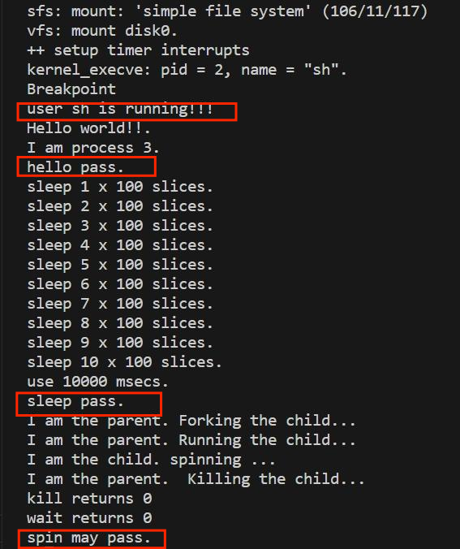
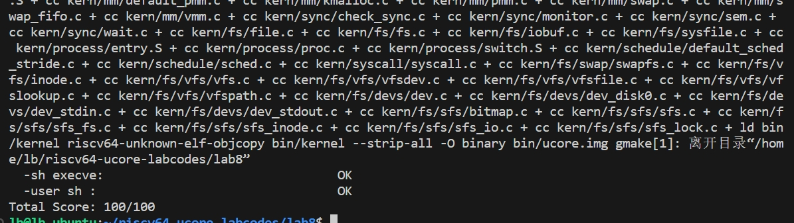

# Lab8：文件系统

## 练习0：填写已有实验

> 本实验依赖实验 1/2/3/4/5/6/7。请把你做的实验 1/2/3/4/5/6/7 的代码填入本实验中代码中有“LAB1”/“LAB2”/“LAB3”/“LAB4”/“LAB5”/“LAB6”/“LAB7”的注释相应部分。并确保编译通过。注意：为了能够正确执行 lab8 的测试应用程序，可能需对已完成的实验 1/2/3/4/5/6/7 的代码进行进一步改进。

需要填入的部分如下：
```
    vmm.c/do_pgfault;
    proc.c/alloc_proc;（需改动）
    proc.c/proc_run;（需改动）
    proc.c/do_fork;（有改动）
    pro.c/load_icode;（需改动，见练习2）
    pmm.c/copy_range;
    schedule/default_scehed_stride.c;（实验6相关）
```
`proc.c/alloc_proc` 改动如下：增加了Lab6和Lab8相关字段的初始化，其中Lab8的 `proc->filesp = NULL;` 初始化指向文件描述符的指针为NULL，表示新创建的该进程还未打开任何文件。

```cpp
static struct proc_struct *
alloc_proc(void) {
    struct proc_struct *proc = kmalloc(sizeof(struct proc_struct));
    if (proc != NULL) {
        proc->state = PROC_UNINIT;
        proc->pid = -1;
        proc->runs = 0;
        proc->kstack = 0;
        proc->need_resched = 0;
        proc->parent = NULL;
        proc->mm = NULL;
        memset(&(proc->context), 0, sizeof(struct context));
        proc->tf = NULL;
        proc->cr3 = boot_cr3;
        proc->flags = 0;
        memset(proc->name, 0, PROC_NAME_LEN);
        proc->wait_state = 0;
        proc->cptr = proc->optr = proc->yptr = NULL;
        //Lab6
        proc->rq = NULL;   //运行队列为空，表示当前进程还未放入任何队列
        list_init(&(proc->run_link));  //运行队列的链表节点为空
        proc->time_slice = 0;   //进程分配的时间片
        proc->lab6_run_pool.left = proc->lab6_run_pool.right = proc->lab6_run_pool.parent = NULL; //初始化左子节点、右子节点、父节点，二叉堆
        proc->lab6_stride = 0;  // Stride Scheduling 算法中的stride值，初始化为0
        proc->lab6_priority = 0;  //优先级初始化为0
        //Lab8
        proc->filesp = NULL;  //指向文件描述符的指针初始化为空，表示该进程没有打开任何文件
    }
    return proc;
}

```
`pro.c/proc_run` 改动如下：增加了flush_tlb()，在切换目录表后，刷新TLB，确保新的进程的地址空间映射关系可以正确加载。
```cpp
void
proc_run(struct proc_struct *proc) {
    if (proc != current) {
        bool intr_flag;
        struct proc_struct *prev = current, *next = proc;
        local_intr_save(intr_flag);  //禁用中断
        {
            current = proc;  //将当前要运行的进程设置为要切换的进程
            lcr3(next->cr3);  //将页表更新为新进程的页表
            flush_tlb();  //刷新TLB
            switch_to(&(prev->context), &(next->context));  //调用switch_to切换到新进程
        }
        local_intr_restore(intr_flag);  //使能中断
    }
}
```
`pro.c/do_fork` 改动如下：增加语句`copy_files(clone_flags, proc` 实现复制当前进程的files_struct到进程proc。如果返回值不为0，说明复制出现错误，跳转到 `bad_fork_cleanup_kstack` 释放分配的内核栈。
```cpp
int
do_fork(uint32_t clone_flags, uintptr_t stack, struct trapframe *tf) {
    int ret = -E_NO_FREE_PROC;
    struct proc_struct *proc;
    if (nr_process >= MAX_PROCESS) {
        goto fork_out;
    }
    ret = -E_NO_MEM;
    if((proc=alloc_proc())==NULL){  //分配proc_struct结构体并初始化
        goto fork_out;
    }
    proc->parent=current; //更新创建proc的parent父线程变量为当前线程
    assert(current->wait_state == 0); //确保当前进程的wait_state为0

    if(setup_kstack(proc)!=0){  //调用setup_kstack分配并初始化内核栈
        goto bad_fork_cleanup_proc;
    }

    if (copy_files(clone_flags, proc) != 0) { //for LAB8，
        goto bad_fork_cleanup_kstack;
    }
    
    if (copy_mm(clone_flags, proc) != 0) { //调用copy_mm根据 clone_flags 决定是复制还是共享内存管理系统
        goto bad_fork_cleanup_fs;
    }
    copy_thread(proc, stack, tf); //设置进程的中断帧和上下文
    ...........
}
```
`Lab6` 中的`schedule/default_scehed_stride.c` 补充如下：实现了 `Stride Scheduling` 调度算法。
首先是 `strinde_init` 函数，初始化调度类的信息，初始化当前的运行队列为一个空的容器结构。
```cpp
/* You should define the BigStride constant here*/
/* LAB6: YOUR CODE */
#define BIG_STRIDE  0x7FFFFFFF /* you should give a value, and is ??? */
........
static void
stride_init(struct run_queue *rq) {
    //LAB6: YOUR CODE
     list_init(&(rq->run_list)); //初始化调度器类
     rq->lab6_run_pool = NULL; //初始化运行的优先队列
     rq->proc_num = 0; //初始化运行队列的进程数目为0
}
```
`stride_enqueue` 函数实现初始化刚进入运行队列的进程 `proc` 的 `stride` 属性，并将 `proc` 插入放入运行队列中去（并未放在队列头部）。
```cpp
static void
stride_enqueue(struct run_queue *rq, struct proc_struct *proc) {
     /*LAB6: YOUR CODE 
      */
#if USE_SKEW_HEAP
     rq->lab6_run_pool =   //将新的进程proc插入到运行队列中
          skew_heap_insert(rq->lab6_run_pool, &(proc->lab6_run_pool), proc_stride_comp_f);
#else
     assert(list_empty(&(proc->run_link)));
     list_add_before(&(rq->run_list), &(proc->run_link));
#endif
     if (proc->time_slice == 0 || proc->time_slice > rq->max_time_slice) {
          proc->time_slice = rq->max_time_slice; //该进程的剩余时间设置为时间片大小
     }
     proc->rq = rq;  //更新运行进程
     rq->proc_num ++;  //运行进程数目加1
}
```
函数 `stride_dequeue` 实现了从运行队列中删除指定的元素 `proc`，通过调用函数 `skew_heap_remove` 实现。
```cpp
static void
stride_dequeue(struct run_queue *rq, struct proc_struct *proc) {  //进程proc从运行队列删除
     /*  LAB6: YOUR CODE 
      */
#if USE_SKEW_HEAP
     rq->lab6_run_pool =  //从队列中删除指定进程
          skew_heap_remove(rq->lab6_run_pool, &(proc->lab6_run_pool), proc_stride_comp_f);
#else
     assert(!list_empty(&(proc->run_link)) && proc->rq == rq);
     list_del_init(&(proc->run_link));
#endif
     rq->proc_num --;   //进程数减1
 
}
```
`stride_pick_next` 函数实现了扫描整个运行队列，返回其中 `stride` 值最小的对应进程，同时更新对应进程的 `stride` 值，即 `pass = BIG_STRIDE / P->priority; P->stride += pass` 。
```cpp
static struct proc_struct *
stride_pick_next(struct run_queue *rq) {  //扫描整个队列，返回stride最小的进程，并更新对应的stride值
     /*  LAB6: YOUR CODE 
      */
#if USE_SKEW_HEAP
     if (rq->lab6_run_pool == NULL) return NULL;
     struct proc_struct *p = le2proc(rq->lab6_run_pool, lab6_run_pool);  //斜堆中选择stride最小的进程
#else
     list_entry_t *le = list_next(&(rq->run_list));

     if (le == &rq->run_list)
          return NULL;
     
     struct proc_struct *p = le2proc(le, run_link);
     le = list_next(le);
     while (le != &rq->run_list)  //遍历链表，查找stride最小的进程
     {
          struct proc_struct *q = le2proc(le, run_link);
          if ((int32_t)(p->lab6_stride - q->lab6_stride) > 0)
               p = q;
          le = list_next(le);
     }
#endif
     if (p->lab6_priority == 0)  //优先级为0，设置为最大stride
          p->lab6_stride += BIG_STRIDE;
     else p->lab6_stride += BIG_STRIDE / p->lab6_priority;  
     return p;
}
```
`stride_proc_tick` 函数实现了检测当前进程分配的时间片是否用完，如果用完设置进程切换标志 `need_resched` ，引起进程切换；如果没有用完，时间片减1。
```cpp
static void
stride_proc_tick(struct run_queue *rq, struct proc_struct *proc) {  //检测当前进程分配的时间片是否用完，如果用完进程切换
     /* LAB6: YOUR CODE */
     if (proc->time_slice > 0) {  //时间片还未用完，
          proc->time_slice --;  //减1
     }
     if (proc->time_slice == 0) { //时间片用完，设置进程切换标志，need_resched为1
          proc->need_resched = 1;
     }
}

```
## 练习1：完成读文件操作的实现（需要编码）
> 首先了解打开文件的处理流程，然后参考本实验后续的文件读写操作的过程分析，填写在 kern/fs/sfs/sfs_inode.c中的sfs_io_nolock()函数，实现读文件中数据的代码。

从 ucore 的角度来看，其文件系统架构包含四类主要的数据结构, 它们分别是：

- **超级块（SuperBlock）**：它主要从文件系统的全局角度描述特定文件系统的全局信息。它的作用范围是整个OS空间。

- **索引节点（inode）**：它主要从文件系统的单个文件的角度它描述了文件的各种属性和数据所在位置。它的作用范围是整个OS空间。

- **目录项（dentry）**：它主要从文件系统的文件路径的角度描述了文件路径中的特定目录。它的作用范围是整个 OS 空间。

- **文件（file）**，它主要从进程的角度描述了一个进程在访问文件时需要了解的文件标识，文件读写的位置，文件引用情况等信息。它的作用范围是某一具体进程。

文件系统会将磁盘上的文件（程序）读取到内存里面来，在用户空间里面变成进程去进一步执行或其他操作。通过一系列系统调用完成这个过程。

根据实验指导书，我们可以了解到 ucore 的文件系统架构主要由四部分组成：

- **通用文件系统访问接口层**：该层提供了一个从用户空间到文件系统的标准访问接口。这一层访问接口让应用程序能够通过一个简单的接口获得 ucore 内核的文件系统服务。

- **文件系统抽象层**：向上提供一个一致的接口给内核其他部分（文件系统相关的系统调用实现模块和其他内核功能模块）访问。向下提供一个抽象函数指针列表和数据结构来屏蔽不同文件系统的实现细节。

- **Simple FS 文件系统层**：一个基于索引方式的简单文件系统实例。向上通过各种具体函数实现以对应文件系统抽象层提出的抽象函数。向下访问外设接口

- **外设接口层**：向上提供 device 访问接口屏蔽不同硬件细节。向下实现访问各种具体设备驱动的接口,比如 disk 设备接口/串口设备接口/键盘设备接口等。

假如应用程序操作文件（打开/创建/删除/读写），首先需要通过文件系统的通用文件系统访问接口层给用户空间提供的访问接口进入文件系统内部，接着由文件系统抽象层把访问请求转发给某一具体文件系统（比如 SFS 文件系统），具体文件系统（Simple FS 文件系统层）把应用程序的访问请求转化为对磁盘上的 `block` 的处理请求，并通过外设接口层交给磁盘驱动例程来完成具体的磁盘操作。结合用户态写文件函数 `write` 的整个执行过程，我们可以比较清楚地看出 ucore 文件系统架构的层次和依赖关系。


首先了解打开文件的处理流程。
- **文件访问接口层**：

用户在进程中调用 `safe_open()` 函数，然后依次调用如下函数 `open->sys_open->syscall`，从而引发系统调用然后进入内核态，然后会由 `sys_open` 内核函数处理系统调用。
```cpp
static int
sys_open(uint64_t arg[]) {
    const char *path = (const char *)arg[0];
    uint32_t open_flags = (uint32_t)arg[1];
    return sysfile_open(path, open_flags);
}
```
进一步调用到内核函数 `sysfile_open`。
```cpp
int
sysfile_open(const char *__path, uint32_t open_flags) {
    int ret;
    char *path;
    if ((ret = copy_path(&path, __path)) != 0) {
        return ret;
    }
    ret = file_open(path, open_flags);
    kfree(path);
    return ret;
}
```
然后将字符串 ``"/test/testfile"`` 拷贝到内核空间中的字符串 `path` 中，然后调用了`file_open`，`file_open`调用了`vfs_open`, 使用了`VFS`的接口，进入到文件系统抽象层的处理流程完成进一步的打开文件操作中。

- **文件系统抽象层**：

系统会分配一个 `file` 数据结构的变量，这个变量其实是 `current->fs_struct->filemap[]` 中的一个空元素，即还没有被用来打开过文件，但是分配完了之后还不能找到对应的文件结点。系统在该层调用了 `vfs_open` 函数通过调用 `vfs_lookup` 找到 `path` 对应文件的 `inode`，然后调用`vop_open` 函数打开文件。然后层层返回，通过执行语句 `file->node=node`;，就把当前进程的 `current->fs_struct->filemap[fd]`（即 file 所指变量）的成员变量 `node` 指针指向了代表文件的索引节点 `node`。这时返回 `fd`。最后完成打开文件的操作。

在上一步中，调用了 SFS 文件系统层的 `vfs_lookup` 函数去寻找 `node`，这里在 `sfs_inode.c` 中易知 `.vop_lookup = sfs_lookup`。

```cpp
static int 
sfs_lookup(struct inode *node, char *path, struct inode**node_store) {
    struct sfs_fs *sfs = fsop_info(vop_fs(node), sfs);
    assert(*path != '\0' && *path != '/');    //以“/”为分割符，从左至右逐一分解path获得各个子目录和最终文件对应的inode节点。
    vop_ref_inc(node);
    struct sfs_inode *sin = vop_info(node, sfs_inode);
    if (sin->din->type != SFS_TYPE_DIR) {
        vop_ref_dec(node);
        return -E_NOTDIR;
    }
    struct inode *subnode;
    int ret = sfs_lookup_once(sfs, sin, path, &subnode, NULL);  //循环进一步调用sfs_lookup_once查找以“test”子目录下的文件“testfile1”所对应的inode节点。

    vop_ref_dec(node);
    if (ret != 0) {  
        return ret;
    }
    *node_store = subnode;  //当无法分解path后，就意味着找到了需要对应的inode节点，就可顺利返回了。
    return 0;
}
```

`sfs_lookup`有三个参数：`node，path，node_store`。其中`node`是根目录`“/”`所对应的`inode`节点；`path`是文件`sfs_filetest1`的绝对路径`/sfs_filetest1`，而`node_store`是经过查找获得的`sfs_filetest1`所对应的`inode`节点。`sfs_lookup`函数以`“/”`为分割符，从左至右逐一分解`path`获得各个子目录和最终文件对应的`inode`节点。在本例中是调用`sfs_lookup_once`查找以根目录下的文件`sfs_filetest1`所对应的`inode`节点。当无法分解`path`后，就意味着找到了`sfs_filetest1`对应的`inode`节点，就可顺利返回了。

再进一步观察 `sfs_lookup_once` 函数，它调用 `sfs_dirent_search_nolock` 函数来查找与路径名匹配的目录项，如果找到目录项，则根据目录项中记录的 `inode` 所处的数据块索引值找到路径名对应的 SFS 磁盘 `inode`，并读入 SFS 磁盘 `inode` 对的内容，创建 SFS 内存 `inode`。
```cpp
static int
sfs_lookup_once(struct sfs_fs *sfs, struct sfs_inode *sin, const char *name, struct inode **node_store, int *slot) {
    int ret;
    uint32_t ino;
    lock_sin(sin);
    {   // find the NO. of disk block and logical index of file entry
        ret = sfs_dirent_search_nolock(sfs, sin, name, &ino, slot, NULL);
    }
    unlock_sin(sin);
    if (ret == 0) {
		// load the content of inode with the the NO. of disk block
        ret = sfs_load_inode(sfs, node_store, ino);
    }
    return ret;
}
```
下面完成对 `sfs_io_nolock` 的填写，填充部分与相应解析如下：

**首部不完整块的处理**：
```cpp
if ((blkoff = offset % SFS_BLKSIZE) != 0) {
    size = (nblks != 0) ? (SFS_BLKSIZE - blkoff) : (endpos - offset);
    if ((ret = sfs_bmap_load_nolock(sfs, sin, blkno, &ino)) != 0) {
        goto out;
    }
    if ((ret = sfs_buf_op(sfs, buf, size, ino, blkoff)) != 0) {
        goto out;
    }
    alen += size;
    if (nblks == 0) {
        goto out;
    }
    buf += size, blkno++, nblks--;
}
```
- `blkoff` 是当前偏移量`offset`在块内的位置，如果不是块的起始位置（即`blkoff`不为0），则需要特殊处理这个不完整的块。
- `size` 用于确定要在这个不完整的块中处理的数据量。如果有更多的块要处理（nblks != 0），则处理当前块的剩余部分；如果这是最后一个块，则只处理到`endpos`位置。
- `sfs_bmap_load_nolock` 用于获取当前块编号`blkno`对应的`inode`编号`ino`，不带锁操作。
- `sfs_buf_op` 是对缓冲区`buf`的操作，将`size`大小的数据从块`ino`的`blkoff`偏移处开始处理。
- `alen` 累加已处理的数据量。
- 如果没有更多的块（`nblks`为0），则跳转到`out`标签结束处理。
- 更新buf, blkno, 和nblks以准备处理下一个块。

**完整块的处理**：
```cpp
while (nblks != 0) {
    if ((ret = sfs_bmap_load_nolock(sfs, sin, blkno, &ino)) != 0) {
        goto out;
    }
    if ((ret = sfs_block_op(sfs, buf, ino, 1)) != 0) {
        goto out;
    }
    alen += size, buf += size, blkno++, nblks--;
}
```
- 这是一个循环，处理所有完整的块。
- 同样使用`sfs_bmap_load_nolock`获取块编号对应的`inode`编号。
- `sfs_block_op` 对整个块进行操作，处理整个块的大小（`SFS_BLKSIZE`）。
- 更新`alen`（累加处理的数据量），`buf`（移动缓冲区指针），`blkno`（下一个块编号），`nblks`（剩余块数量）。

**尾部不完整块的处理**：
```cpp
if ((size = endpos % SFS_BLKSIZE) != 0) {
    if ((ret = sfs_bmap_load_nolock(sfs, sin, blkno, &ino)) != 0) {
        goto out;
    }
    if ((ret = sfs_buf_op(sfs, buf, size, ino, 0)) != 0) {
        goto out;
    }
    alen += size;
}
```
- 最后，如果`endpos`在块中的位置不是块的起始位置（即`endpos % SFS_BLKSIZE`不为0），说明还有一个尾部不完整的块需要处理。
- 同样使用`sfs_bmap_load_nolock`获取这个尾部块的`inode`编号。
- 使用`sfs_buf_op`进行缓冲区操作，从块的起始位置开始处理`size`大小的数据。
- `alen` 累加最后一块处理的数据量。

## 练习2: 完成基于文件系统的执行程序机制的实现（需要编码）
> 改写 proc.c 中的 load_icode 函数和其他相关函数，实现基于文件系统的执行程序机制。执行：make qemu。如果能看看到 sh 用户程序的执行界面，则基本成功了。如果在 sh 用户界面上可以执行”ls”,”hello”等其他放置在 sfs 文件系统中的其他执行程序，则可以认为本实验基本成功。

proc.c中需要改写的函数包括 `alloc_proc`、`proc_run` 、`do_fork`，具体改动见练习0.实验 8 和实验 5 中 `load_icode（）` 函数代码最大不同的地方在于读取 EFL 文件方式，实验 5 中是通过获取 ELF 在内存中的位置，根据 ELF 的格式进行解析，而在实验 8 中则是通过 ELF 文件的文件描述符调用 `load_icode_read（）` 函数来进行解析程序。
本次实验的`load_icode` 函数主要工作就是给用户进程建立一个能够让其正常运行的用户环境，通过从磁盘上（此处即同之前实现的主要区别，不是从内存直接读取）加载用户程序的二进制文件（ELF格式）到当前进程的内存中，并设置进程的上下文，包括内存映射、栈设置、参数传递等，具体实现如下：
```cpp
static int
load_icode(int fd, int argc, char **kargv) {
    /* LAB8:EXERCISE2 YOUR CODE  HINT:how to load the file with handler fd  in to process's memory? how to setup argc/argv?
     */
    assert(argc >= 0 && argc <= EXEC_MAX_ARG_NUM);
    
    if (current->mm != NULL) {
        panic("load_icode: current->mm must be empty.\n");
    }

    int ret = -E_NO_MEM;
    struct mm_struct *mm;
    //(1) create a new mm for current process
    if ((mm = mm_create()) == NULL) {  //分配内存管理空间
        goto bad_mm;
    }
    //(2) create a new PDT, and mm->pgdir= kernel virtual addr of PDT
    if (setup_pgdir(mm) != 0) {//申请一个页表空间作为页目录表，并拷贝内核页目录表的内容，可以正确映射内核空间
        goto bad_pgdir_cleanup_mm;
    }
    //(3) copy TEXT/DATA section, build BSS parts in binary to memory space of process
    //复制TEXT/DATA段、BBS段到进程的内存空间mm中
    struct Page *page;
    //(3.1) read raw data content in file and resolve elfhdr
    struct elfhdr __elf, *elf = &__elf;
    if ((ret = load_icode_read(fd, elf, sizeof(struct elfhdr), 0)) != 0) {  //读取ELF文件头部的信息
        goto bad_elf_cleanup_pgdir;
    }

    if (elf->e_magic != ELF_MAGIC) {  //验证ELF头部的魔数是否正确，确保文件是合法的ELF文件
        ret = -E_INVAL_ELF;
        goto bad_elf_cleanup_pgdir;
    }
    //(3.2) read raw data content in file and resolve proghdr based on info in elfhdr
    struct proghdr __ph, *ph = &__ph;
    uint32_t vm_flags, perm, phnum;
    for (phnum = 0; phnum < elf->e_phnum; phnum ++) {  //循环处理ELF文件的每个程序头部，
        off_t phoff = elf->e_phoff + sizeof(struct proghdr) * phnum;
        if ((ret = load_icode_read(fd, ph, sizeof(struct proghdr), phoff)) != 0) {
            goto bad_cleanup_mmap;
        }
        if (ph->p_type != ELF_PT_LOAD) {  //判断程序头部类型，是否可加载
            continue ;
        }
        if (ph->p_filesz > ph->p_memsz) {
            ret = -E_INVAL_ELF;
            goto bad_cleanup_mmap;
        }
        if (ph->p_filesz == 0) {
            // continue ;
            // do nothing here since static variables may not occupy any space
        }
        //(3.3) call mm_map to build vma related to TEXT/DATA
        vm_flags = 0, perm = PTE_U | PTE_V;
        if (ph->p_flags & ELF_PF_X) vm_flags |= VM_EXEC;
        if (ph->p_flags & ELF_PF_W) vm_flags |= VM_WRITE;
        if (ph->p_flags & ELF_PF_R) vm_flags |= VM_READ;
        // modify the perm bits here for RISC-V
        if (vm_flags & VM_READ) perm |= PTE_R;
        if (vm_flags & VM_WRITE) perm |= (PTE_W | PTE_R);
        if (vm_flags & VM_EXEC) perm |= PTE_X;
        if ((ret = mm_map(mm, ph->p_va, ph->p_memsz, vm_flags, NULL)) != 0) { //创建新的虚拟内存区域，并映射到对应的物理内存
            goto bad_cleanup_mmap;
        }
        off_t offset = ph->p_offset;
        size_t off, size;
        uintptr_t start = ph->p_va, end, la = ROUNDDOWN(start, PGSIZE);

        ret = -E_NO_MEM;

        end = ph->p_va + ph->p_filesz;
        //(3.4) call pgdir_alloc_page to allocate page for TEXT/DATA, read contents in file and copy them into the new allocated pages
        while (start < end) {  //调用pgdir_alloc_page函数分配物理页面，并将ELF文件的TEXT/DATA内容复制到这些页面山
            if ((page = pgdir_alloc_page(mm->pgdir, la, perm)) == NULL) {  
                ret = -E_NO_MEM;
                goto bad_cleanup_mmap;
            }
            off = start - la, size = PGSIZE - off, la += PGSIZE;
            if (end < la) {
                size -= la - end;
            }
            if ((ret = load_icode_read(fd, page2kva(page) + off, size, offset)) != 0) {
                goto bad_cleanup_mmap;
            }
            start += size, offset += size;
        }
        end = ph->p_va + ph->p_memsz;

        if (start < la) {
            /* ph->p_memsz == ph->p_filesz */
            if (start == end) {
                continue ;
            }
            off = start + PGSIZE - la, size = PGSIZE - off;
            if (end < la) {
                size -= la - end;
            }
            memset(page2kva(page) + off, 0, size);
            start += size;
            assert((end < la && start == end) || (end >= la && start == la));
        }
        //(3.5) call pgdir_alloc_page to allocate pages for BSS, memset zero in these pages  
        while (start < end) {  //调用pgdir_alloc_page函数分配物理页面，并将ELF文件的BSS内容复制到这些页面山
            if ((page = pgdir_alloc_page(mm->pgdir, la, perm)) == NULL) {
                ret = -E_NO_MEM;
                goto bad_cleanup_mmap;
            }
            off = start - la, size = PGSIZE - off, la += PGSIZE;
            if (end < la) {
                size -= la - end;
            }
            memset(page2kva(page) + off, 0, size);
            start += size;
        }
    }
    sysfile_close(fd);  //关闭文件
    //(4) call mm_map to setup user stack, and put parameters into user stack
    vm_flags = VM_READ | VM_WRITE | VM_STACK;
    if ((ret = mm_map(mm, USTACKTOP - USTACKSIZE, USTACKSIZE, vm_flags, NULL)) != 0) {  //建立用户栈，为其分配一些页面
        goto bad_cleanup_mmap;
    }
    assert(pgdir_alloc_page(mm->pgdir, USTACKTOP-PGSIZE , PTE_USER) != NULL);
    assert(pgdir_alloc_page(mm->pgdir, USTACKTOP-2*PGSIZE , PTE_USER) != NULL);
    assert(pgdir_alloc_page(mm->pgdir, USTACKTOP-3*PGSIZE , PTE_USER) != NULL);
    assert(pgdir_alloc_page(mm->pgdir, USTACKTOP-4*PGSIZE , PTE_USER) != NULL);
    //(5) setup current process's mm, cr3, reset pgidr (using lcr3 MARCO)
    mm_count_inc(mm);  //设置当前进程的mm、cr3寄存器
    current->mm = mm;
    current->cr3 = PADDR(mm->pgdir);
    lcr3(PADDR(mm->pgdir));

    //(6) setup uargc and uargv in user stacks
    //setup argc, argv，设置用户程序参数
    uint32_t argv_size=0, i;
    for (i = 0; i < argc; i ++) {
        argv_size += strnlen(kargv[i],EXEC_MAX_ARG_LEN + 1)+1;
    }

    uintptr_t stacktop = USTACKTOP - (argv_size/sizeof(long)+1)*sizeof(long);
    char** uargv=(char **)(stacktop  - argc * sizeof(char *));
    
    argv_size = 0;
    for (i = 0; i < argc; i ++) {
        uargv[i] = strcpy((char *)(stacktop + argv_size ), kargv[i]);
        argv_size +=  strnlen(kargv[i],EXEC_MAX_ARG_LEN + 1)+1;
    }
    
    stacktop = (uintptr_t)uargv - sizeof(int);
    *(int *)stacktop = argc;

    //(7) setup trapframe for user environment  
    struct trapframe *tf = current->tf;
    // Keep sstatus
    uintptr_t sstatus = tf->status;
    memset(tf, 0, sizeof(struct trapframe));
    
    // Set user stack pointer (sp)
    tf->gpr.sp = USTACKTOP;
    // Set entry point of user program (epc)
    tf->epc = elf->e_entry;
    // Set status register
    tf->status = read_csr(sstatus) & ~(SSTATUS_SPIE | SSTATUS_SPP);

    ret = 0;
out:
    return ret;
bad_cleanup_mmap:
    exit_mmap(mm);
bad_elf_cleanup_pgdir:
    put_pgdir(mm);
bad_pgdir_cleanup_mm:
    mm_destroy(mm);
bad_mm:
    goto out;
}
```
该函数的具体实现流程如下：
* **创建新的 mm 结构**：调用 `mm_create` 函数来申请进程的内存管理数据结构 mm 所需内存空间，并对 mm 进行初始化；
* **设置新的页目录表**：调用 `setup_pgdir` 来申请一个页目录表所需的一个页大小的内存空间，并把描述 `ucore` 内核虚空间映射的内核页表（`boot_pgdir` 所指）的内容拷贝到此新目录表中，最后让 `mm->pgdir` 指向此页目录表，作为进程新的页目录表，且能够正确映射内核虚空间；
* **读取EFL文件头部信息**：根据应用程序文件的文件描述符（fd）通过调用 `load_icode_read（）` 函数来加载读取此 ELF 格式的执行程序，包括程序入口等；
* **根据魔数验证ELF文件**：检查 ELF 头部的魔数是否正确，确保文件是合法的 ELF 文件；
* **for循环遍历ELF文件的程序头部**：
    *  调用 `load_icode_read（）` 函数来加载和解析ELF文件的程序头部；
    *  调用 `mm_map` 函数根据 ELF 格式的执行程序说明的各个段（代码段、数据段、BSS 段等）的起始位置和大小建立对应的 vma 结构，并把 vma 插入到 mm 结构中，从而表明了用户进程的合法用户态虚拟地址空间；
    *  调用 `pgdir_alloc_page` 函数根据执行程序各个段的大小分配物理内存空间，并根据执行程序各个段的起始位置确定虚拟地址，并在页表中建立好物理地址和虚拟地址的映射关系，然后把执行程序各个段的内容拷贝到相应的内核虚拟地址中。
* **关闭文件**：`sysfile_close(fd)` 关闭文件；
* **给用户设置用户栈**：调用 mm_mmap 函数建立用户栈的 vma 结构，明确用户栈的位置在用户虚空间的顶端，大小为 256 个页，即 1MB，并调用 `pgdir_alloc_pag` 函数分配一定数量的物理内存且建立好栈的虚地址 <–>物理地址映射关系；
* **更新虚拟内存空间，设置参数**：将新创建的 mm 结构关联到当前进程中，并把 `mm->pgdir` 赋值到 cr3 寄存器中，即更新用户进程的虚拟内存空间，同时设置 `uargc` 和 `uargv` 参数在用户栈中。
* **设置中断帧**：先清空进程的中断帧，再重新设置进程的中断帧，使得在执行中断返回指令“iret”后，能够让 CPU 转到用户态特权级，并回到用户态内存空间，并确保在用户态能够响应中断。

## 结果演示

执行 `make qemu` ，可以看到 sh 用户界面成功运行，输入 hello、sleep、spin等指令成功执行。



执行 `make grade`，如下图所示，成功通过。




## Challenge1：完成基于“UNIX的PIPE机制”的设计方案
> 如果要在ucore里加入UNIX的管道（Pipe)机制，至少需要定义哪些数据结构和接口？（接口给出语义即可，不必具体实现。数据结构的设计应当给出一个(或多个）具体的C语言struct定义。在网络上查找相关的Linux资料和实现，请在实验报告中给出设计实现”UNIX的PIPE机制“的概要设方案，你的设计应当体现出对可能出现的同步互斥问题的处理。）

在 `Linux` 中，管道的实现并没有使用专门的数据结构，而是借助了文件系统的 `file` 结构和 `VFS` 的索引节点 `inode`。通过将两个 `file` 结构指向同一个临时的 `VFS` 索引节点，而这个 `VFS` 索引节点又指向一个物理页面从而实现的。


管道可以看作是由内核管理的一个缓冲区，一端连接进程 A 的输出，另一端连接进程 B 的输入。进程 A 会向管道中放入信息，而进程 B 会取出被放入管道的信息。当管道中没有信息，进程 B 会等待，直到进程 A 放入信息。当管道被放满信息的时候，进程A会等待，直到进程 B 取出信息。当两个进程都结束的时候，管道也自动消失。管道基于 `fork` 机制建立，从而让两个进程可以连接到同一个 `PIPE` 上。

以下是一个实现管道机制需要的数据结构和接口的设计概要。

### 数据结构
- 管道缓冲区结构：用于存储管道中的数据。
```cpp
#define PIPE_BUFFER_SIZE 4096 // 定义管道缓冲区大小

struct pipe_buffer {
    char data[PIPE_BUFFER_SIZE]; // 实际储存数据的缓冲区
    unsigned int start; // 缓冲区中数据起始位置
    unsigned int end;   // 缓冲区中数据结束位置
};
```
- 管道结构：用于表示管道的整体状态，包括缓冲区以及同步和互斥用的原语。
```cpp
struct pipe {
    struct pipe_buffer buffer; // 管道的缓冲区
    bool readable; // 表示管道是否可读
    bool writable; // 表示管道是否可写
    semaphore_t read_semaphore; // 用于同步的读信号量
    semaphore_t write_semaphore; // 用于同步的写信号量
    mutex_t mutex; // 互斥锁，用于读写操作的互斥
    int ref_count; // 引用计数
};
```
### 接口
- 创建管道 (pipe_create)
```cpp
int pipe_create(int pipefd[2]);
```
初始化一个管道结构，创建两个文件描述符，分配缓冲区，初始化同步和互斥原语，将文件描述符返回给用户。

- 读取管道 (pipe_read)
```cpp
ssize_t pipe_read(int fd, void *buf, size_t count);
```
从管道的读端读取数据，如果缓冲区为空，则等待直到有数据可读。读取操作需要获得互斥锁，并在读取后更新缓冲区状态，最后释放互斥锁。

- 写入管道 (pipe_write)
```cpp
ssize_t pipe_write(int fd, const void *buf, size_t count);
```
向管道的写端写入数据，如果缓冲区满，则等待直到有空间可写。写入操作需要获得互斥锁，并在写入后更新缓冲区状态，最后释放互斥锁。

- 关闭管道 (pipe_close)
```
int pipe_close(int fd);
```
关闭管道的一个端点（读端或写端），更新管道的可读写状态，如果是最后一个引用管道的端点，则释放管道结构和缓冲区。

### 同步互斥问题的处理
- 互斥：使用互斥锁保证任一时间只有一个进程可以对管道的读端或写端进行操作。
- 同步：使用信号量实现生产者-消费者模型，保证读操作在缓冲区为空时等待，写操作在缓冲区满时等待。

创建管道时，需要初始化读写信号量和互斥锁。对于读操作，若缓冲区为空，则读信号量会阻塞读操作直到写操作释放信号量；对于写操作，若缓冲区已满，则写信号量会阻塞写操作直到读操作释放信号量。

当读取操作完成后，需要释放写信号量以唤醒等待的写操作。类似地，当写入操作完成后，需要释放读信号量以唤醒等待的读操作。

这种设计可以确保管道机制中的数据传输是同步和互斥的，防止数据竞争和条件竞争问题的发生。

## Challenge2：完成基于“UNIX的软连接和硬连接机制”的设计方案

> 如果要在ucore里加入UNIX的软连接和硬连接机制，至少需要定义哪些数据结构和接口？（接口给出语义即可，不必具体实现。数据结构的设计应当给出一个(或多个）具体的C语言struct定义。在网络上查找相关的Linux资料和实现，请在实验报告中给出设计实现”UNIX的软连接和硬连接机制“的概要设方案，你的设计应当体现出对可能出现的同步互斥问题的处理。）

### 要点介绍

#### 硬链接（Hard Link）

1. **概念**：

   - 硬链接是指在文件系统中，多个文件共享相同的 inode（索引节点）。硬链接实际上是在文件系统中为同一个文件创建了多个文件名，它们共享相同的 inode 号。

2. **特点**：

   - 所有硬链接文件具有相同的 inode 号、相同的文件内容，但可以有不同的文件名。

   - 删除一个硬链接文件并不会影响其他硬链接文件，只有当所有硬链接文件都被删除后，才会真正释放磁盘空间。

3. **创建硬链接的条件**：

   - 只能在同一个文件系统内创建硬链接。

   - 硬链接只能对已存在的文件进行创建，不能对目录进行创建。

#### 软链接（Symbolic Link）

1. **概念**：

   - 软链接是指在文件系统中创建一个独立的文件，该文件包含指向另一文件或目录的路径。软链接实际上是一个指向原文件的快捷方式。

2. **特点**：

   - 软链接文件有自己独立的 inode 号和文件内容，内容是指向原文件或目录的路径。

   - 删除原文件不会影响软链接文件，但删除软链接文件将导致链接失效。

   - 可以跨越文件系统创建软链接。

    - 创建软链接时，链接计数不会增加。

3. **创建软链接的条件**：

   - 可以在不同文件系统间创建软链接。

   - 软链接可以对文件和目录进行创建。

### **数据结构**

在设计硬链接和软链接机制时，需要对 inode 进行扩展，并引入新的数据结构表示链接。

```c
// 软链接结构
struct symlink {
    char path[MAX_PATH_LENGTH];  // 软链接的目标路径
};

struct inode {
    ......
    uint16_t link_type;  // 链接类型
    struct symlink *symlink;  // 指向软链接结构的指针
};
```


#### ***函数接口***

- **创建硬链接：**

   - 为 new_path 创建新的 inode。

   - 将新文件的 `inode` 连接到`link_path`对应的`sfs_disk_inode`，并增加`sfs_disk_inode`的`nlinks`。

```cpp
// 创建硬链接
int create_hardlink(const char *path, const char *link_path);
```

- **创建软链接：**

   - 在创建软链接时，创建一个新的文件，将`inode`的`link_type`属性设为软连接，并将 `target_path` 的作为文本保存到symlink中。

```cpp
// 创建软链接
int create_symlink(const char *path, const char *link_path);
```

- **删除链接：**

   - 在删除软链接时，直接删除软连接的 `inode`。
   
   - 在删除硬链接时，除了删除`inode` 外，还需减少对应`sfs_disk_inode`的`nlinks`，如果减到 0，需要将 `sfs_disk_inode` 删除。

```cpp
// 删除链接
int unlink(const char *path);
```

- **访问链接：**

   - 访问硬链接的方式是与之前一致，访问软连接则访问`symlink`中存储的路径。

```cpp
// 访问链接目标
int io_link(const char *path, char *buf, size_t size, bool write);
```

### **同步互斥问题的处理**

   - 使用锁机制确保对连接计数等关键字段的原子性操作，避免并发导致的错误。